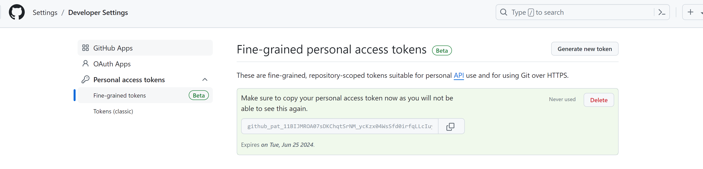
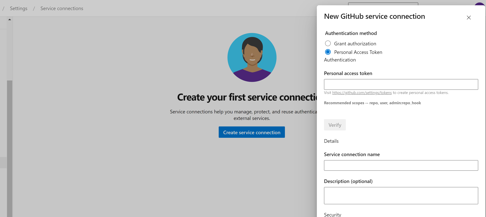
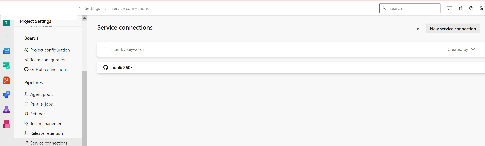
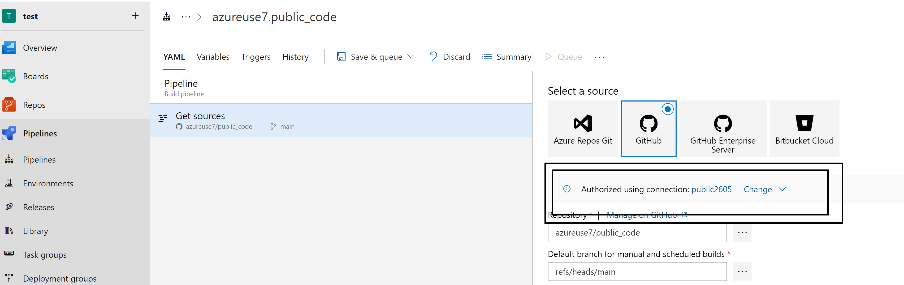

# Azure-DevOps connection to GitHub repositories

1) Create a PAT in Github 

2) Copy the PAT in github

3) Go to Azure devops and Copy the PAT 

4) Create the service connection

5) You can access the via the sevice connection

To create a PAT, visit Personal access tokens in your GitHub settings. The required permissions are repo, admin:repo_hook, read:user, and user:email. These are the same permissions required when using OAuth above. Copy the generated PAT to the clipboard and paste it into a new GitHub service connection in your Azure DevOps project settings. For future recall, name the service connection after your GitHub username. It will be available in your Azure DevOps project for later use when creating pipelines.

# Personal access token (PAT) authentication
PATs are effectively the same as OAuth, but allow you to control which permissions are granted to Azure Pipelines. Builds and GitHub status updates will be performed on behalf of your personal GitHub identity. For builds to keep working, your repository access must remain active.

To create a PAT, visit Personal access tokens in your GitHub settings. The required permissions are repo, admin:repo_hook, read:user, and user:email. These are the same permissions required when using OAuth above. Copy the generated PAT to the clipboard and paste it into a new GitHub service connection in your Azure DevOps project settings. For future recall, name the service connection after your GitHub username. It will be available in your Azure DevOps project for later use when creating pipelines.

# Permissions needed in GitHub
To create a pipeline for a GitHub repository with continuous integration and pull request triggers, you must have the required GitHub permissions configured. Otherwise, the repository will not appear in the repository list while creating a pipeline. Depending on the authentication type and ownership of the repository, ensure that the following access is configured.

If the repo is in your personal GitHub account, the PAT must have the required access scopes under Personal access tokens: repo, admin:repo_hook, read:user, and user:email.

If the repo is in someone else's personal GitHub account, the PAT must have the required access scopes under Personal access tokens: repo, admin:repo_hook, read:user, and user:email. You must be added as a collaborator in the repository's settings under "Collaborators". Accept the invitation to be a collaborator using the link that is emailed to you.

If the repo is in a GitHub organization that you own, the PAT must have the required access scopes under Personal access tokens: repo, admin:repo_hook, read:user, and user:email. You must be added as a collaborator, or your team must be added, in the repository's settings under "Collaborators and teams".

If the repo is in a GitHub organization that someone else owns, the PAT must have the required access scopes under Personal access tokens: repo, admin:repo_hook, read:user, and user:email. You must be added as a collaborator, or your team must be added, in the repository's settings under "Collaborators and teams". Accept the invitation to be a collaborator using the link that is emailed to you.

# Ben

A personal Access Token and an OAuth token link Azure Pipelines to GitHub with your user account. 

Your access token will be used to download the repo and the pipeline could access the token to access any repository your user has access to. While often convenient, it's a problem since you may not be the only person using the integration, so others could use your credentials by changing the pipeline.

The user bound tokens also have the problem that the owner of that user account may leave the company, breaking all pipelines, or worst, requiring quite a bit of reconfiguration to make sure that user loses all the access to the repositories the pipeline has access to.

The GitHub App will allow you to configure exactly what repositories should be allowed to be accessed by Azure Pipelines. It's decoupled from your user account and the access can be limited to just the repositories you want.