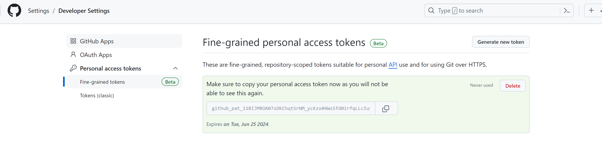
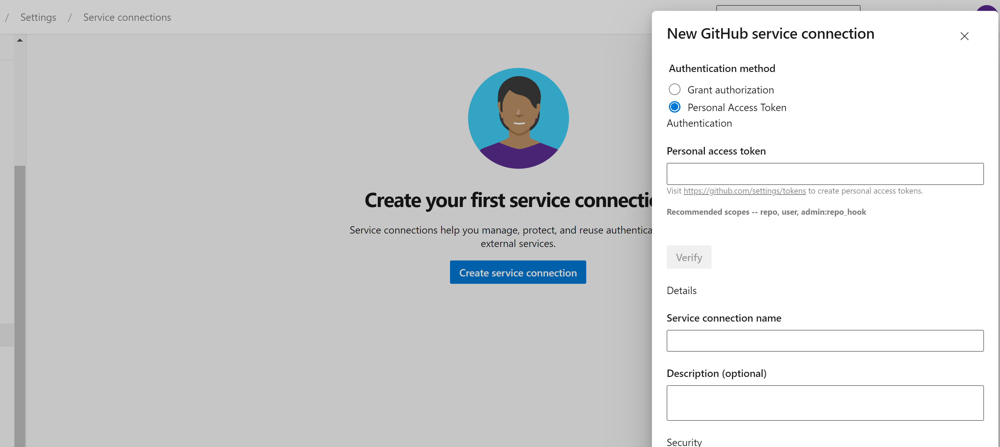
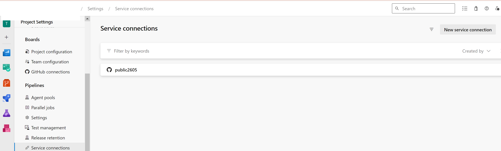
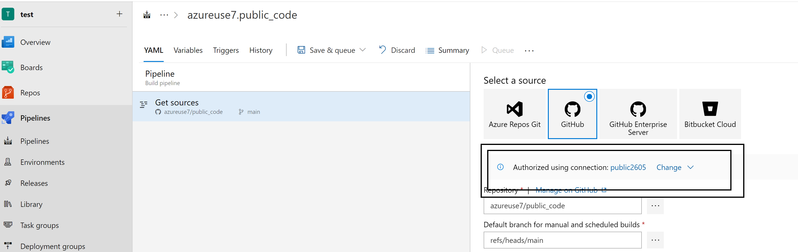

# Azure DevOps Connection to GitHub Repositories via PAT

This guide explains how to connect Azure DevOps to GitHub repositories using a Personal Access Token (PAT).

## Steps to Set Up the Connection

1. Create a PAT in GitHub.

   

2. Copy the PAT from GitHub.

   

3. Go to Azure DevOps and paste the PAT.

   

4. Create the service connection.

   

5. You can now access repositories via the service connection.

   

To create a PAT, visit **Personal access tokens** in your GitHub settings. The required permissions are `repo`, `admin:repo_hook`, `read:user`, and `user:email`. These are the same permissions required when using OAuth. Copy the generated PAT to the clipboard and paste it into a new GitHub service connection in your Azure DevOps project settings. For future reference, name the service connection after your GitHub username. It will be available in your Azure DevOps project for later use when creating pipelines.

## Personal Access Token (PAT) Authentication

PATs are effectively the same as OAuth, but allow you to control which permissions are granted to Azure Pipelines. Builds and GitHub status updates will be performed on behalf of your personal GitHub identity. For builds to keep working, your repository access must remain active.

To create a PAT, visit **Personal access tokens** in your GitHub settings. The required permissions are `repo`, `admin:repo_hook`, `read:user`, and `user:email`. Copy the generated PAT to the clipboard and paste it into a new GitHub service connection in your Azure DevOps project settings. For future reference, name the service connection after your GitHub username. It will be available in your Azure DevOps project for later use when creating pipelines.

## Permissions Needed in GitHub

To create a pipeline for a GitHub repository with continuous integration and pull request triggers, you must have the required GitHub permissions configured. Otherwise, the repository will not appear in the repository list while creating a pipeline. Depending on the authentication type and ownership of the repository, ensure that the following access is configured.

- **Repo in your personal GitHub account**: The PAT must have the required access scopes: `repo`, `admin:repo_hook`, `read:user`, and `user:email`.

- **Repo in someone else's personal GitHub account**: The PAT must have the required access scopes: `repo`, `admin:repo_hook`, `read:user`, and `user:email`. You must be added as a collaborator in the repository's settings under "Collaborators". Accept the invitation to be a collaborator using the link that is emailed to you.

- **Repo in a GitHub organization that you own**: The PAT must have the required access scopes: `repo`, `admin:repo_hook`, `read:user`, and `user:email`. You must be added as a collaborator, or your team must be added, in the repository's settings under "Collaborators and teams".

- **Repo in a GitHub organization that someone else owns**: The PAT must have the required access scopes: `repo`, `admin:repo_hook`, `read:user`, and `user:email`. You must be added as a collaborator, or your team must be added, in the repository's settings under "Collaborators and teams". Accept the invitation to be a collaborator using the link that is emailed to you.

## Note on User-Bound Tokens

A Personal Access Token and an OAuth token link Azure Pipelines to GitHub with your user account.

Your access token will be used to download the repository, and the pipeline could use the token to access any repository your user has access to. While often convenient, this is a potential concern since you may not be the only person using the integration, meaning others could use your credentials by modifying the pipeline.

User-bound tokens also carry the risk that the account owner may leave the organization, breaking all pipelines — or worse, requiring significant reconfiguration to ensure that user loses all repository access that the pipeline depends on.

The GitHub App allows you to configure exactly which repositories Azure Pipelines is permitted to access. It is decoupled from your user account, and access can be limited to only the repositories you specify.
