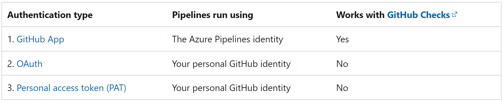
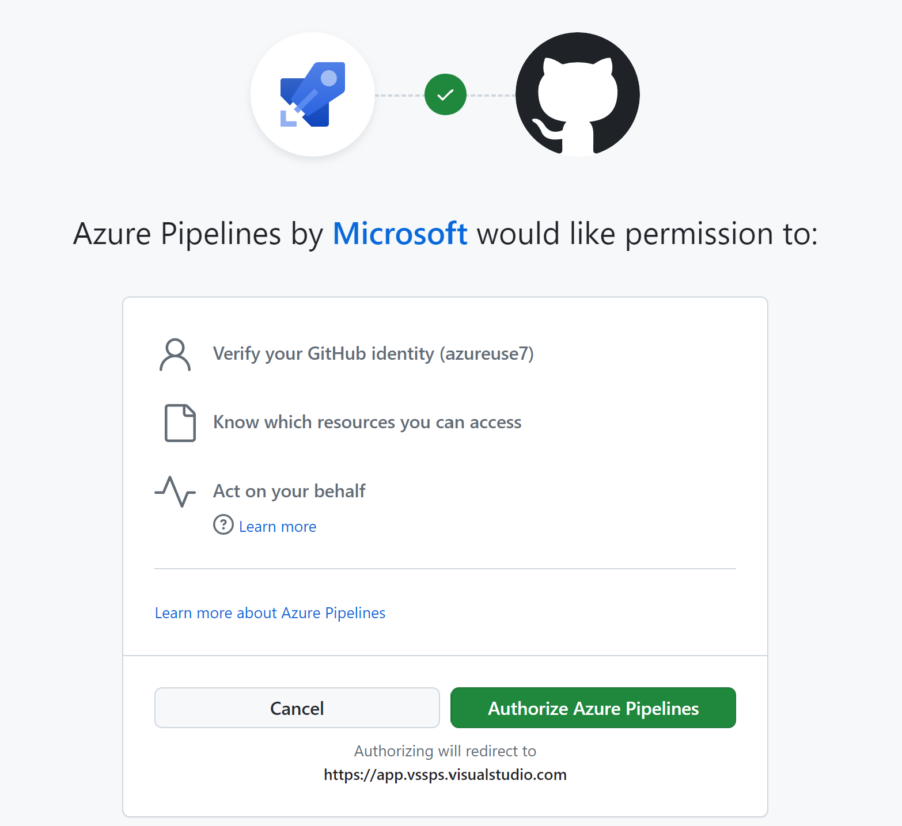
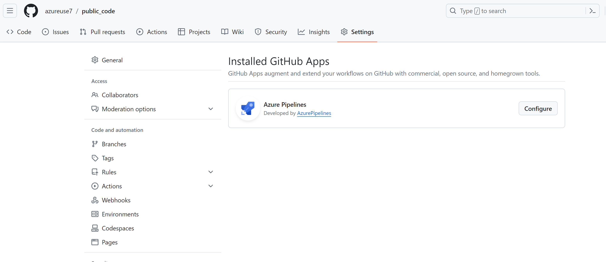
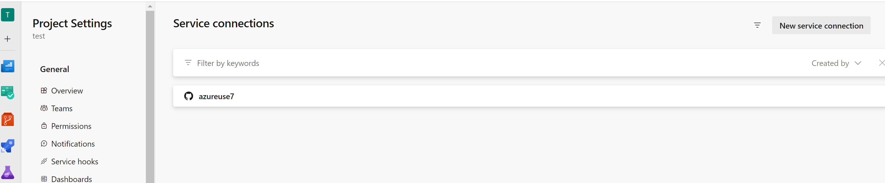

Access to GitHub repositories

# GitHub app authentication
After you install the GitHub App in your GitHub account or organization, your pipeline will run without using your personal GitHub identity. 
 
Builds and GitHub status updates will be performed using the Azure Pipelines identity. 

To use the GitHub App, install it in your GitHub organization or user account.

After installation, the GitHub App will become Azure Pipelines' default method of authentication to GitHub (instead of OAuth) when pipelines are created for the repositories.

### Permissions needed in GitHub
Installation of Azure Pipelines GitHub app requires you to be a GitHub organization owner or repository admin. 

If the repo is in your personal GitHub account, install the Azure Pipelines GitHub App in your personal GitHub account, and you’ll be able to list this repository when creating the pipeline in Azure Pipelines.

If the repo is in someone else's personal GitHub account, the other person must install the Azure Pipelines GitHub App in their personal GitHub account. You must be added as a collaborator in the repository's settings under "Collaborators". Accept the invitation to be a collaborator using the link that is emailed to you. Once you’ve done so, you can create a pipeline for that repository.

If the repo is in a GitHub organization that you own, install the Azure Pipelines GitHub App in the GitHub organization. You must also be added as a collaborator, or your team must be added, in the repository's settings under "Collaborators and teams".

If the repo is in a GitHub organization that someone else owns, a GitHub organization owner or repository admin must install the Azure Pipelines GitHub App in the organization. You must be added as a collaborator, or your team must be added, in the repository's settings under "Collaborators and teams". Accept the invitation to be a collaborator using the link that is emailed to you.

# How to configure.
https://www.youtube.com/watch?v=YZlaoNPzaxA

I have created a new github and azure devops project.
There is no connection at present 

Install the Github App --> Market place --> serach 

What access you want to give 

Now its taking me to Azure DevOps side

Now it wants to authorize

Go to started pipeline in Devops and create pipeline, save and run  

Notice a build has started and its also created that pipeline in our gihub repo 

Notice The apo is created in github

also in Azure devops

### what if we want to add a new repo to azure devops
Create a new repo in github 

Lets delete the service and let seee what happends 
