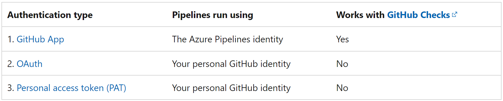
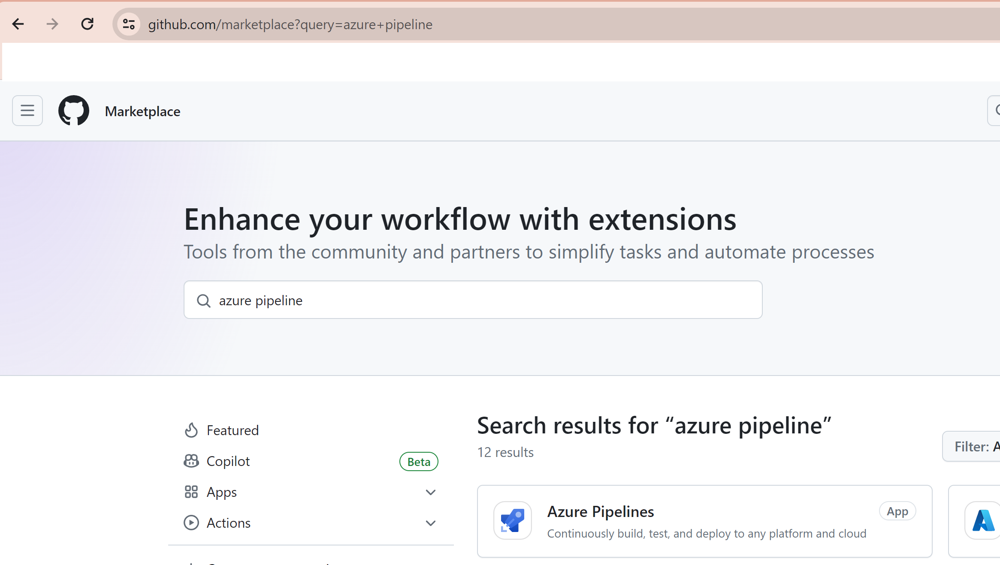
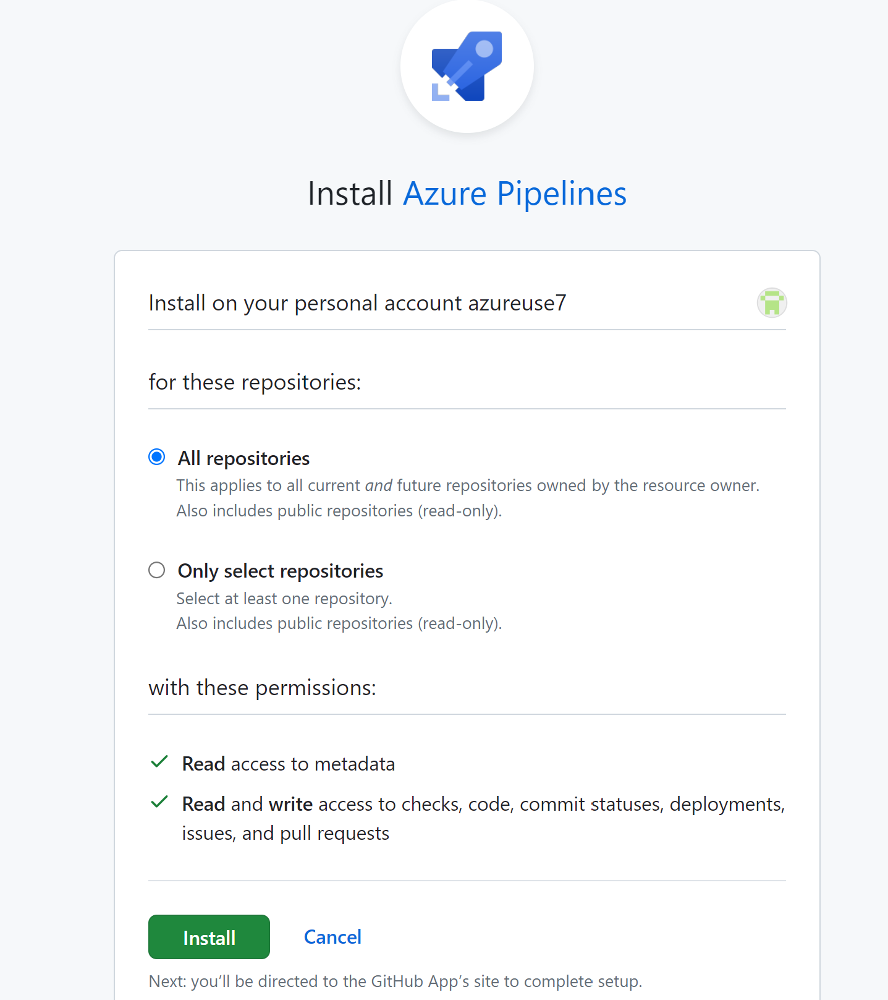
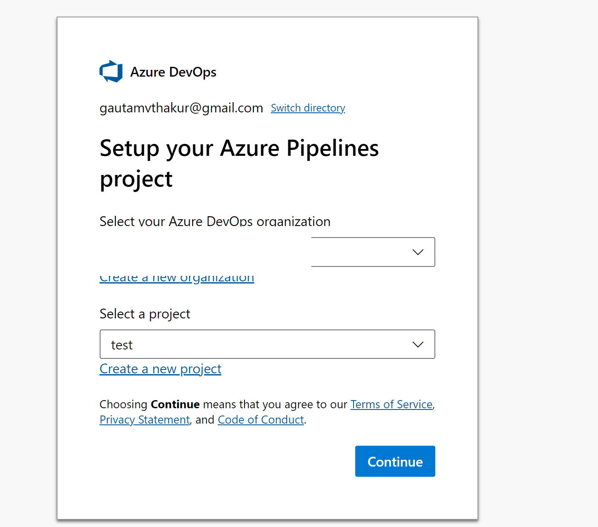
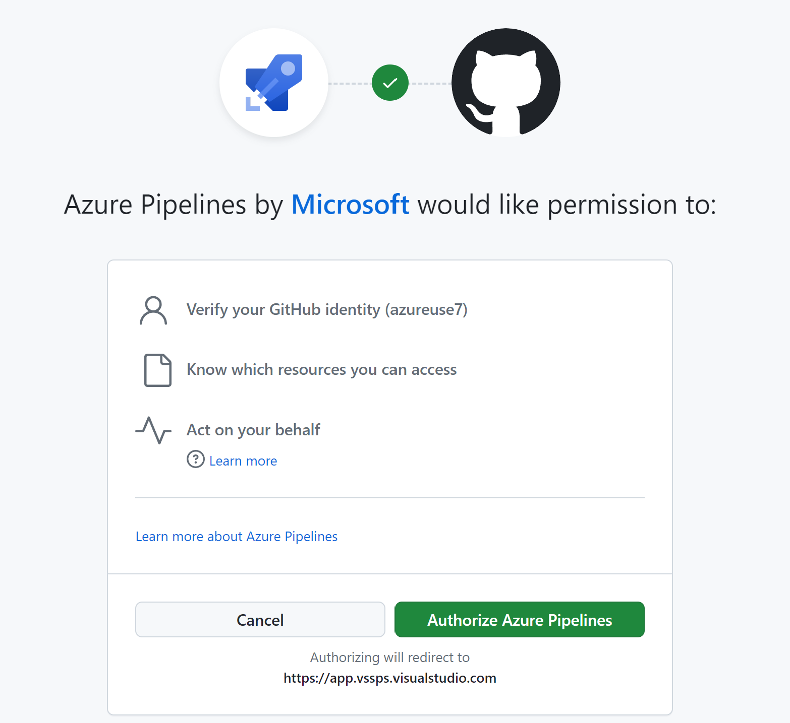
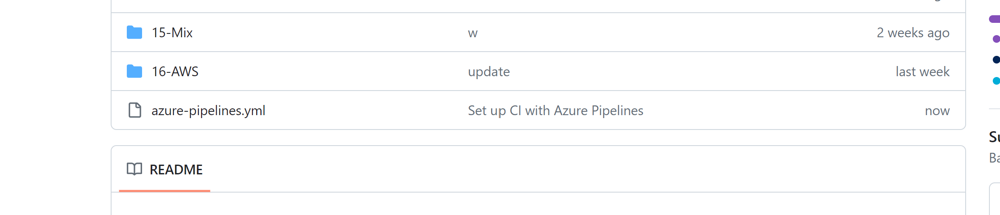
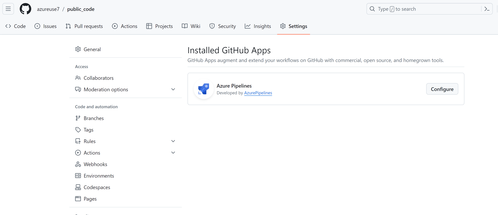
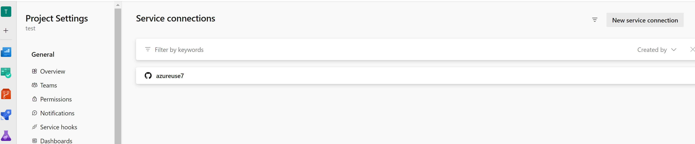
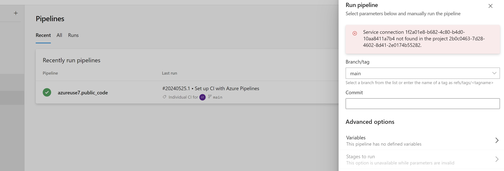

Access to GitHub repositories thee are thee way. 



#### GitHub app authentication
- After you install the GitHub App in your GitHub account or organization, your pipeline will run without using your personal GitHub identity. 
 
- Builds and GitHub status updates will be performed using the Azure Pipelines identity. 

- To use the GitHub App, install it in your GitHub organization or user account.

- After installation, the GitHub App will become Azure Pipelines' default method of authentication to GitHub (instead of OAuth) when pipelines are created for the repositories.


### How to configure.
https://www.youtube.com/watch?v=YZlaoNPzaxA

- I have created a new github and azure devops project.
There is no connection at present 

- Install the Github App --> Market place --> serach --> add


- What access you want to give 

- Now its taking me to Azure DevOps side

- Now it wants to authorize

- Go to started pipeline in Devops and create pipeline, save and run  

- Notice a build has started and its also created that pipeline in our gihub repo 

- Notice The app is created in github

- also created in Azure devops



- Lets delete the service and let seee what happends 



Now How would this be used in DevOps
,Each pipeline has .yml files that has a reference to one repo that contains all the templates for build and release. Like this:
```yaml
resources:  
   repositories:    
   - repository: templates      
     type: github    
     name: MyGitHubOrg/MyTemplatesRepo    
     ref: refs/heads/master    
     endpoint: MyGitHubOrg
stages:
   - template: build.yml@templates
     parameters:
        ...
```
- The main character in this story is the endpoint **MyGitHubOrg**. This is the name of a service connection created by the Azure Pipelines GitHub App mentioned above.

- When you install the Azure Pipelines app it will create the Service Connection for you. In whatever team project you supply during installation.

Once it’s installed and working for one Team Project in Azure DevOps you can share it with other projects so they can also use it. To do this go to that Service Connection in Azure DevOps and select Security. If you are not sure where this is it’s under Project Settings — Service Connections in Azure DevOps.


