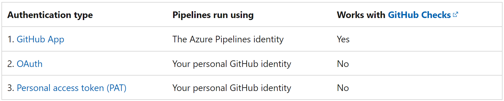
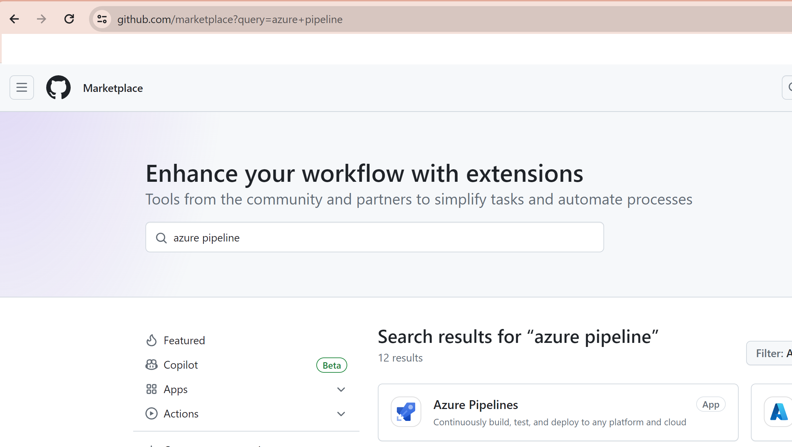
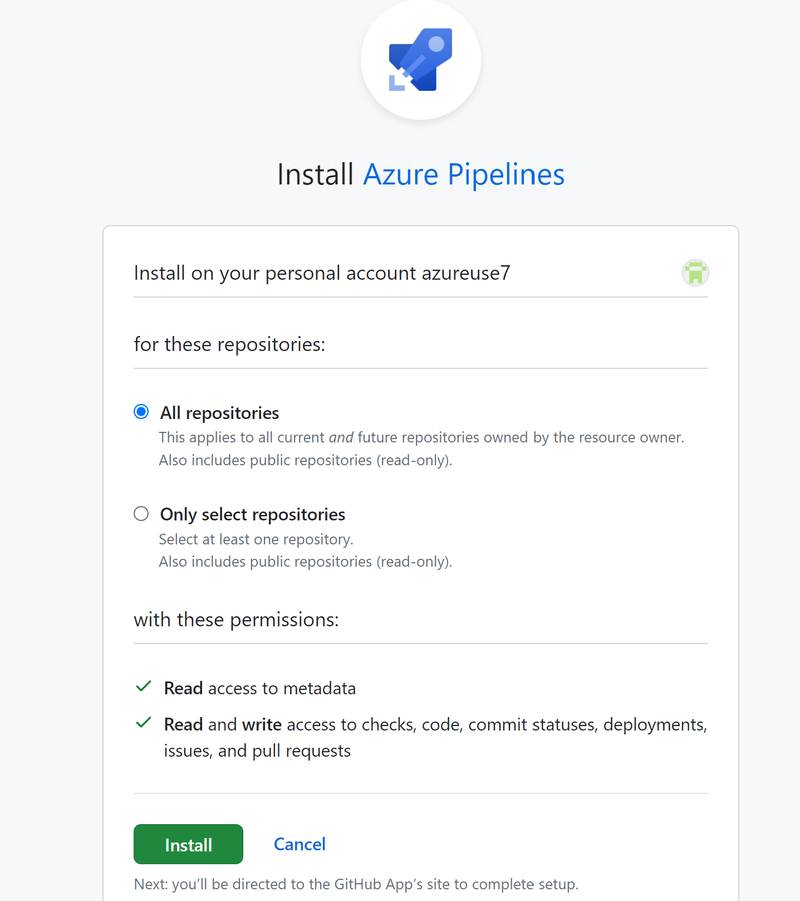
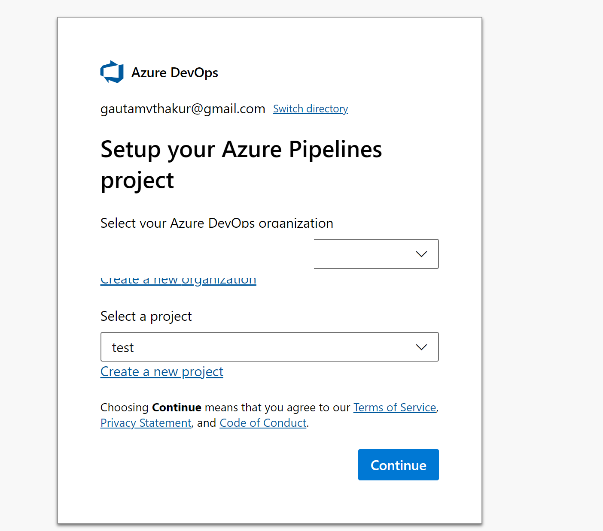
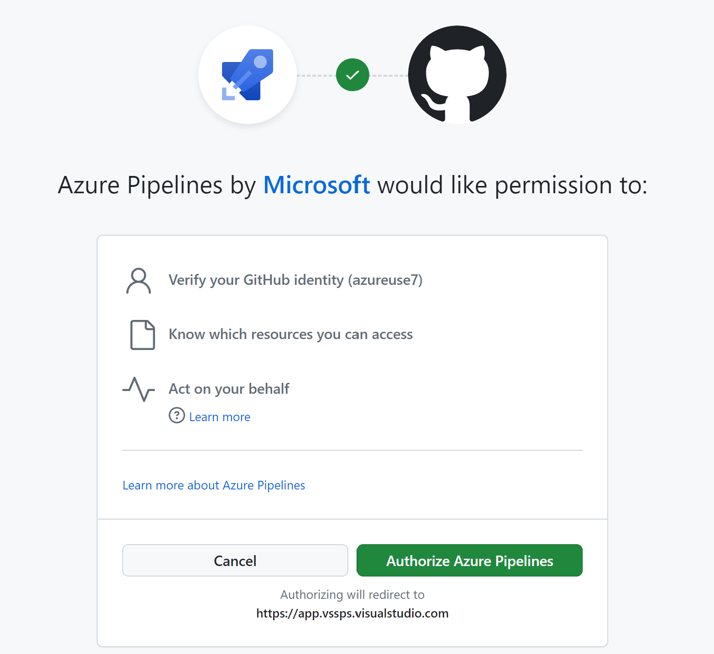
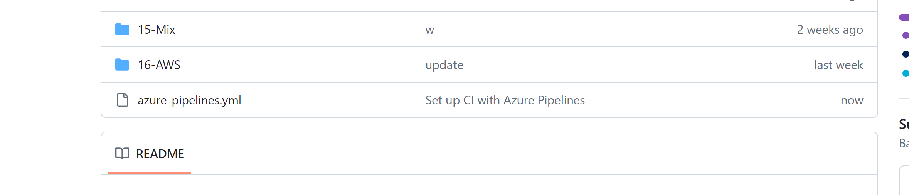
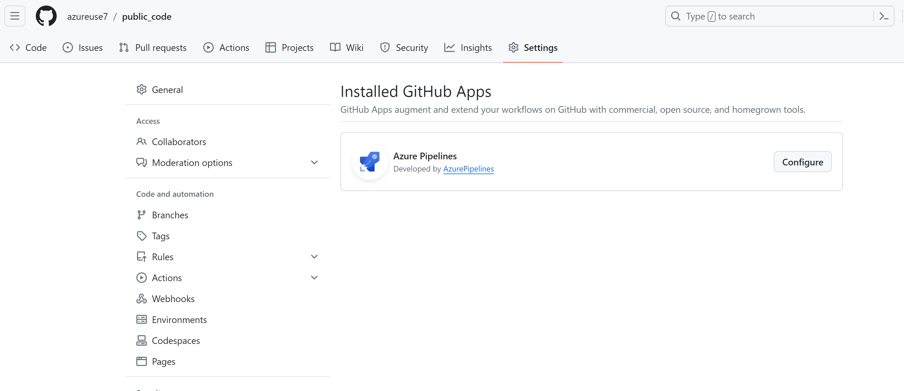
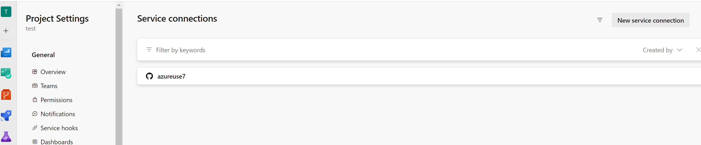
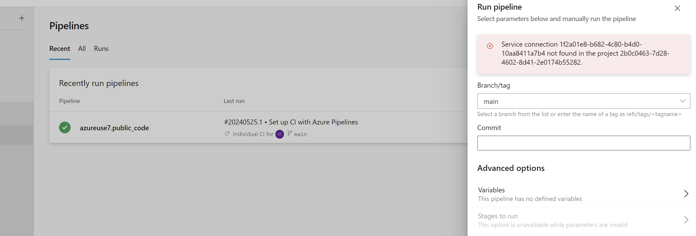

# GitHub App Authentication for Azure DevOps

There are three ways to access GitHub repositories from Azure DevOps. This document covers GitHub App authentication.



## GitHub App Authentication

- After you install the GitHub App in your GitHub account or organization, your pipeline will run without using your personal GitHub identity.
- Builds and GitHub status updates will be performed using the Azure Pipelines identity.
- To use the GitHub App, install it in your GitHub organization or user account.
- After installation, the GitHub App will become Azure Pipelines' default method of authentication to GitHub (instead of OAuth) when pipelines are created for the repositories.

## How to Configure

Reference: [GitHub App Authentication Setup (YouTube)](https://www.youtube.com/watch?v=YZlaoNPzaxA)

1. Create a new GitHub account and a new Azure DevOps project. There is no connection at present.

2. Install the GitHub App via the Marketplace: search for "Azure Pipelines" and add it.

   

3. Select the repositories you want to grant access to.

   

4. You will be redirected to the Azure DevOps side to complete the setup.

   

5. Authorize the connection when prompted.

   

6. Go to the starter pipeline in Azure DevOps, create a pipeline, then save and run it.

7. A build will start, and the pipeline will also be created in your GitHub repository.

   

8. The GitHub App will appear in your GitHub account settings.

   

9. The service connection will also appear in Azure DevOps.

   

## Deleting the Service Connection

To see what happens when the service connection is removed, delete it and observe the effect on pipelines.



## Using the GitHub App in Azure DevOps Pipelines

Each pipeline has a `.yml` file that references a repository containing all build and release templates. For example:

```yaml
resources:
  repositories:
    - repository: templates
      type: github
      name: MyGitHubOrg/MyTemplatesRepo
      ref: refs/heads/master
      endpoint: MyGitHubOrg

stages:
  - template: build.yml@templates
    parameters:
      ...
```

The key field here is the `endpoint` value — **`MyGitHubOrg`**. This is the name of the service connection created by the Azure Pipelines GitHub App.

When you install the Azure Pipelines app, it will automatically create the service connection for you in whichever team project you supply during installation.

Once it is installed and working for one Team Project in Azure DevOps, you can share it with other projects so they can also use it. To do this, go to that service connection in Azure DevOps and select **Security**. This is found under **Project Settings > Service Connections** in Azure DevOps.
