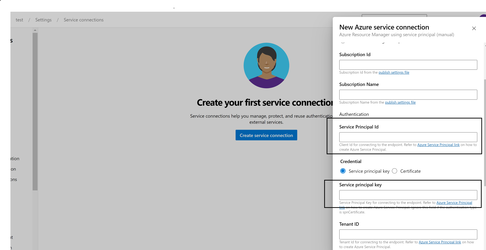
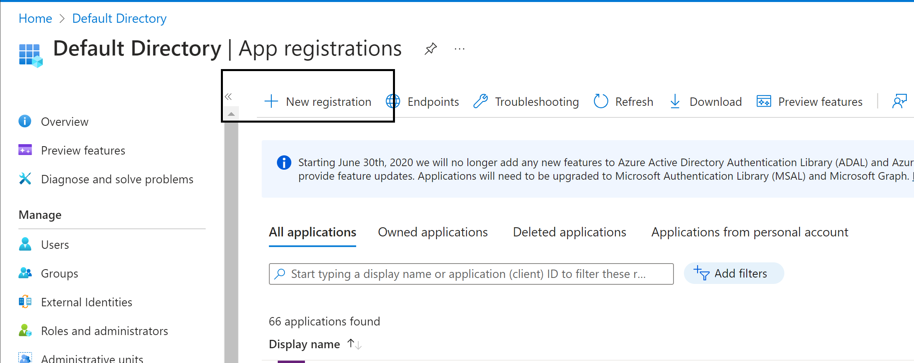
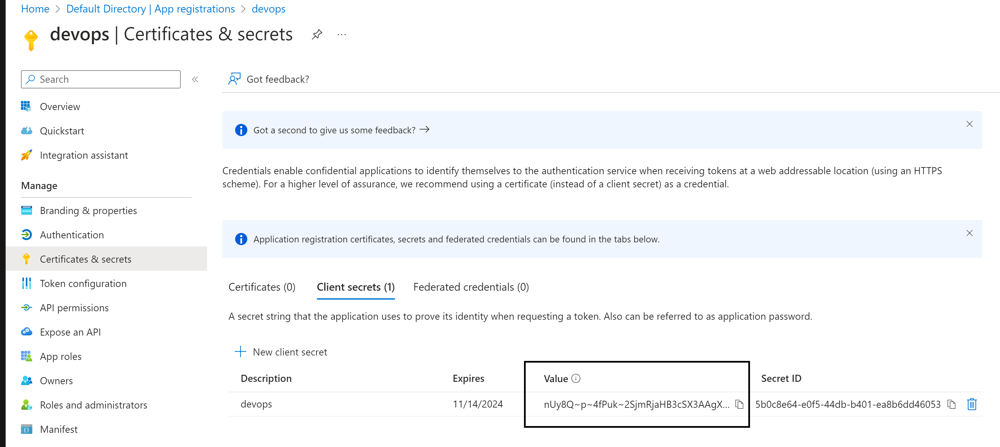
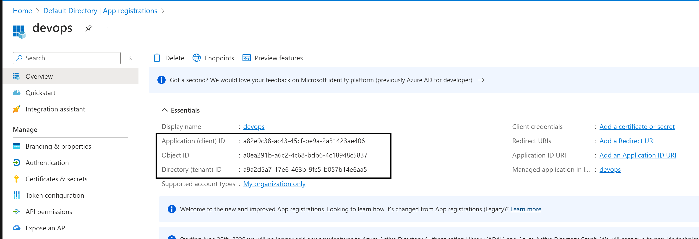
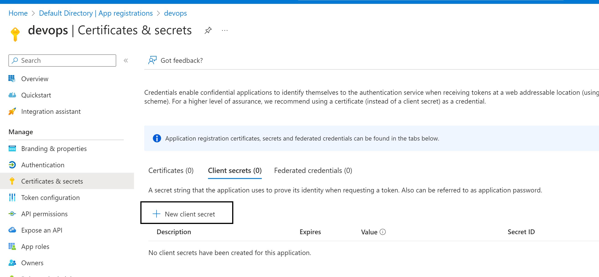
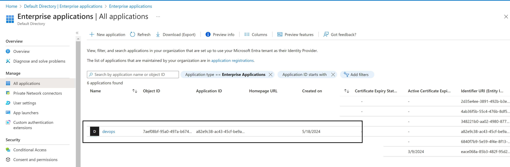
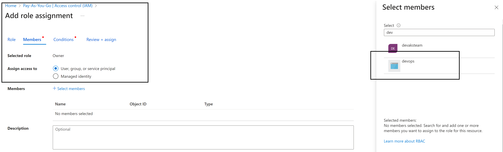

# Local (laptop) connection to GitHub
To connect to GitHub with SSH from Windows, follow these steps:

- Open PowerShell
- Run the "ssh-keygen" command to create SSH keys (ssh-keygen -o -t rsa -C "windows-ssh@mcnz.com")
- Copy the value of the SSH public key ( This is validated against a locally stored private key that Git uses to validate and establish a connection.)
- Save the public key in your GitHub account settings
- Perform a Git clone operation using your repo’s SSH URL

# Azure-DevOps connection to GitHub repositories
 
To create a PAT, visit Personal access tokens in your GitHub settings. The required permissions are repo, admin:repo_hook, read:user, and user:email. These are the same permissions required when using OAuth above. Copy the generated PAT to the clipboard and paste it into a new GitHub service connection in your Azure DevOps project settings. For future recall, name the service connection after your GitHub username. It will be available in your Azure DevOps project for later use when creating pipelines.

Azure-DevOps connection to Azure 
[Azure DevOps | Creating a Service connection with Azure ]
# https://www.youtube.com/watch?v=06wxMtSt_0g&t=367s

# Service connection 

- What is service connection, 
"service connection" refers to a secure and managed way to connect to external services or resources from Azure Pipelines, Azure DevOps, or Azure Automation to azure basically its a connection.

To create a service conection you need the below

- subscpition id 
- subscpition name
- authication --> select service connection
- service principle id
- service principle key
- tentant id 

# Authicate method used by Service connection, we use Service Principle 
- what is service principle

It will use the app ID and aap secret to connect to azure subscpition. 

# Create an app-registration

- Once ceated 
- app regsitration needs api permssions check them 
- Secrets --> this is where we generate our secrets --> create a new secret 
  
- copy the value and this is the "service principle key". SO in the service connection copy the secret into service principle key
- 
- service principle id = application(client)id 

- 
- 

 Notice in Enterprize app a service princple is also raeted 

One very important thing,  the application must have correct roles example owners on the rescource its going to create rescouce 
Example here I am giving my service prinple owner on the full subscpition 

