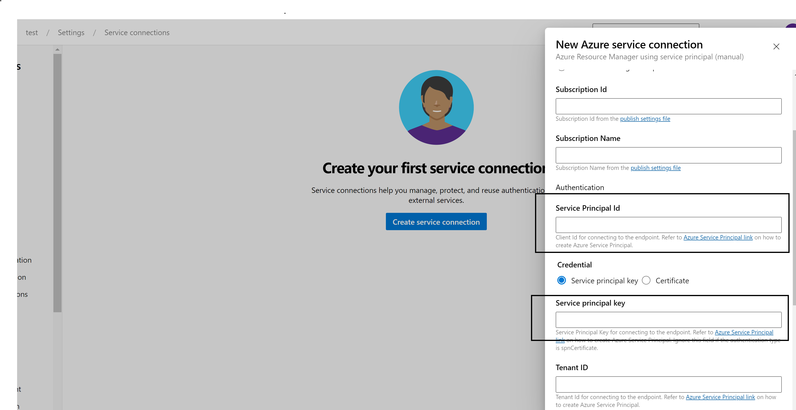
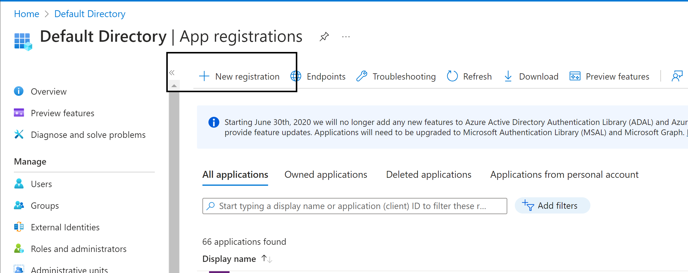
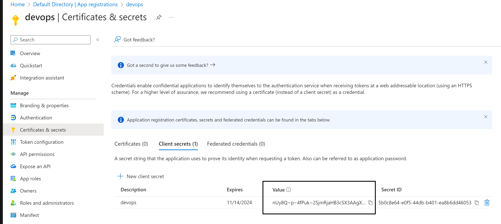
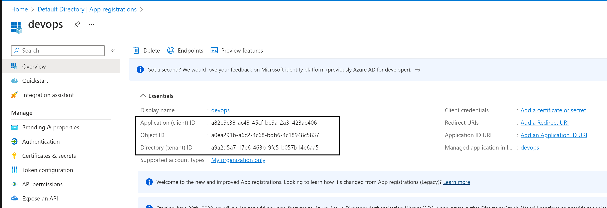
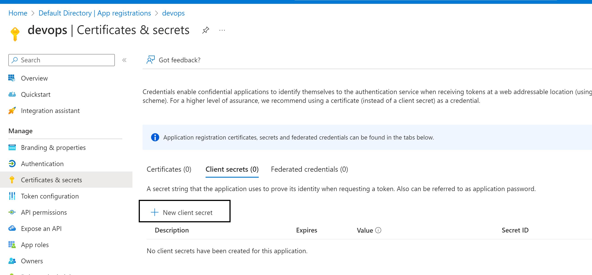
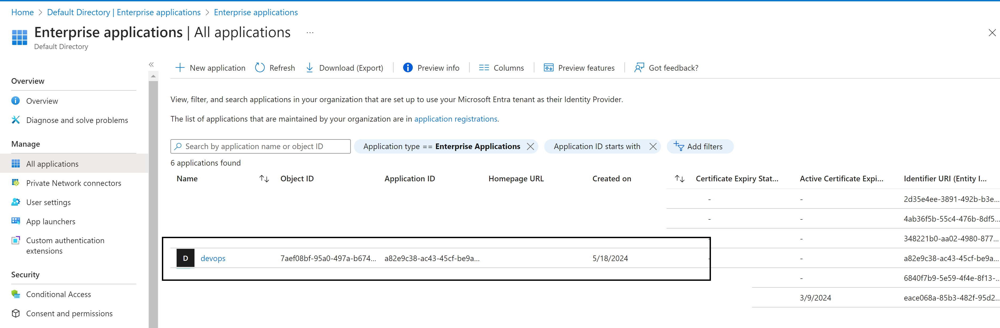
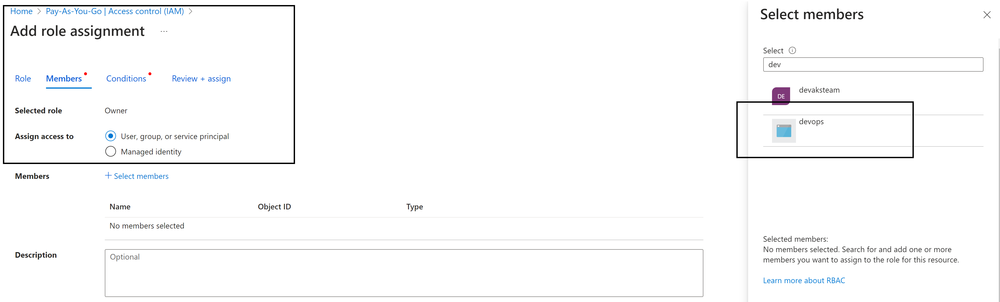

Azure-DevOps connection to Azure 
[Azure DevOps | Creating a Service connection with Azure ]
# https://www.youtube.com/watch?v=06wxMtSt_0g&t=367s

#### Service connection 
 
"service connection" refers to a secure and managed way to connect to external services or resources from Azure Pipelines, Azure DevOps, or Azure Automation to azure basically its a connection.

To create a service conection you need the below
- subscpition id --> You can find this in Azure portal 
- subscpition name --> You can find this in Azure portal
- Under authication --> select service connection (It will use the app ID and aap secret to connect to azure subscpition.)
- service principle id
- service principle key
- tentant id 

#### Log into Azure 

#### For Service connection to authenticate, we use Service Principle 
what is service principle

It will use the app ID and aap secret to connect to azure subscpition. 

#### Create an app-registration (Under manage)

- Once ceated 
- app regsitration needs api permssions check them 
- **Secrets** --> this is where we generate our secrets --> create a new secret 
  
-  service principle key = Secret 
- 
- service principle id = application(client)id 

- 
- 

 Notice in Enterprize app a service princple is also created

One very important thing,  the application must have correct roles example owners on the rescource its going to create rescouce 
Example here I am giving my service prinple owner on the full subscpition 

