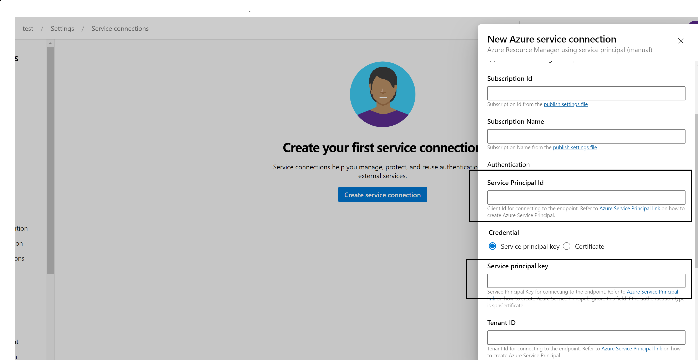
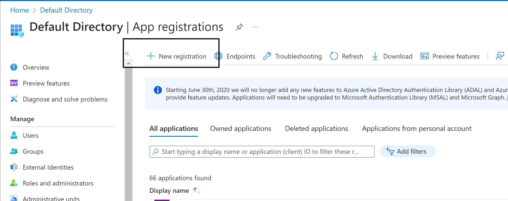
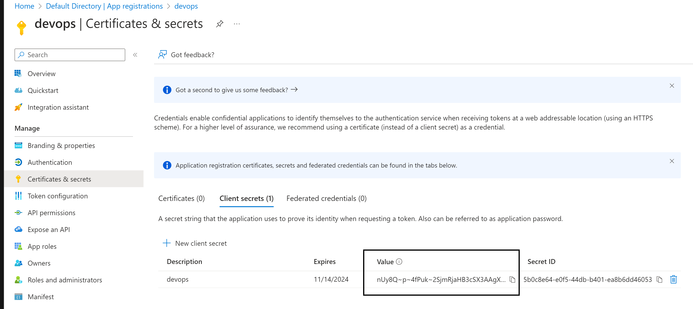
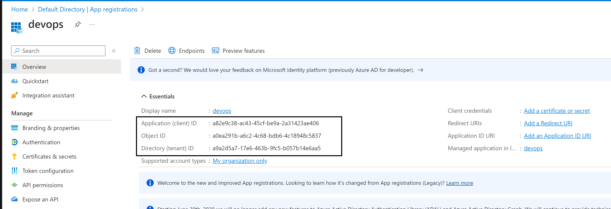
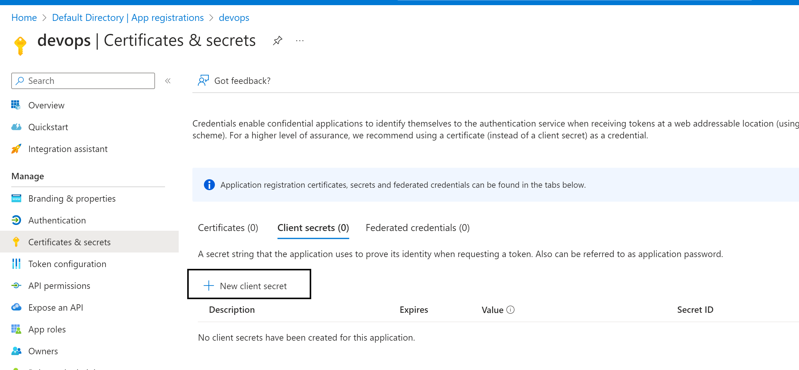
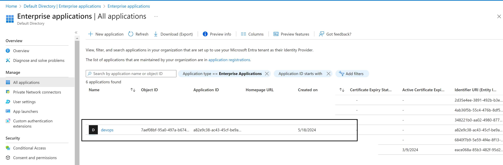
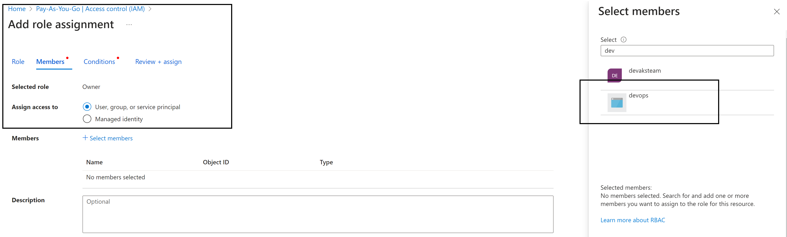

# Azure DevOps Service Connection to Azure

This guide explains how to create a service connection from Azure DevOps to an Azure subscription.

Reference: [Azure DevOps - Creating a Service Connection with Azure (YouTube)](https://www.youtube.com/watch?v=06wxMtSt_0g&t=367s)

## What is a Service Connection?

A "service connection" is a secure and managed way to connect to external services or resources from Azure Pipelines, Azure DevOps, or Azure Automation. In essence, it is a configured connection that allows pipelines to authenticate and interact with Azure or other platforms.

## What You Need to Create a Service Connection

To create a service connection you need the following:

- **Subscription ID**: Found in the Azure portal.
- **Subscription Name**: Found in the Azure portal.
- **Authentication method**: Select **Service Principal**. It will use the App ID and App Secret to connect to the Azure subscription.
- **Service Principal ID**: The Application (Client) ID from the app registration.
- **Service Principal Key**: The secret generated for the app registration.
- **Tenant ID**: Found in the Azure portal under Azure Active Directory.

## Log Into Azure

Log into the [Azure portal](https://portal.azure.com) before proceeding with the steps below.

## Service Principal Authentication

A service connection uses a Service Principal to authenticate against Azure. The Service Principal uses an App ID and App Secret to connect to the Azure subscription.

## Create an App Registration

1. In the Azure portal, navigate to **Azure Active Directory > App registrations** and create a new registration.

   

2. Once created, check the API permissions for the app registration.

3. Navigate to **Certificates & secrets** to generate a new secret.

   

   - **Service Principal Key** = the secret value generated here.

   

   - **Service Principal ID** = the **Application (Client) ID** shown on the app registration overview page.

   

4. Note that when the app registration is created, a corresponding Service Principal is also automatically created in **Enterprise Applications**.

   

## Assign the Correct Role to the Service Principal

The application must have the correct role assigned on the resource it will manage. For example, to allow the service principal to create resources in a subscription, assign it the **Owner** role at the subscription level.

