(https://www.youtube.com/watch?v=_pBYrm_CNrQ)

- Create a Cluster with policy add-on enabled.
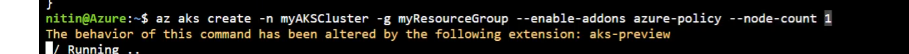

- Log in to the to the cluster.
- You can see that the policy is running.
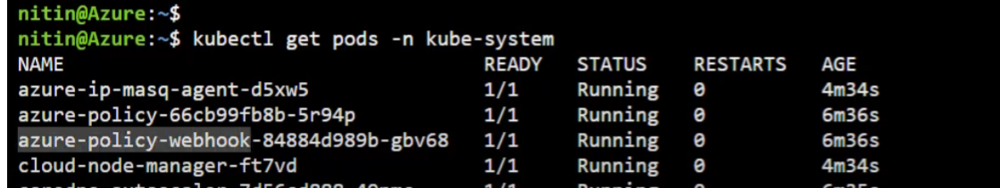
You can also see gatekeeper namespace has been created and pods
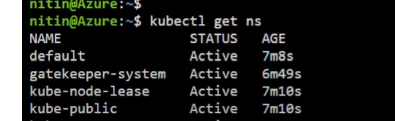

Check what constraints are running.
``` 
 k get constraint template
``` 
- https://open-policy-agent.github.io/gatekeeper/website/docs/constrainttemplates/
``` 
 k get constraint
``` 
- These constraints can't be changed, using Kubectl; you have to edit the Azure policy.
-These are dry runs.

Now let's check a constrainttemplate
 and view the definition.
```  
kubcetl get constrainttemplate <>
``` 
### Now let's test this

Let's create a pod with privileges.
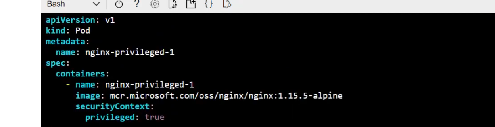
Let's apply this and run.
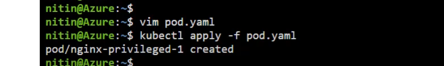
Lets check,
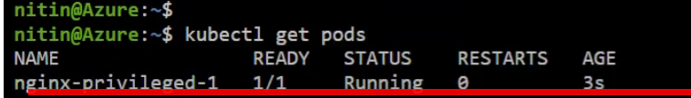
We were able to create the pod because the Constrait policy allowed us
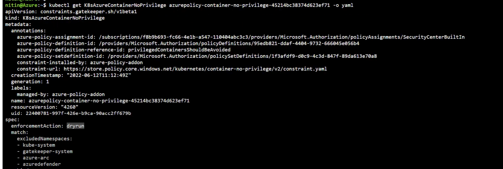
Now we can't change this from Kubectl, but we need to do it from Azure Policy.
- Notice we have two agreements now.
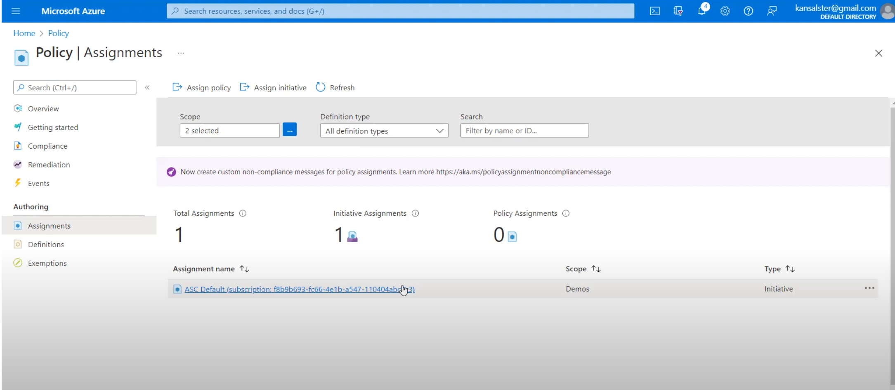


Let's create a definition.
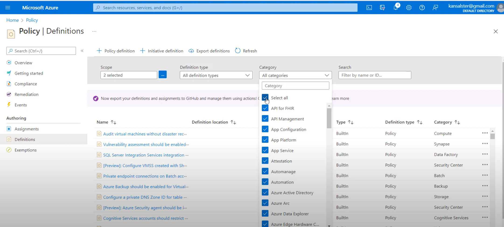
Select Kubernetes.
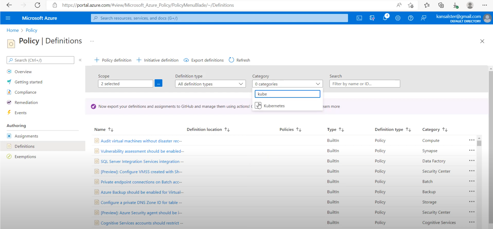
Select the pod security baseline.
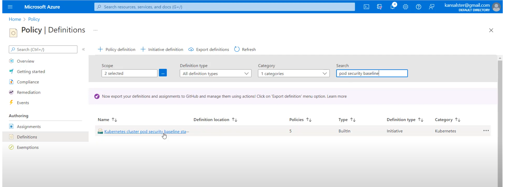
Let's assign it
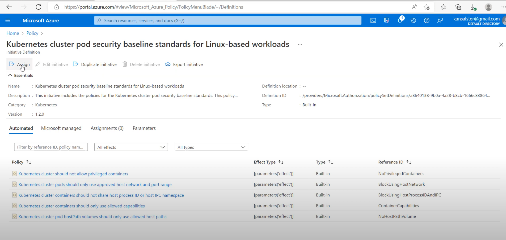
Select Scope, and let's add the scope.
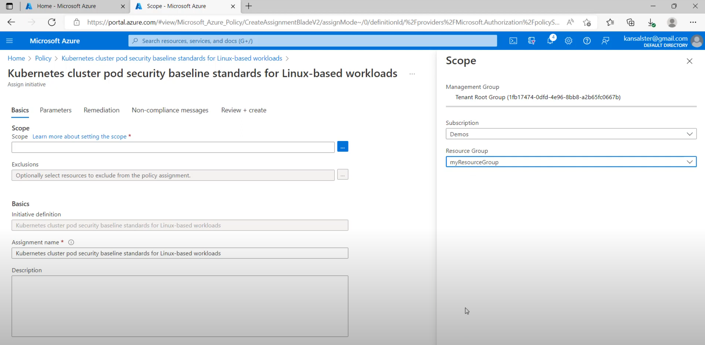
From audit, apply to deny
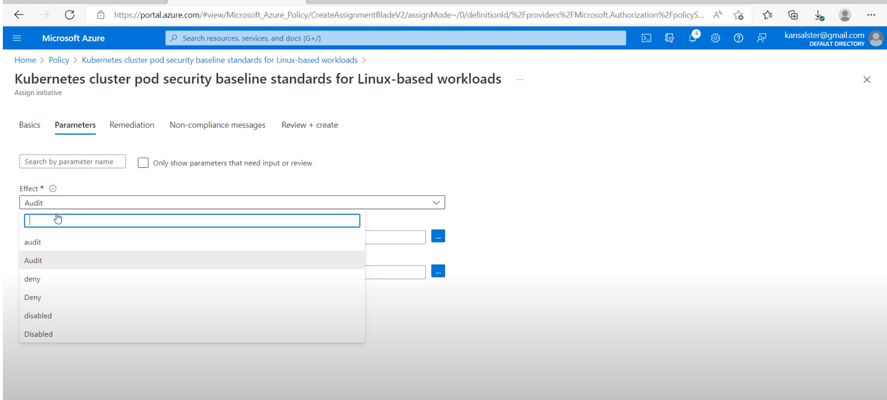
- Notice we have two agreements now.
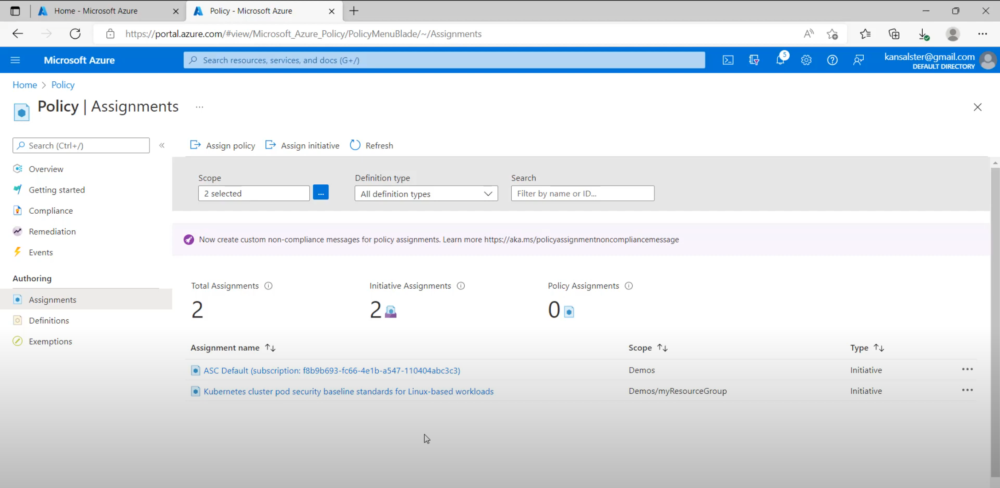
We can see we have two
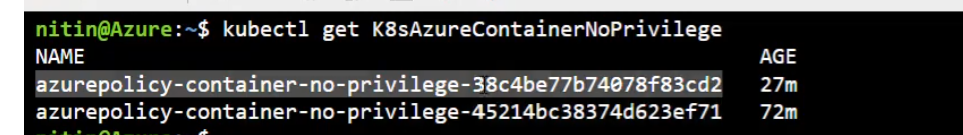

- Let's check the enforcings. notice is denied now.
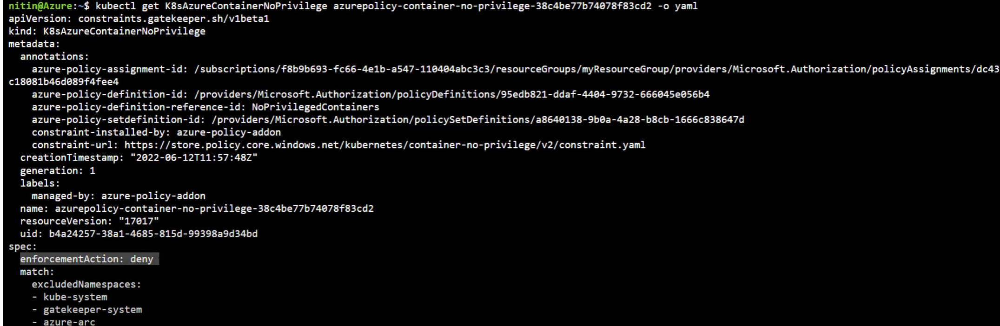


Let's try to apply the pod now.
Notice it fails.
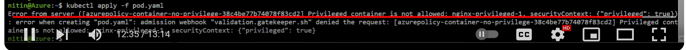


<!-- 
(https://www.youtube.com/watch?v=_pBYrm_CNrQ)

- Create a clsuter with policy add on enabled 


- Log in cluster and run 
- You can se pod with policy are running 

- You can also see gatekeeper namespace is created and pods 


- check what constrainys are running 
- k get constrainttemplate
- https://open-policy-agent.github.io/gatekeeper/website/docs/constrainttemplates/
- 
- k get constraint
These constrain can 't be changed husng kubectl, you have to edit from azure policy 
These are dry run 

Now lets check a constrait and view the deintaion 
- kubcetl get constrainttemplate <>
### Now lets Test This

- Lets create a pod with privilege 

- Lets aapply this and run 

- lets check,

- we were able to create the pod becuase the constrait policy allowed us 

- Now we can't change this from kubectl but we need to do it from azure policy 
- Notice we have two assigmnets now


- Lets create a defination

- Select Kubernetes 

- Select Pod security baseline

- Let assign it 

- Select Scope and lets aadd the scop

- From audit apply to deny

- Notice we have two assigmnets now

- we can see we have two co


- let check the enforments. notice is deny now


- Let try to apply now the pod
- Notice it fails 
 -->