# Azure Policy and OPA Gatekeeper on AKS

Reference video: [Azure Policy with OPA Gatekeeper on AKS](https://www.youtube.com/watch?v=_pBYrm_CNrQ)

## Step-01: Create a Cluster with Policy Add-On

- Create a cluster with the policy add-on enabled.
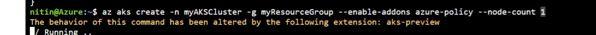

## Step-02: Log In and Verify

- Log in to the cluster.
- Confirm that the policy pods are running.
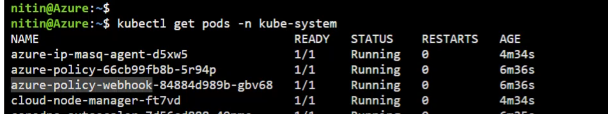

You can also see that the `gatekeeper` namespace has been created and its pods are running.
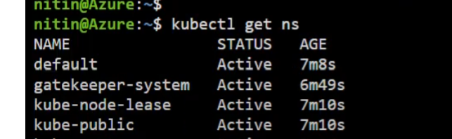

## Step-03: Review Existing Constraints

Check what constraint templates are currently running:

```bash
kubectl get constrainttemplate
```

Reference: [OPA Gatekeeper Constraint Templates](https://open-policy-agent.github.io/gatekeeper/website/docs/constrainttemplates/)

```bash
kubectl get constraint
```

- These constraints cannot be changed using `kubectl`; you must edit them from Azure Policy.
- These are dry-run mode by default.

View the definition of a specific constraint template:

```bash
kubectl get constrainttemplate <name>
```

### Step-04: Test the Policy

Let's create a pod with elevated privileges.
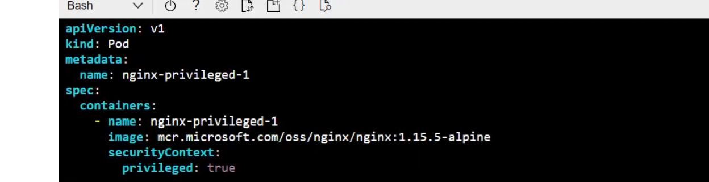

Apply and run it:
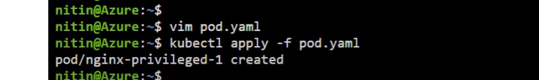

Check the result:
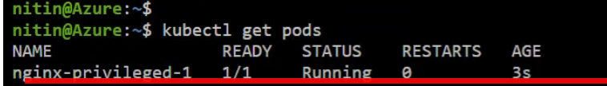

We were able to create the pod because the constraint policy allowed it (dry-run mode).
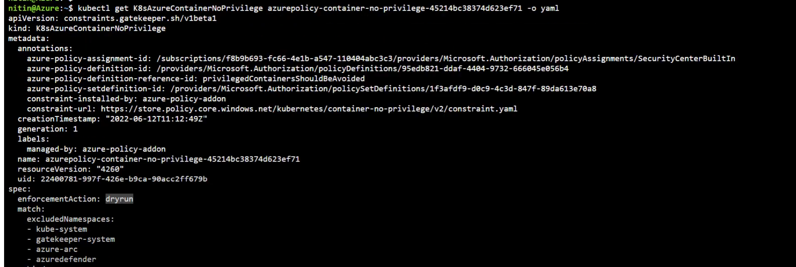

Note that constraints cannot be changed from `kubectl` — changes must be made through Azure Policy. Notice there are two assignments now.
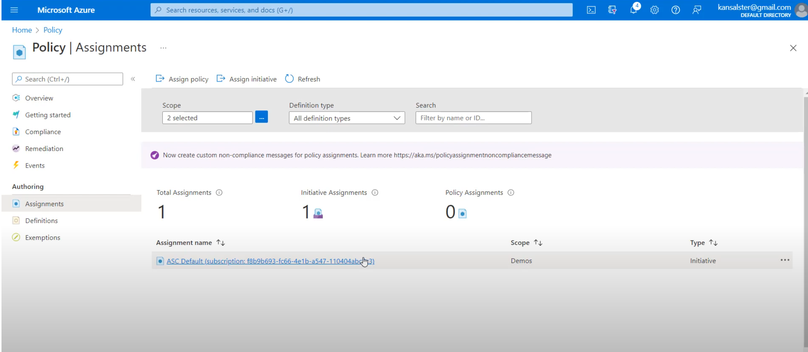

## Step-05: Create a Policy Definition to Enforce Denial

Let's create a new policy definition.
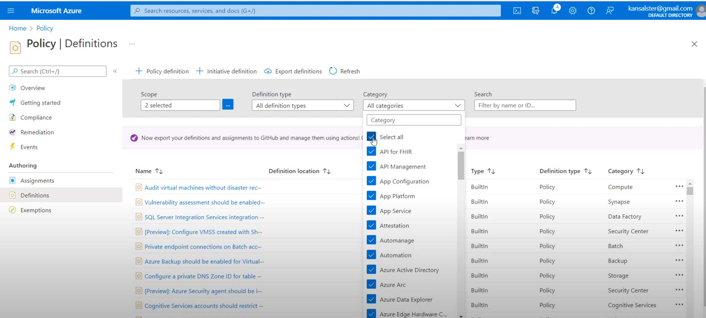

Select Kubernetes.
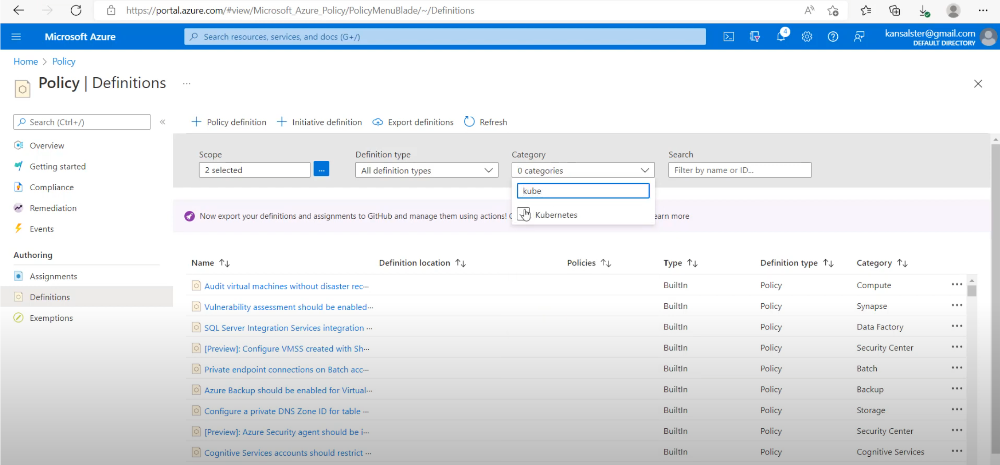

Select the Pod Security Baseline.
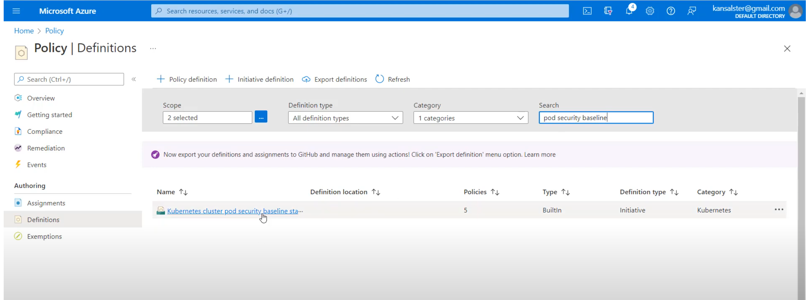

Assign it to your scope.
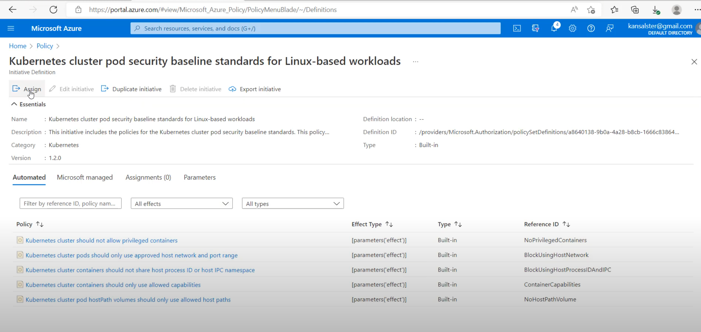

Select the scope and add it.
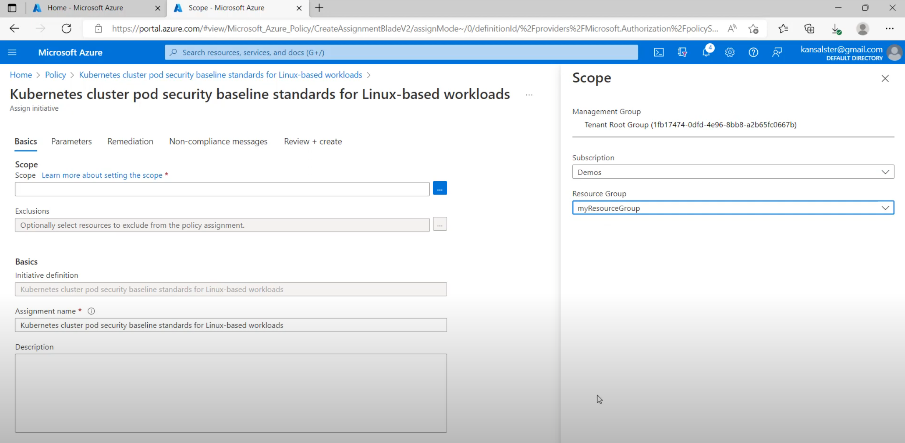

Change the effect from **Audit** to **Deny**.
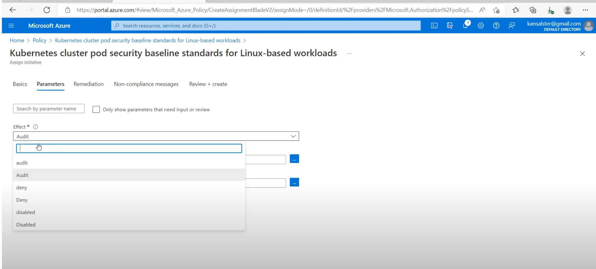

Notice there are now two assignments.
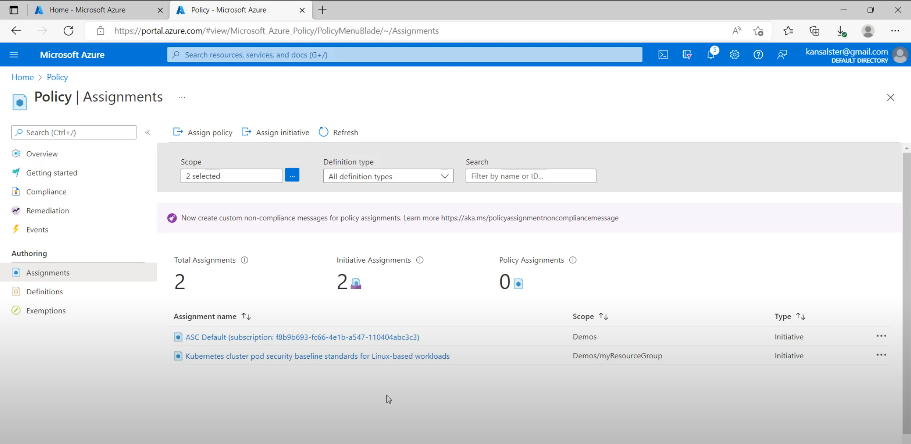

We can confirm both assignments are active.
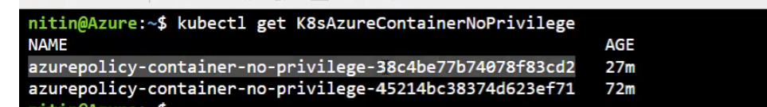

## Step-06: Verify Enforcement

Check the enforcements — the policy effect is now **Deny**.
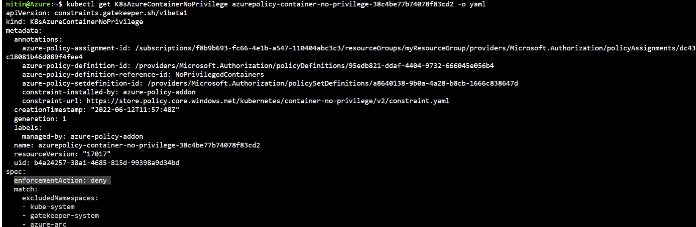

Try to apply the privileged pod again. Notice it now fails as expected.
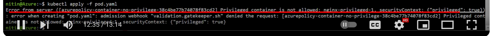
