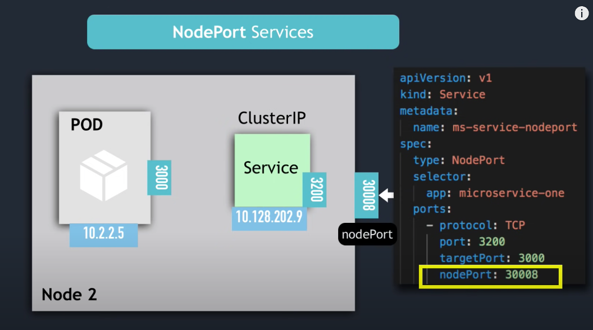
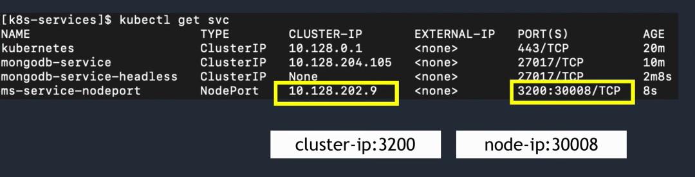
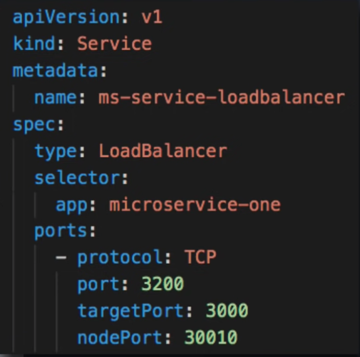
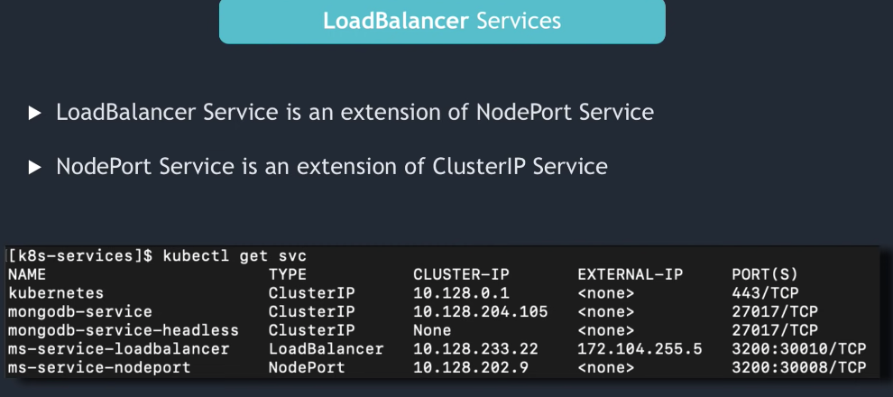

# There are four different service types:

# Service:

- Each pod gets its own IP address, but Pods are ephemeral they destroy frequently
- No doesn’t make sense to use their IP address 
- So we can use a Service with a stable IP to communicate with the Pods
- Pod <- Service (stable IP)

# Several Types of service: 
Instead of static IP address-based assignments, Services use selectors (or labels) to define which pods uses which service. These dynamic assignments make releasing new versions or adding pods to a service really easy. Anytime a Pod with the same labels as a service is spun up, it’s assigned to the service.

- ClusterIP exposes the service on an internal IP only. This makes the service reachable only from within the cluster. This is the default type.

- NodePort exposes the service on each node’s IP at a specific port. 
 This value exposes the service externally. It assigns each node a static port that responds to that service. When accessed through nodeIp:port, the node automatically redirects the request to an internal service of the ClusterIP type. This service then forwards the request to the applications.

- LoadBalancer exposes the service externally using a cloud provider’s load balancer. This is often used when the cloud provider’s load balancer is supported by Kubernetes, as it automates their configuration.

Load Balancer Service:

LoadBalancer: This value exposes the service externally by using Azure's load-balancing solution. When created, this resource spins up an Azure Load Balancer resource within your Azure subscription. Also, this type automatically creates a NodePort service to which the load balancer's traffic is redirected and a ClusterIP service to forward it internally.

To access our application outside of Azure k8s cluster we can use Kubernetes Load Balancer service

Ports

port: Port on which node port service listens in Kubernetes cluster internally

targetPort: We define container port here on which our application is running.

- ExternalName will just map a CNAME record in DNS. No proxying of any kind is established. This is commonly used to create a service within Kubernetes to represent an external datastore like a database that runs externally to Kubernetes. One potential use case would be using AWS RDS as the production database, and a MySQL container for the testing environment.

By default, services are only reachable inside the cluster using the clusterIP service type. Other service types do allow external access; the LoadBalancer type is the most common in cloud deployments. It will spin up a load balancer per service on the cloud environment, which can be expensive. With many services, it can also become very complex.

To solve that complexity and cost, Kubernetes supports Ingress, a high-level abstraction governing how external users access services running in a Kubernetes cluster using host- or URL-based HTTP routing rules.

There are many different Ingress controllers (Nginx, Ambassador), and there’s support for cloud-native load balancers (from Google, Amazon, and Microsoft). Ingress controllers allow you to expose multiple services under the same IP address, using the same load balancers.

