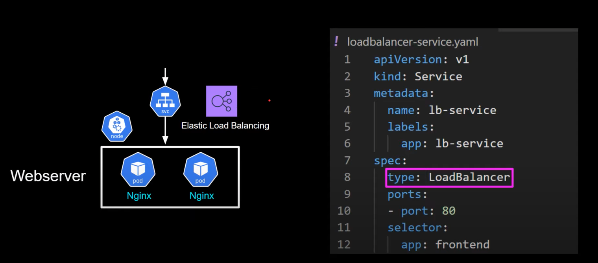
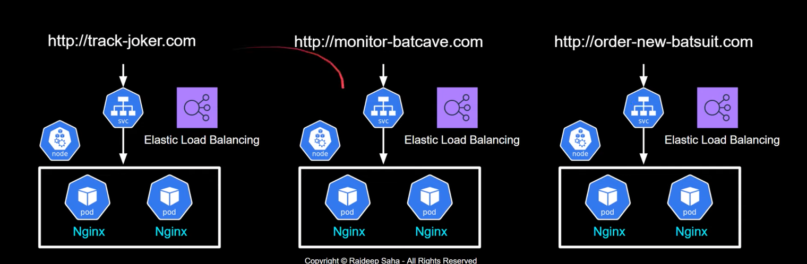
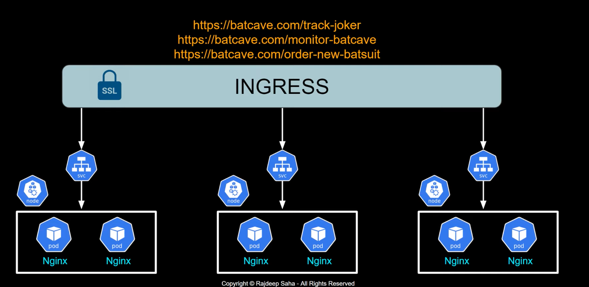
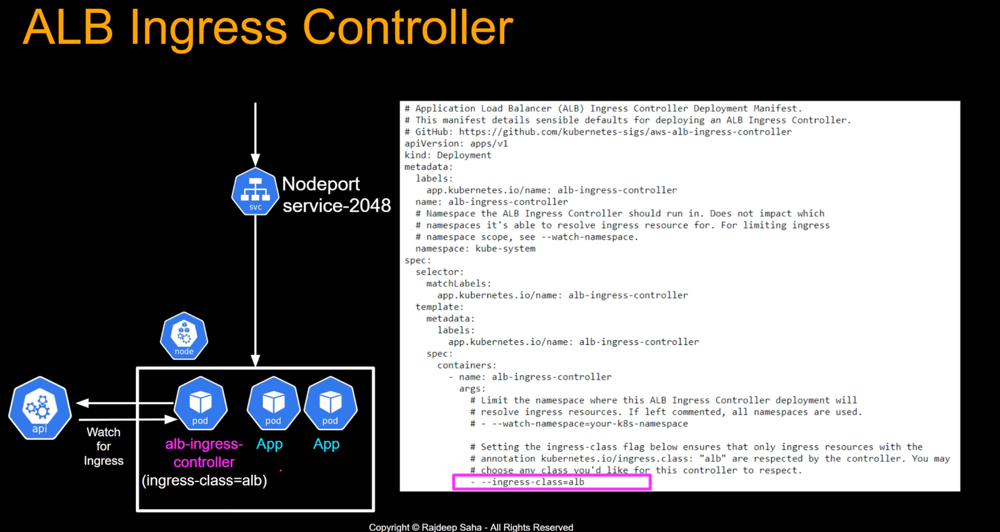
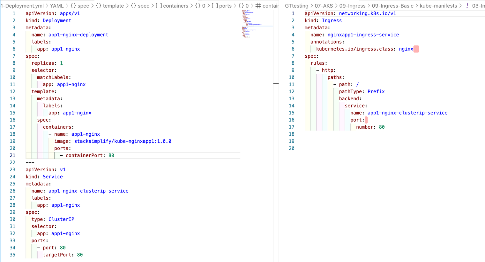
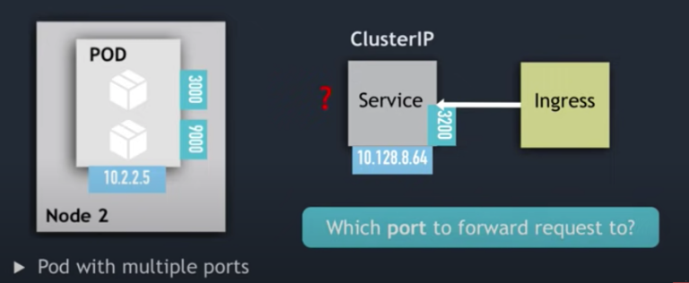
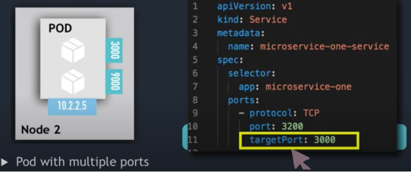
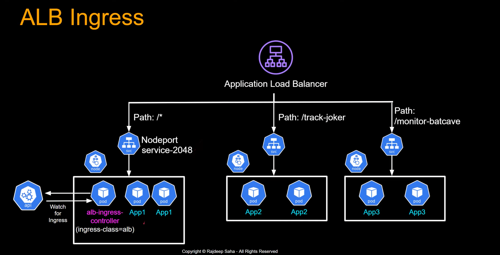
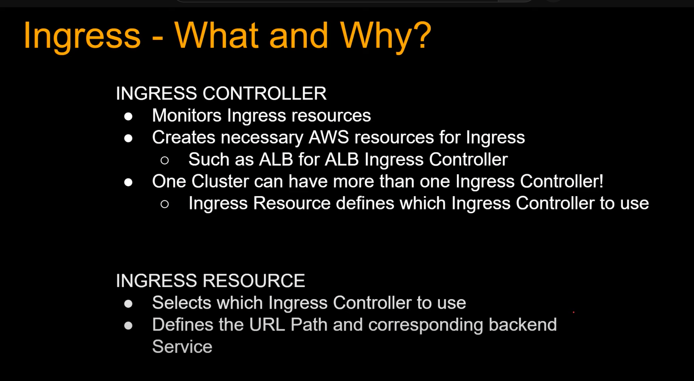

# Ingress - Basics

## Retrieving the Ingress Controller External IP (Terraform)

There may be times when the NGINX Ingress external IP (load balancer) is needed while configuring deployments. Below is example code showing how to retrieve it using a Terraform data call:

```hcl
data "kubernetes_service" "example" {
  metadata {
    name      = "ingress-nginx-controller"
    namespace = "ingress-nginx"
  }
}

output "test" {
  value = data.kubernetes_service.example.status[0].load_balancer[0].ingress[0].ip
}
```

## Step-01: Introduction

[](https://www.udemy.com/course/aws-eks-kubernetes-masterclass-devops-microservices/?referralCode=257C9AD5B5AF8D12D1E1)

## Step-02: Create a Static Public IP

```bash
# Get the resource group name of the AKS cluster
az aks show --resource-group aks-rg1 --name aksdemo1 --query nodeResourceGroup -o tsv

# Template - create a public IP address with static allocation
az network public-ip create --resource-group <REPLACE-OUTPUT-RG-FROM-PREVIOUS-COMMAND> --name myAKSPublicIPForIngress --sku Standard --allocation-method static --query publicIp.ipAddress -o tsv

# Example - replace the resource group value
az network public-ip create --resource-group MC_aks-rg1_aksdemo1_centralus --name myAKSPublicIPForIngress --sku Standard --allocation-method static --query publicIp.ipAddress -o tsv
```

Make a note of the static IP, which will be used in the next step when installing the Ingress Controller:

```
52.154.156.139
```

## Step-03: Install the Ingress Controller

```bash
# Install Helm3 (if not installed)
brew install helm

# Create a namespace for your ingress resources
kubectl create namespace ingress-basic

# Add the official stable repository
helm repo add ingress-nginx https://kubernetes.github.io/ingress-nginx
helm repo update

# Inspect available values before installing
helm show values ingress-nginx/ingress-nginx

# Template - deploy NGINX ingress controller using Helm
helm install ingress-nginx ingress-nginx/ingress-nginx \
    --namespace ingress-basic \
    --set controller.replicaCount=2 \
    --set controller.nodeSelector."kubernetes\.io/os"=linux \
    --set defaultBackend.nodeSelector."kubernetes\.io/os"=linux \
    --set controller.service.externalTrafficPolicy=Local \
    --set controller.service.loadBalancerIP="REPLACE_STATIC_IP"

# Example - replace with the static IP captured in Step-02
helm install ingress-nginx ingress-nginx/ingress-nginx \
    --namespace ingress-basic \
    --set controller.replicaCount=2 \
    --set controller.nodeSelector."kubernetes\.io/os"=linux \
    --set defaultBackend.nodeSelector."kubernetes\.io/os"=linux \
    --set controller.service.externalTrafficPolicy=Local \
    --set controller.service.loadBalancerIP="52.154.156.139"

# List services with labels
kubectl get service -l app.kubernetes.io/name=ingress-nginx --namespace ingress-basic

# List pods
kubectl get pods -n ingress-basic
kubectl get all -n ingress-basic

# Access the public IP — expect a 404 Not Found response from Nginx
# http://<Public-IP-created-for-Ingress>

# Verify the load balancer in the Azure Portal under Settings -> Frontend IP Configuration
```

## Step-05: Deploy Application Manifests and Verify

```bash
# Deploy
kubectl apply -f kube-manifests/

# List pods
kubectl get pods

# List services
kubectl get svc

# List ingress resources
kubectl get ingress

# Access the application
# http://<Public-IP-created-for-Ingress>/app1/index.html
# http://<Public-IP-created-for-Ingress>

# Verify Ingress Controller logs
kubectl get pods -n ingress-basic
kubectl logs -f <pod-name> -n ingress-basic
```

## Step-06: Clean Up Apps

```bash
kubectl delete -f kube-manifests/
```

## How Ingress Works

A typical setup without Ingress looks like this:



When you have multiple services, each needing its own load balancer, the cost and complexity grows:


Ingress solves this by acting as a single entry point that routes traffic to multiple services:




The routing chain works as follows:


- **Deployment** has a label: `app: app1-nginx`
- **Service** uses a selector: `app: app1-nginx`
- **Ingress** defines a path and points to the service `app1-nginx-clusterip-service`

In short, the Ingress rule says:
- For path `/`, route to service `app1-nginx-clusterip-service`
- The service then forwards to the pod matching its selector
- A DNS record maps a hostname to the Ingress IP address

When a pod has multiple containers, the service uses the `targetPort` to forward to the correct container port:




The target port (for example, `3000`) is matched using labels:

- Path `/` routes to one service
- Path `/track-joker` routes to another



