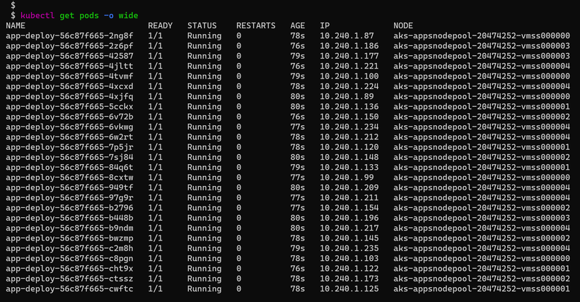

### Kubernetes Nodepools Explained

Tutorial available here:
https://techcommunity.microsoft.com/t5/core-infrastructure-and-security/kubernetes-nodepools-explained/ba-p/2531581


- In a Kubernetes cluster, the containers are deployed as pods into VMs called worker nodes.

- These nodes are identical as they use the same VM size or SKU.

- This was just fine until we realized we might need nodes with different SKU for the following reasons:

 
- Prefer to deploy Kubernetes system pods (like CoreDNS, metrics-server, Gatekeeper addon) and application pods on different dedicated nodes. 


 However, we can add nodepools during or after cluster creation. We can also remove these nodepools at any time. There are 2 types of nodepools:

 

##### 1. System nodepool:
   Used to preferably deploy system pods. Kubernetes could have multiple system nodepools. At least one nodepool is required with at least one single node. System nodepools must run only on Linux due to the dependency to Linux components (no support for Windows).

#### 2. User nodepool:
 used to preferably deploy application pods. Kubernetes could have multiple user nodepools or none. All user nodepools could scale down to zero nodes. A user nodepool could run on Linux or Windows nodes.

 
### 1. Create an AKS cluster with one single system nodepool
```yml
 $ az group create -n aks-cluster -l westeurope                            
 $ az aks create -n aks-cluster -g aks-cluster
```

- This will create a new cluster with one single nodepool called agentpool with 3 nodes.

```yml
$ kubectl get nodes
```


- This node pool is of type System. It doesn't have any taints. Taints allows a node to ‘accept’ only some pods to be deployed. 
- The only pods that could be deployed are the ones using a specific Toleration. In other words, the node says « I cannot accept any pod except the ones tolerating my taints ». And the pods says « I could be deployed on that node because I have the required toleration ». 

 
```yml
 $ kubectl get nodes -o json | jq '.items[].spec.taints'
```


But it has some labels for its nodes. Let's show the labels with the following command:

 
```yml
$ kubectl get nodes -o json | jq '.items[].metadata.labels'
```


### 2. Add a new user nodepool for the user applications

 
```yml
$ az aks nodepool add `
     --resource-group aks-cluster `
     --cluster-name aks-cluster `
     --name appsnodepool `
     --node-count 5 `
     --node-vm-size Standard_B2ms `
     --kubernetes-version 1.20.7 `
     --max-pods 30 `
     --priority Regular `
     --zones 3 `
     --mode User
```


We can then view the 2 nodepools from the portal or command line.
 
```yml
 $ az aks nodepool list --cluster-name aks-cluster --resource-group aks-cluster -o table
```


The end result of adding a new nodepool should be like the following:


### 3. Deploy an application into a specific nodepool.

 
By default, if we deploy a pod into the cluster, it could be deployed into any of the 2 nodepools.

However, we can choose to target a specific nodepool using Labels on nodepools and nodeSelector from deployment/pods.

Each nodepool have its own set of labels like the agent pool name ("agentpool": "appsnodepool",). We can use the label to target the nodes by using nodeSelector from the deployment file. 

Let's show the labels of one of one of the users nodepool nodes with the following command. Make sure to replace the node name.

 
```yml
$ kubectl get node aks-appsnodepool-20474252-vmss000001 -o json | jq '.metadata.labels'
 
```
```yml
{
  "agentpool": "appsnodepool",
  "beta.kubernetes.io/arch": "amd64",
  "beta.kubernetes.io/instance-type": "Standard_B2ms",
  "beta.kubernetes.io/os": "linux",
  "failure-domain.beta.kubernetes.io/region": "westeurope",
  "failure-domain.beta.kubernetes.io/zone": "westeurope-3",
  "kubernetes.azure.com/cluster": "MC_aks-cluster_aks-cluster_westeurope",
  "kubernetes.azure.com/node-image-version": "AKSUbuntu-1804gen2containerd-2021.05.19",
  "kubernetes.azure.com/role": "agent",
  "kubernetes.io/arch": "amd64",
  "kubernetes.io/hostname": "aks-appsnodepool-20474252-vmss000001",
  "kubernetes.io/os": "linux",
  "kubernetes.io/role": "agent",
  "node-role.kubernetes.io/agent": "",
  "node.kubernetes.io/instance-type": "Standard_B2ms",
  "storageprofile": "managed",
  "storagetier": "Premium_LRS",
  "topology.kubernetes.io/region": "westeurope",
  "topology.kubernetes.io/zone": "westeurope-3"
}
```
- Let's consider the following yaml deployment using the nodeSelector of pool name:

 
```yml
# app-deploy.yaml
apiVersion: apps/v1
kind: Deployment
metadata:
  labels:
    app: app-deploy
  name: app-deploy
spec:
  replicas: 100
  selector:
    matchLabels:
      app: app-deploy
  template:
    metadata:
      labels:
        app: app-deploy
    spec:
      containers:
      - image: nginx
        name: nginx
      nodeSelector:
        agentpool: appsnodepool
```

- Let's deploy the yaml file.

 
```yml
$ kubectl apply -f app-deploy.yaml
```

Note how all the 100 pods are all deployed to the same user nodepool.

 
```yml
$ kubectl get pods -o wide
``` 



#### 4 Deploying system pods into system nodepool

 

The application pods will be deployed only to the user nodepool. However, the system pods could be rescheduled to the user nodepool. We don't want that to happen as we want to physically isolate these critical system pods. The solution here is to use Taints on the nodepool and Tolerations on the pods.

System pods like CoreDNS already have default tolerations like CriticalAddonsOnly.

 
```yml
      tolerations:
        - key: CriticalAddonsOnly
          operator: Exists
```

 
```yml
$ kubectl get deployment coredns -n kube-system -o json | jq ".spec.template.spec.tolerations"
```


To allow these system pods to be deployed only to system nodepool, we need to make sure the system nodepool defines a taint with the same name. As seen earlier, the system nodepool doesn't have any taints by default. Unfortunately, we can add taints only during nodepool creation, not after. So we need to create a new system nodepool with taint (CriticalAddonsOnly=true:NoSchedule).

```yml

$ az aks nodepool add `
     --resource-group aks-cluster `
     --cluster-name aks-cluster `
     --name systempool `
     --node-count 3 `
     --node-vm-size Standard_D2s_v4 `
     --kubernetes-version 1.20.7 `
     --max-pods 30 `
     --priority Regular `
     --zones 1, 2, 3 `
     --node-taints CriticalAddonsOnly=true:NoSchedule `
     --mode System
``` 

The same thing could be achieved using the Azure portal :


System pods will still run on old system nodepool until we drain that nodepool or delete it.

Let’s go to delete it from the portal or the following command.

 
```yml
$ az aks nodepool delete --cluster-name aks-cluster --resource-group aks-cluster --name agentpool
```

Let’s now verify that system pods (except the DaemonSets) are deployed only into the new system nodepool nodes :

 
```yml
$ kubectl get pods -n kube-system -o wide
```


Note that it is possible to force pods to be scheduled into the system nodepool by adding the following toleration to the pod or the deployment. This should be done to the components like Calico, Prometheus, Elasticsearch…

 
```yml
      tolerations:
        - key: CriticalAddonsOnly
          operator: Exists
```

 

1. Using Nodepools to upgrade the cluster with less risk.

 

Upgrading the entire cluster (control plane and all nodepools) might be a risky operation. Nodepools could be leveraged to reduce this risk. Instead of upgrading the nodepool, we proceed with blue/green upgrade:

Upgrade only the control plane to the newer version. 
az aks upgrade –name N --resource-group G --control-plane-only​
Create a new nodepool with the newer k8s version.
Deploy the application pods in the newer nodepool.
Verify the application works fine on the new nodepool.
Delete the old nodepool.
