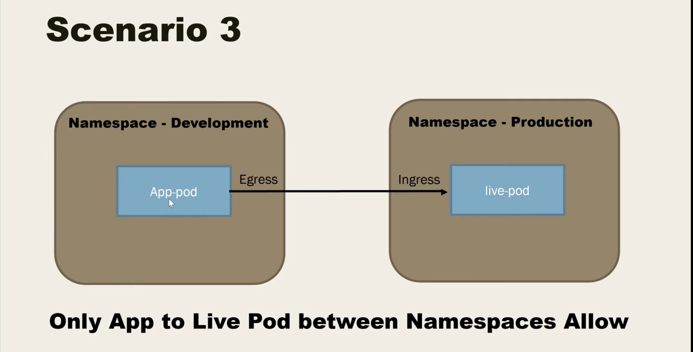

# Network Policy for Kubernetes Cluster

- Within a pod, containers can communicate without any restrictions. Containers within a pod exist within the same network namespace and share an IP. This means containers can communicate over localhost. Pods can communicate with each other using the pod IP address, which is reachable across the cluster.

# Default Deny 


- No namespace:  so it will be deployed to the default namespace. 

- Pod selector:  is empty so applied to all Pod in the namespace 

1) If we create two pods, they can communicate by default 

2) Apply the above policy and it will fail 


```bash
apiVersion: networking.k8s.io/v1
kind: NetworkPolicy
metadata:
  name: allow-egress
  namespace: development
spec:
  podSelector:
    matchLabels:
      run: app-pod  (pod name is app pod)
  policyTypes:
  - Egress
  egress:
  - to:
    - podSelector:
        matchLabels:
        run: dp pod 
```        
# In the above network policy 

- We have namespace 

- pod app-pod will have egress connect to dp pod 

```bash

apiVersion: networking.k8s.io/v1
kind: NetworkPolicy
metadata:
  name: allow-ingress
  namespace: development
spec:
  podSelector:
    matchLabels:
      run: db-pod
  policyTypes:
  - Ingress
  ingress:
  - from:
    - podSelector:
        matchLabels:
          run: app-pod

```          
Same as above 



=====================================================================