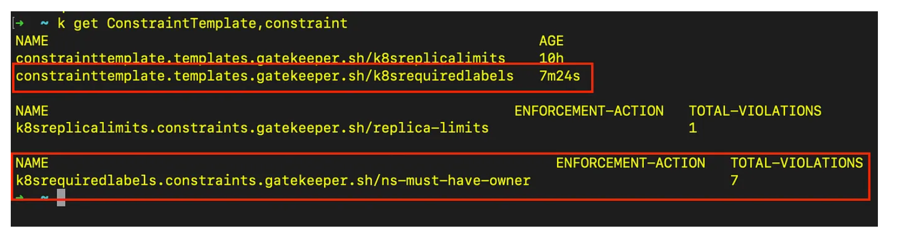
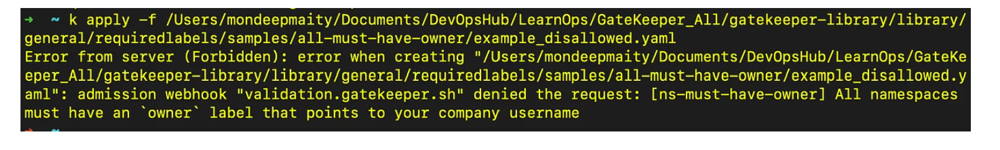

https://medium.com/@maity.mondeep/manage-kubernetes-cluster-policies-via-gatekeeper-opa-491720477fa2

#### When you do a k apply –f deployment.yaml 
1)	It authenticates  and authorization and admission controller checks weather the reqies is secure and compliant then its deploys 

#### Process involved in Gatekeeper implementation 
 1)	Intsall gatekeeper
 2)	Create a constraint thenplete (rego)
 3)	Create constraint CRD
 4)	Create deploy and test 

# k8s-opa-gatekeeper-demo

This project is demoing OPA Gatekeeper with Kubernetes. Gatekeeper is an opensource project supported by CNCF. It aims for creating policies to manage Kubernetes like:

* Enforcing labels on namespaces.
* Allowing only images coming from certain Docker Registries.
* Require all Pods specify resource requests and limits.
* Prevent conflicting Ingress objects from being created.
* Enforcing running containers as non-root.

Watch the video here: https://youtu.be/urvSPmlU69k


#### What is OPA Gatekeeper?
- Gatekeeper is a tool that enables you to audit and enforce policies on your Kubernetes cluster in an automated way. 
- All these policies are written in rego language. It’s a K8s-specific of OPA [Open Policy Agent] running as validating Admission Controller.

#### Why You Need Gatekeeper?

- To bring some governance there so we can set some limits, rules via policy as per best practices. To configure those policies we can configure OPA Gatekeeper.

#### How does OPA Gatekeeper work?
- The gatekeeper acts as a bridge between the Kubernetes API server and OPA. 
- It means that Gatekeeper checks every request that comes into the cluster to see if it violates any of the predefined policies. 
- OPA generates policy decisions by evaluating the query input against policies and data. For example, if you’re trying to create 10 replicas for your dev application and the constraint is set as a maximum of 5, OPA will reject the deployment. 


### Understand Policy
So, when we are talking about policies, to understand the policy you need to know about a few things as must to know like CRD, ConstraintTemplate, and Constraints. Let's try to understand these things in a simplified way.

#### CRD:
- The CustomResourceDefinition ( CRD ) API allows us to define custom resources. 
- Defining a CRD object creates a new custom resource with a name and schema that we specify. 
- The Kubernetes API serves and handles the storage of your custom resources.
- Here Gatekeeper uses CRD internally to allow us to define Constraint Templates, Constraints so we can apply policies.

#### Constraint Templates:
- ConstraintTemplates define a way to validate some set of Kubernetes objects in the Admission Controller. 
- This is where you can configure your policies and customize them as per your needs as well as when a policy doesn’t meet you can customize the message as well so the error will be clear for the end user to take necessary actions. This policy needs to be written in Rego.

#### Constraints:
- A Constraint is a declaration of requirements that a system needs to meet. 
- In other words, Constraints are used to inform Gatekeeper that the admin wants a ConstraintTemplate to be enforced, and how. 
- In layman's terms, it's an argument for your function. Here you can refer function as your ConstraintTemplates.


### Configure Gatekeeper
```
helm repo add gatekeeper https://open-policy-agent.github.io/gatekeeper/charts
helm repo update
helm install gatekeeper/gatekeeper gatekeeper --namespace gatekeeper-system --create-namespace
```
- Here am using “gatekeeper” as my Helm Release name. So, once this will be done you should be able to see some pods, services, cluster roles, secrets, and CRD got created.


- Also, you’ll see both mutating webhook configuration and validating webhook configuration resources created as well.


- Alright, So we are good with Gatekeeper installation now, let's configure some policies on top of it and play around with it.

#### Gatekeeper Policy Test
- To start with simply, we will enforce a policy where you can’t create a namespace without “owner” project labels. Below I have added Constraint Templates and Constraints as follows. I have added some comments in the code section so you can understand it better.
```
apiVersion: templates.gatekeeper.sh/v1
kind: ConstraintTemplate
metadata:
  name: k8srequiredlabels
  annotations:
    metadata.gatekeeper.sh/title: "Required Labels"
    metadata.gatekeeper.sh/version: 1.0.0
    description: >-
      Requires resources to contain specified labels, with values matching
      provided regular expressions.
spec:
  crd:
    spec:
      names:
        kind: K8sRequiredLabels
      validation:
        openAPIV3Schema:
          type: object
          properties:
            message:
              type: string
            labels:
              type: array
              description: >-
                A list of labels and values the object must specify.
              items:
                type: object
                properties:
                  key:
                    type: string
                    description: >-
                      The required label.
                  allowedRegex:
                    type: string
                    description: >-
                      If specified, a regular expression the annotation's value
                      must match. The value must contain at least one match for
                      the regular expression.
  targets:
    - target: admission.k8s.gatekeeper.sh
      rego: |
        ## Defines the package name of the module
        package k8srequiredlabels

        get_message(parameters, _default) = msg {
          not parameters.message
          msg := _default
        }

        get_message(parameters, _default) = msg {
          msg := parameters.message
        }
        ## Defining the violation rule. The violation rule schema must be followed for it to be considered a valid ConstraintTemplate, which is {"msg": string, "details" set}
        violation[{"msg": msg, "details": {"missing_labels": missing}}] {
          ## 'provided' variable is a set with all the labels from the object currently being evaluated by gatekeeper
          provided := {label | input.review.object.metadata.labels[label]}
          ## 'required' variable is a set with all the labels from the Constraint parameters 
          required := {label | label := input.parameters.labels[_].key}
          ## 'missing' variable is a set the difference in value between required and provided
          missing := required - provided
          ## if there are more than zero values in the set 'missing' evaluate to true
          count(missing) > 0
          ## 'msg' variable is declared.
          def_msg := sprintf("you must provide labels: %v", [missing])
          msg := get_message(input.parameters, def_msg)
        }

        violation[{"msg": msg}] {
          value := input.review.object.metadata.labels[key]
          expected := input.parameters.labels[_]
          expected.key == key
          # do not match if allowedRegex is not defined, or is an empty string
          expected.allowedRegex != ""
          not re_match(expected.allowedRegex, value)
          def_msg := sprintf("Label <%v: %v> does not satisfy allowed regex: %v", [key, value, expected.allowedRegex])
          msg := get_message(input.parameters, def_msg)
        }
```
```
apiVersion: constraints.gatekeeper.sh/v1beta1
kind: K8sRequiredLabels
metadata:
  name: ns-must-have-owner
spec:
  match:
    kinds:
      - apiGroups: [""]
        kinds: ["Namespace"]
  parameters:
    message: "All namespaces must have an `owner` label that points to your company username"
    labels:
      - key: owner
        allowedRegex: "^[a-zA-Z]+.LearnOps$"
```
- After applying both files I can see them as below. You can see it’s showing 7 violations for the existing namespaces.


Constraint Template and Constraints
- Alright, let's try to create a namespace without a label and see if it rejects the request or not.
```
apiVersion: v1
kind: Namespace
metadata:
  name: expected-to-be-fail
```

That’s it, 🔴 it rejected the namespace creation request as expected since it doesn’t have an “owner” tag. Let’s try to add the “owner” tag now and try to create it again 🙌
```
apiVersion: v1
kind: Namespace
metadata:
  name: expected-to-be-working
  labels:
    owner: mondeepmaity.LearnOps
```

- Voila! ✅ Our Namespace got created when we are following proper labels as defined by the policy.

- So this is how you can configure other policies as well as per the project needs. am not going to add more examples here as the post will be longer and eventually you might lose interest to Read it 😄

- Here am going to share some links which can be useful for you to proceed you can customize them as per your needs and configure them for your cluster to make it more secure, and under control and apply proper governance across it.

GeneralPolicies:- https://github.com/open-policy-agent/gatekeeper-library/tree/master/library/general

PodSecurityPolicies:- https://github.com/open-policy-agent/gatekeeper-library/tree/master/library/pod-security-policy

#### Dry Run enforcement action​
- When rolling out new constraints to running clusters, the dry run functionality can be helpful as it enables constraints to be deployed in the cluster without making actual changes. This allows constraints to be tested in a running cluster without enforcing them. Cluster resources that are impacted by the dry run constraint are surfaced as violations in the status field of the constraint.

- To use the dry run feature, add enforcementAction: dryrun to the constraint spec to ensure no actual changes are made as a result of the constraint. By default, enforcementAction is set to deny as the default behavior is to deny admission requests with any violation.

#### Warn enforcement action
Warn enforcement action offers the same benefits as a dry run, such as testing constraints without enforcing them. In addition to this, it will also provide immediate feedback on why that constraint would have been denied.

#### Config Resource
The config resource can be used to exclude namespaces, and sync resources from certain processes for all constraints in the cluster. An asterisk can be used for wildcard matching (e.g. kube-*). To exclude namespaces at a constraint level, use excludedNamespaces the constraint instead.

Some constraints are impossible to write without access to more states than just the object under test. For example, it is impossible to know if an ingress’s hostname is unique among all ingresses unless a rule has access to all other ingresses. To make such rules possible, we enable syncing of data into OPA.

The audit feature does not require replication by default. However, when the audit-from-cache the flag is set to true, the OPA cache will be used as the source of truth for audit queries; thus, an object must first be cached before it can be audited for constraint violations.

Kubernetes data can be replicated into OPA via the sync config resource. Currently, the resources defined syncOnly will be synced into OPA. Updating syncOnly should dynamically update what objects are synced. Below is an example:
```
apiVersion: config.gatekeeper.sh/v1alpha1
kind: Config
metadata:
 name: config
 namespace: "gatekeeper-system"
spec:
  sync:
    syncOnly:
      - group: ""
        version: "v1"
        kind: "Namespace"
      - group: ""
        version: "v1"
        kind: "Pod"
  match:
    - excludedNamespaces: ["kube-*"]
      processes: ["*"]
    - excludedNamespaces: ["audit-excluded-ns"]
      processes: ["audit"]
```      
- To summarize things
You can implement the validating and mutating policies in Kubernetes using the OPA gatekeeper.
Rego enables you to define complex logic for the policies. but it’s not easy to learn rego. However, “Gatekeeper-Library” is a very good repo to start with and learn, and then you can start writing on your own.
You can create a Constraint of a kind only if the constraint template of that kind is already defined.
When rolling out new constraints to running clusters, the dry run functionality can be helpful.
Please read my other articles as well and feel free to share your valuable feedback. If you like the content please 👏, comment, and follow for upcoming articles.