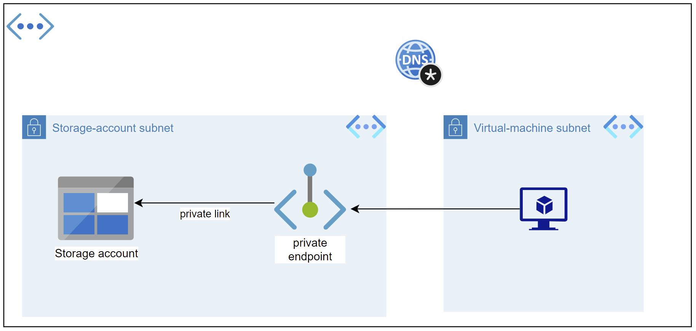

Private Endpoints grant network access to specific resources behind a given service providing granular segmentation. Traffic can reach the service resource from on premises without using public endpoints.

A Service Endpoint remains a publicly routable IP address. A Private Endpoint is a private IP in the address space of the virtual network where the private endpoint is configured.

For simplicity, let's take the view of a VM in a VNET connecting to a storage account in the same subscription and same Azure region. There are three ways to connect.

# Default

By default all traffic goes against the public endpoint of the storage account. Source IP of the traffic is the Public IP of the VM.

# Service Endpoints

Traffic is still directed against the public endpoint of the storage account but the source IP has changed to the private IP of the VM. In fact, the traffic is also using the VNET and Subnet as source in the network dataframe.

# Private Endpoints

The PaaS service now gets a virtual network interface inside the subnet and traffic from the VM to the storage account is now directed against the private IP address.

# Private Endpoints
