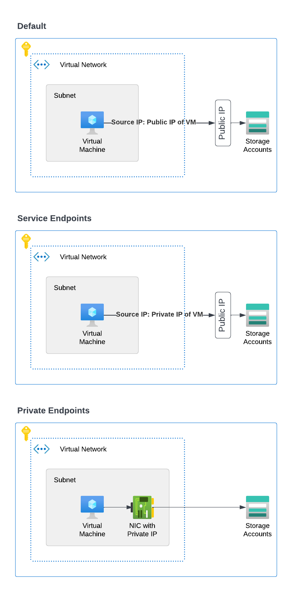
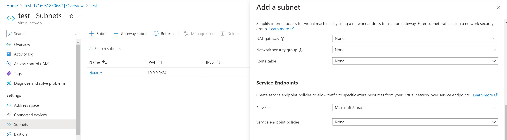
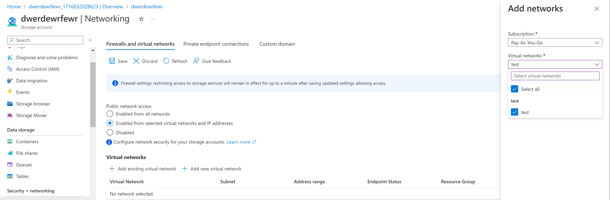
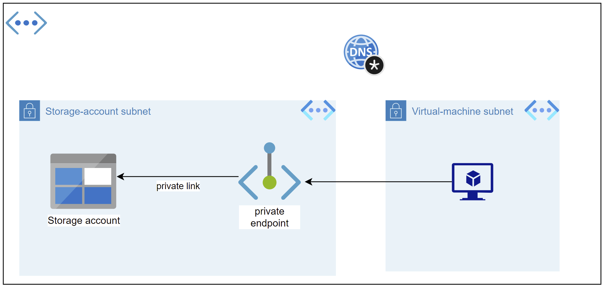
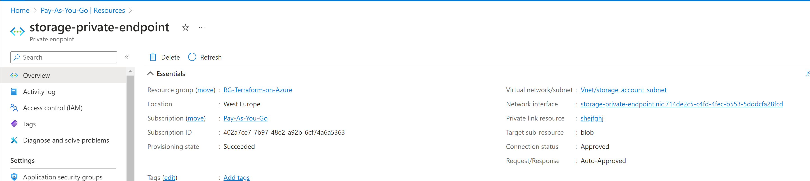
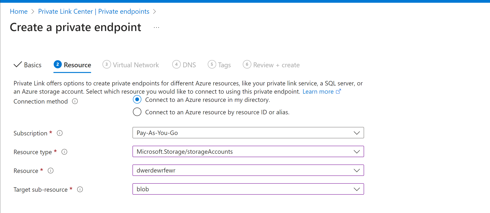
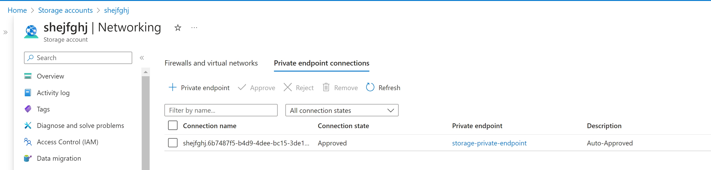
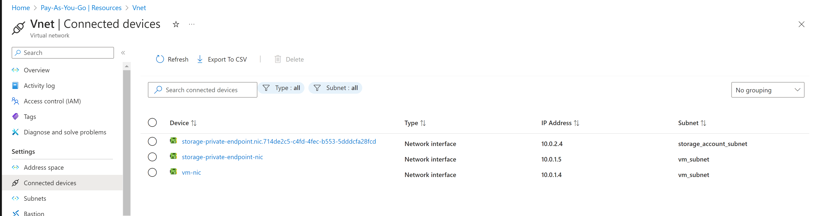
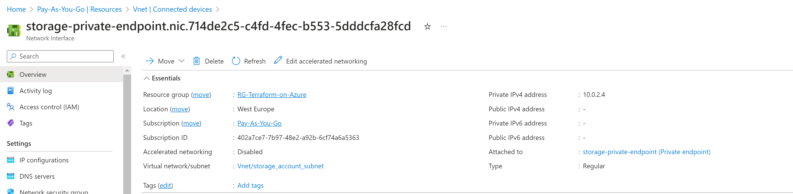

# Private Endpoints vs Service Endpoints

## Overview

- **Private Endpoints** grant network access to specific resources behind a given service, providing granular segmentation. Traffic can reach the service resource from on-premises without using public endpoints.

- A **Service Endpoint** remains a publicly routable IP address. A **Private Endpoint** is a private IP in the address space of the virtual network where the private endpoint is configured.

For simplicity, consider a VM in a VNet connecting to a storage account in the same subscription and the same Azure region. There are three ways to connect:

## Default

By default, all traffic goes to the public endpoint of the storage account. The source IP of the traffic is the public IP of the VM.

## Service Endpoints

Traffic is still directed to the public endpoint of the storage account, but the source IP has changed to the private IP of the VM. The traffic also uses the VNet and subnet as the source in the network data frame.

**Step 1:** Create a subnet and enable the service endpoint.

**Step 2:** Add that subnet to the storage account.

Communication can now occur from the subnet to the storage account without going over the internet.

## Private Endpoints

The PaaS service now gets a virtual network interface inside the subnet, and traffic from the VM to the storage account is directed to the private IP address.

**Step 1:** Create a private endpoint.

**Step 2:** Attach it to the storage account.

**Step 3:** Confirm it is attached.

**Step 4:** Check the VNet to verify it is connected.

**Step 5:** Confirm the network interface is attached to the storage account.

## References

- [What is the difference between Service Endpoints and Private Endpoints? (Microsoft Docs)](https://learn.microsoft.com/en-us/azure/private-link/private-link-faq#what-is-the-difference-between-service-endpoints-and-private-endpoints-)
- [YouTube: Private Endpoints vs Service Endpoints](https://www.youtube.com/watch?v=qkeZO0K58Po)
