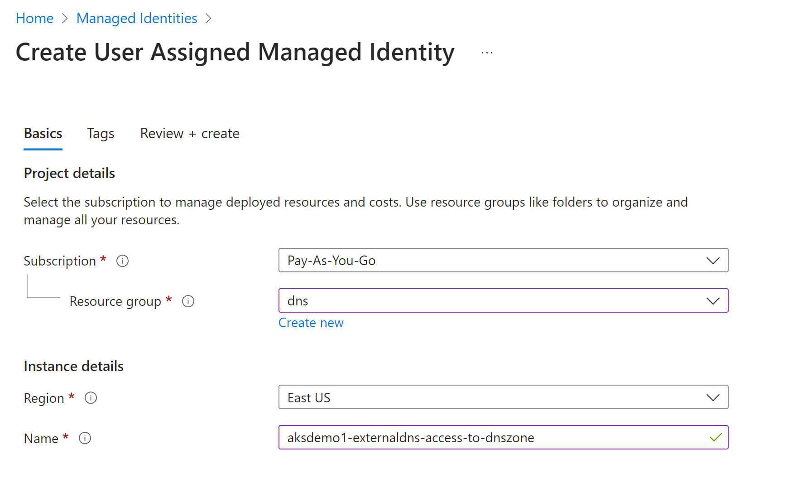
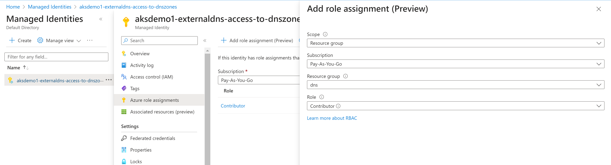
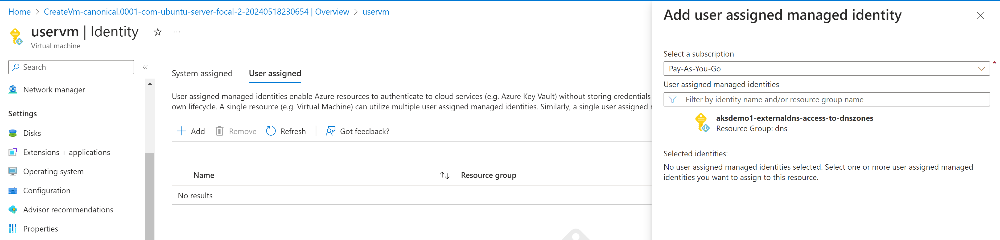

VM wants access to create DNS records


### Create Manged Service Identity (MSI)
- Go to All Services -> Managed Identities -> Add
- Resource Name: aksdemo1-externaldns-access-to-dnszones
- Subscription: Pay-as-you-go
- Resource group: aks-rg1
- Location: Central US
- Click on **Create**


### Add Azure Role Assignment in MSI
- Opem MSI -> aksdemo1-externaldns-access-to-dnszones 
- Click on **Azure Role Assignments** -> **Add role assignment**
- Scope: Resource group
- Subscription: Pay-as-you-go
- Resource group: dns-zones
- Role: Contributor


### Make a note of Client Id and update in azure.json
- Go to **Overview** -> Make a note of **Client ID"
- Update in **azure.json** value for **userAssignedIdentityID**
```
  "userAssignedIdentityID": "de836e14-b1ba-467b-aec2-93f31c027ab7"
```

## Step-04: Associate MSI in AKS Cluster VMSS
- Go to All Services -> Virtual Machine Scale Sets (VMSS) -> Open aksdemo1 related VMSS (aks-agentpool-27193923-vmss)
- Go to Settings -> Identity -> User assigned -> Add -> aksdemo1-externaldns-access-to-dnszones 
