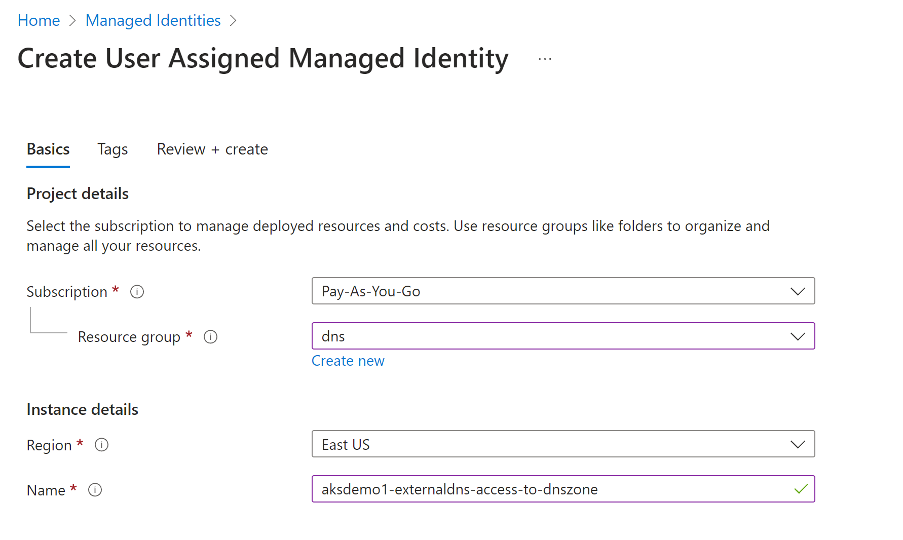
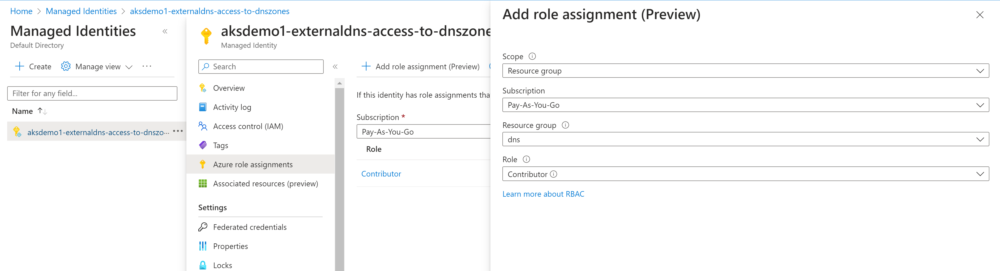
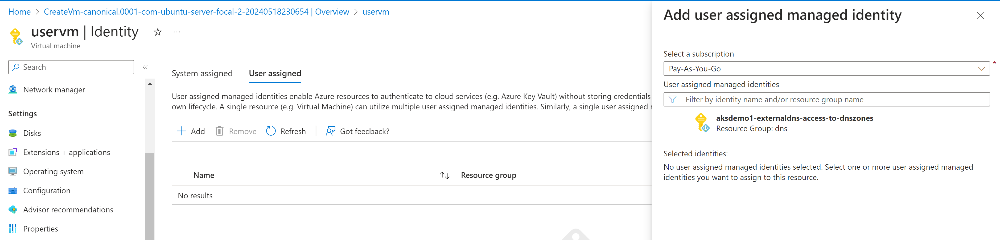
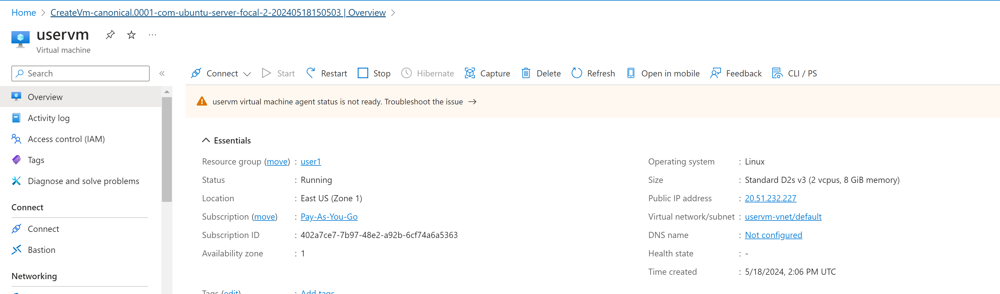
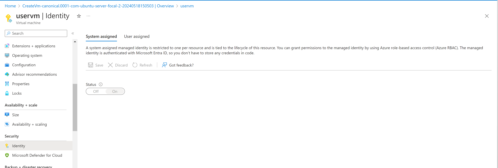
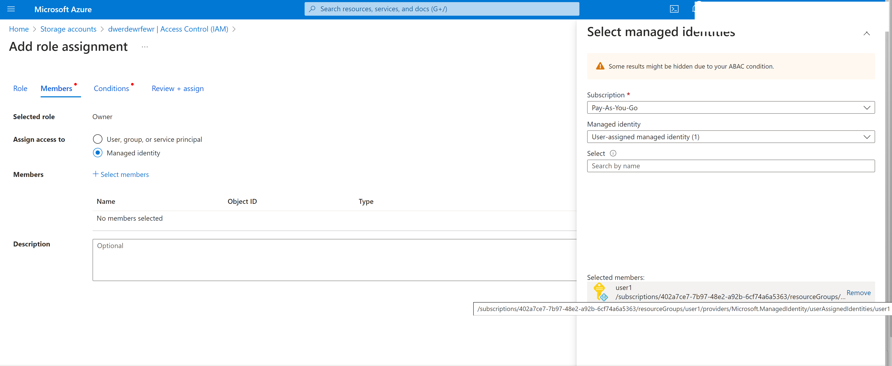
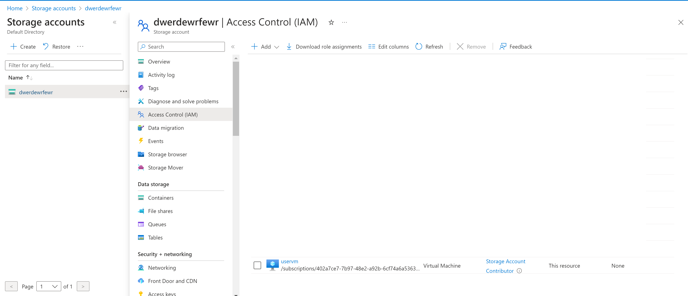
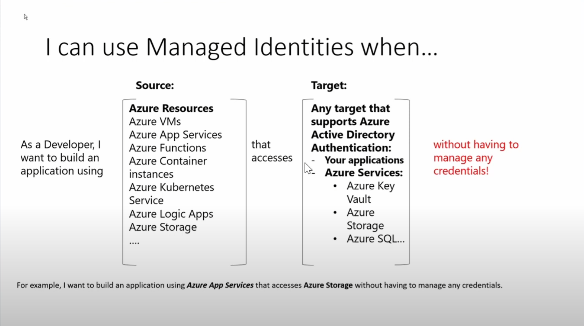

# Azure Managed Identity
> A Managed Identity is an Azure AD identity automatically managed by Azure. It lets resources (VMs, AKS nodes) authenticate to other Azure services without storing credentials in code or config.

## Use Case 1: AKS ExternalDNS — MSI Access to DNS Zones

### Create Managed Service Identity (MSI)
- Go to All Services -> Managed Identities -> Add
- Resource Name: aksdemo1-externaldns-access-to-dnszones
- Subscription: Pay-as-you-go
- Resource group: aks-rg1
- Location: Central US
- Click on **Create**


### Add Azure Role Assignment in MSI
- Open MSI -> aksdemo1-externaldns-access-to-dnszones
- Click on **Azure Role Assignments** -> **Add role assignment**
- Scope: Resource group
- Subscription: Pay-as-you-go
- Resource group: dns-zones
- Role: Contributor


### Make a note of Client ID and update in azure.json
- Go to **Overview** -> Make a note of **Client ID**
- Update in **azure.json** the value for **userAssignedIdentityID**
```json
"userAssignedIdentityID": "de836e14-b1ba-467b-aec2-93f31c027ab7"
```

### Associate MSI with AKS Cluster VMSS
- Go to All Services -> Virtual Machine Scale Sets (VMSS) -> Open AKS-related VMSS (aks-agentpool-27193923-vmss)
- Go to Settings -> Identity -> User assigned -> Add -> aksdemo1-externaldns-access-to-dnszones


---

## Use Case 2: VM Accessing a Storage Account via Managed Identity

- Create a VM


- Turn on Managed Identity on the VM


- Create a Storage Account and assign the VM's managed identity with the appropriate role (e.g. Storage Blob Data Reader)


- Confirm the identity assignment is active




> Reference: https://learn.microsoft.com/en-us/entra/identity/managed-identities-azure-resources/managed-identity-best-practice-recommendations
