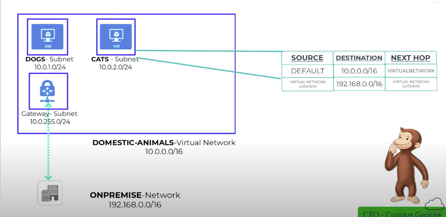
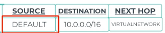
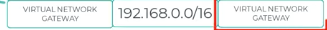
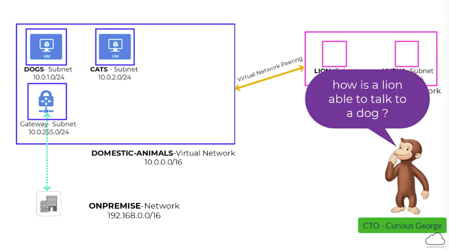
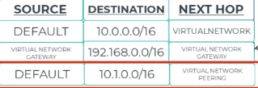
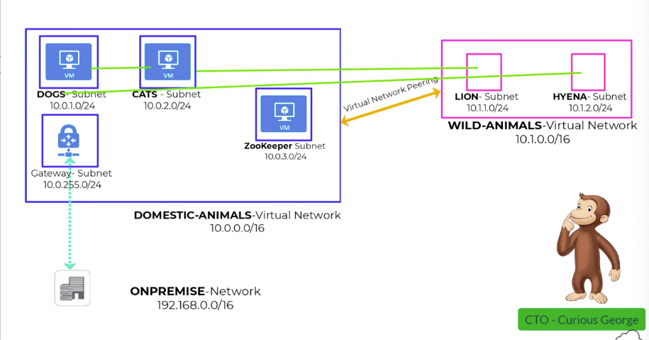
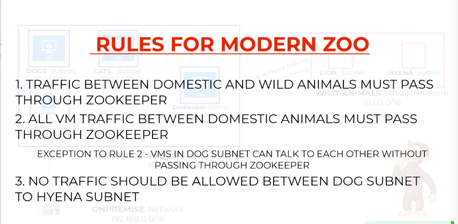
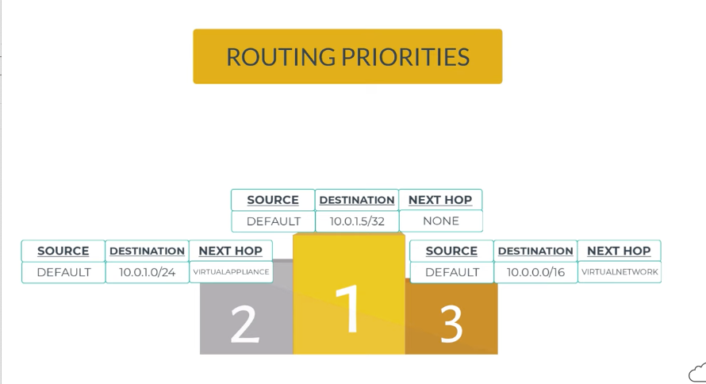
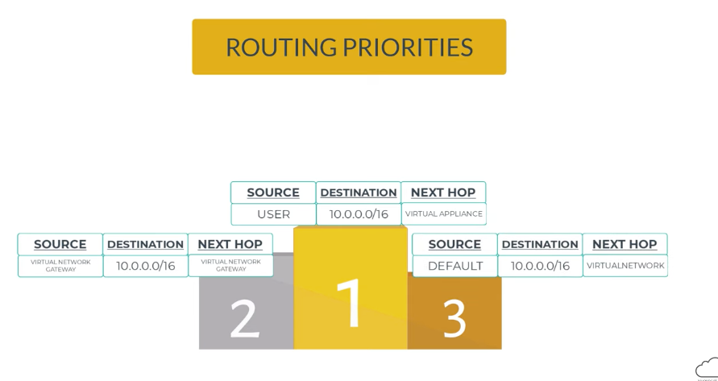
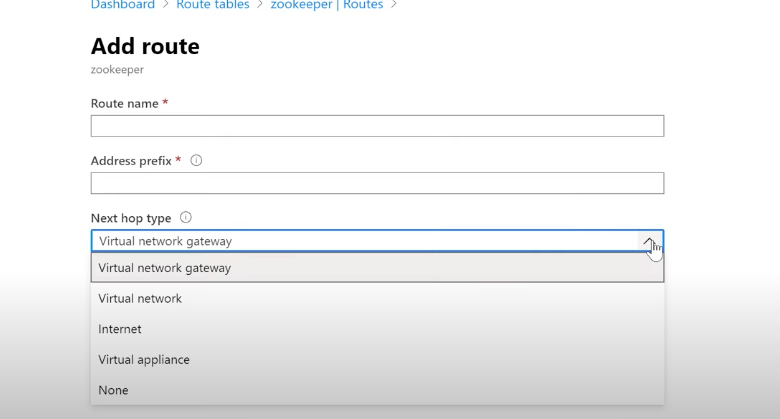

# Azure Routing explained

- How do two VMs communicate within a subnet? :  
- They have a default route (VM--> NIC--> Effective Routes) they are called system routes.

- Next Hop-> Virtual network (route within the Vnet) 

- Source--> Default → who created: default (Azure created it) 

#### How are they communicating to On-premise 

Now 

- There would be route on both as above 

- Now we have a ZOOKeeper 

- Address with the longest subnet mask wins 

- If all the same but different source 

- User DEfined route 

- Create a routeing table 

- None → Blackhole (Rule 3)

- Virtual appliance → Route to IP or subnet (Rule 1 and 2)

- Internet -->

- Virtual network ->default azure route

