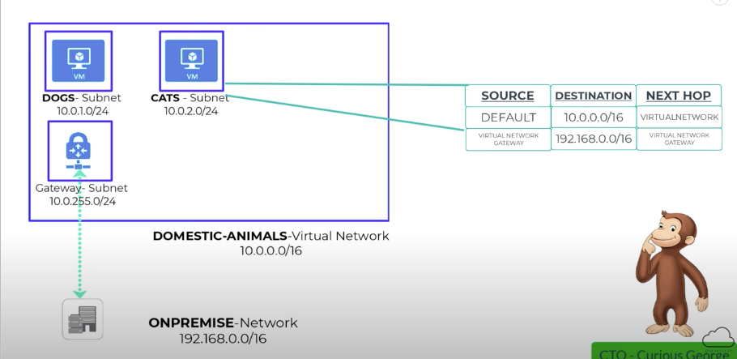
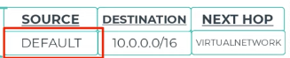
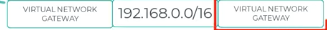
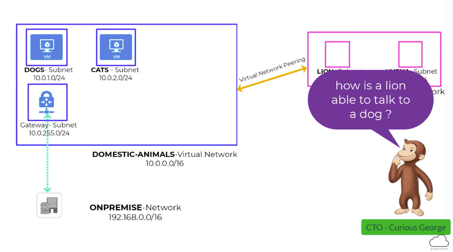
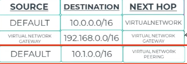
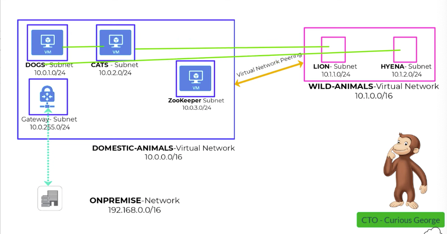
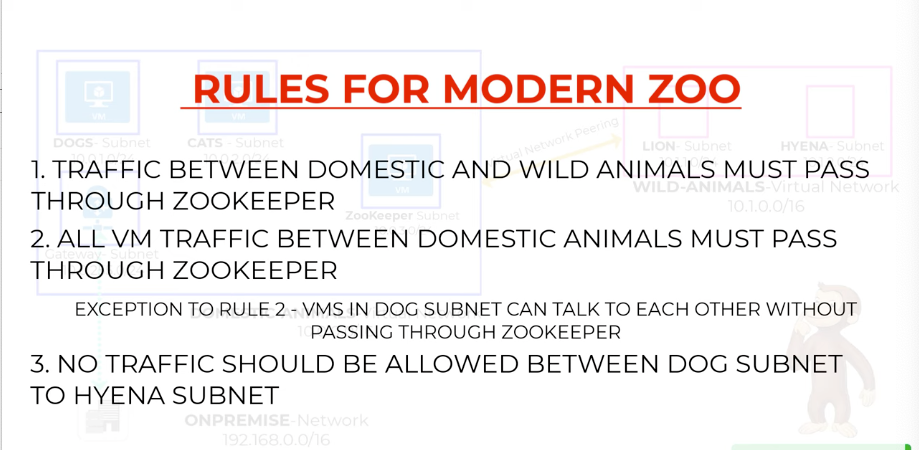
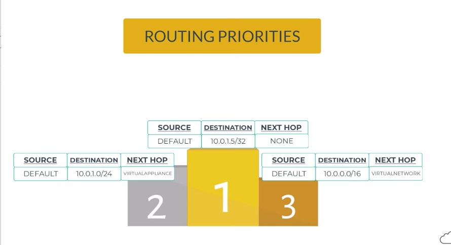
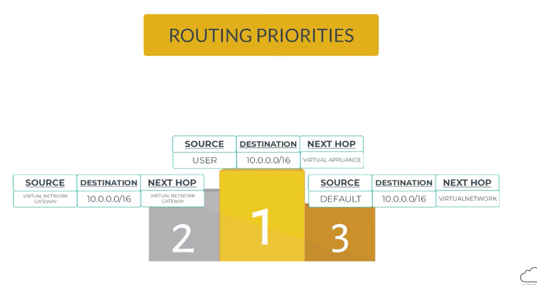
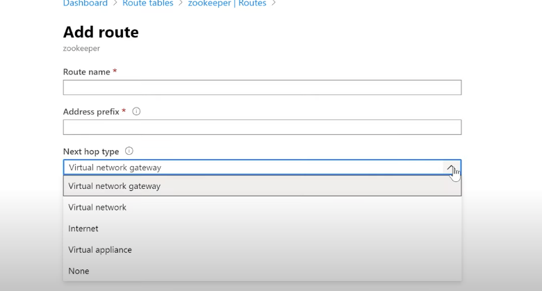

# Azure Routing Explained

This guide explains how Azure routing works, from intra-subnet communication to on-premises connectivity and user-defined routes.

## How Two VMs Communicate Within a Subnet

VMs have a default route accessible via **VM > NIC > Effective Routes**. These are called system routes.

- **Next Hop:** Virtual Network (route within the VNet)
- **Source:** Default — indicates this route was created by Azure

## How VMs Communicate with On-Premises

When connectivity to an on-premises network is configured, routes are added in both directions.

There would be routes on both sides, as shown above.

When multiple routes exist, the address with the **longest subnet mask** wins (most specific route takes priority).

If routes are the same length but have different sources, Azure uses the following priority order:

## User-Defined Routes (UDR)

User-defined routes allow you to override Azure's default system routes and control how traffic flows through your network. To use them, create a routing table and associate it with a subnet.

The **Next Hop** types available in a route are:

- **None** — Blackhole; traffic is dropped (Rule 3)
- **Virtual Appliance** — Route traffic to a specific IP or subnet (Rules 1 and 2)
- **Internet** — Route traffic directly to the internet
- **Virtual Network** — Use the default Azure VNet route

