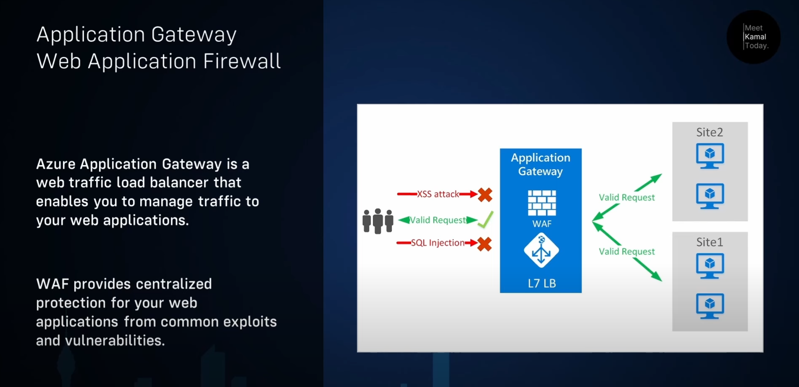
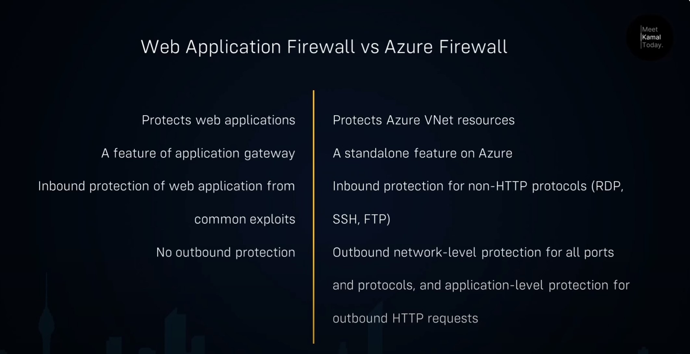
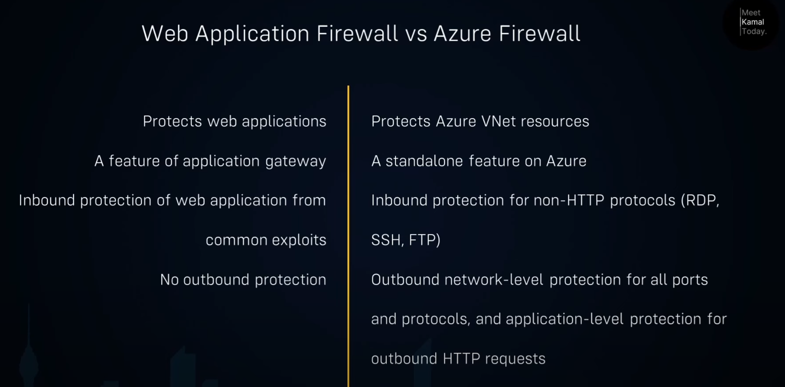
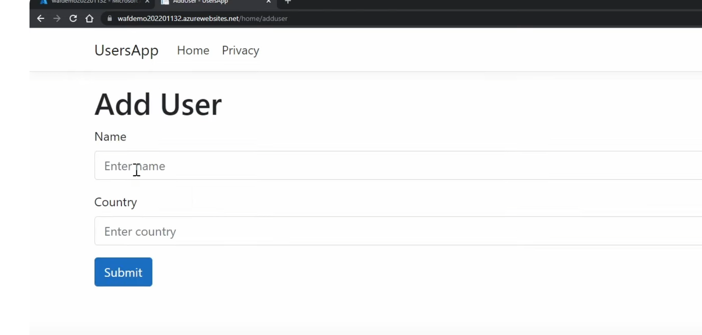
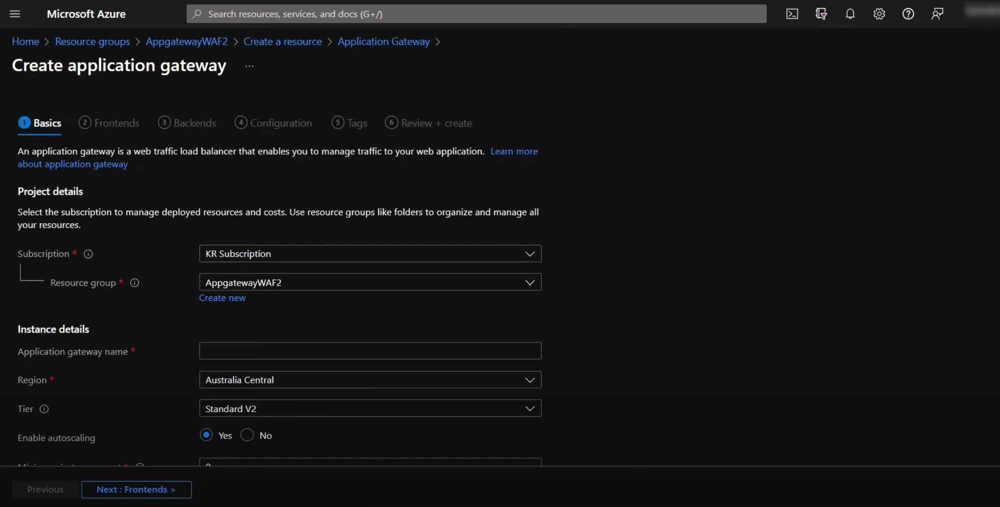
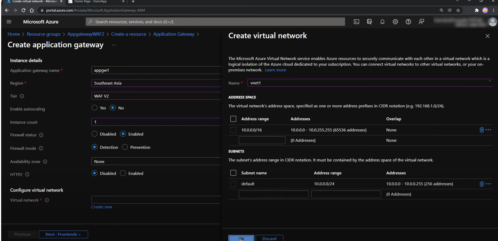
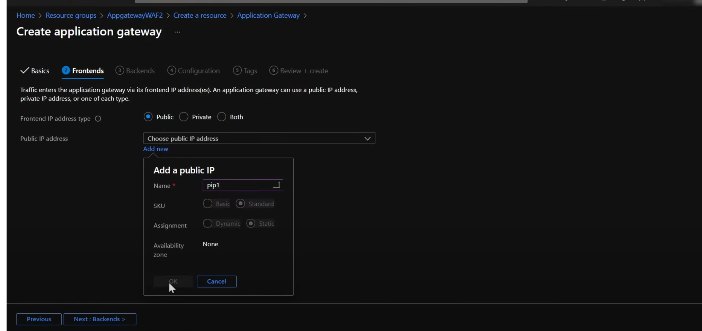
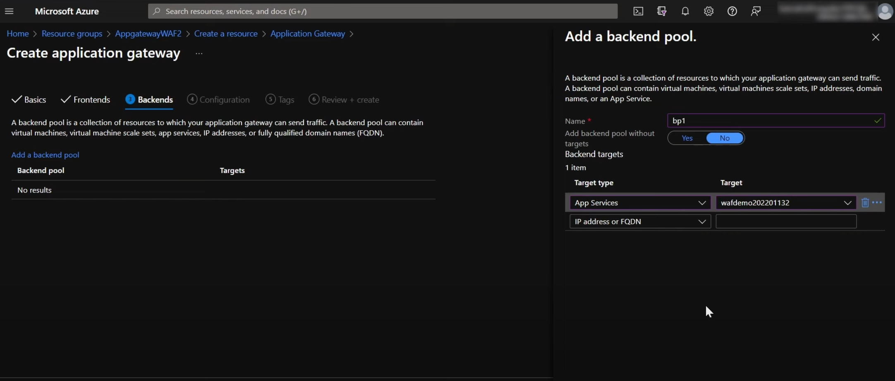
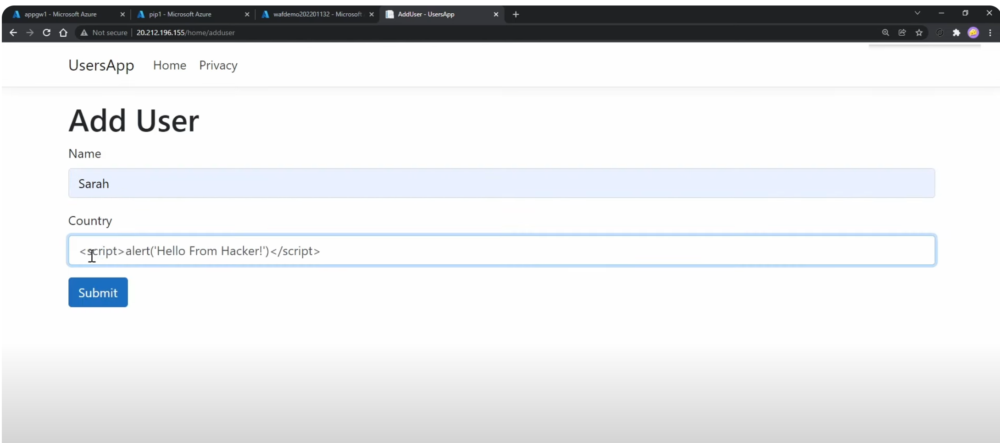
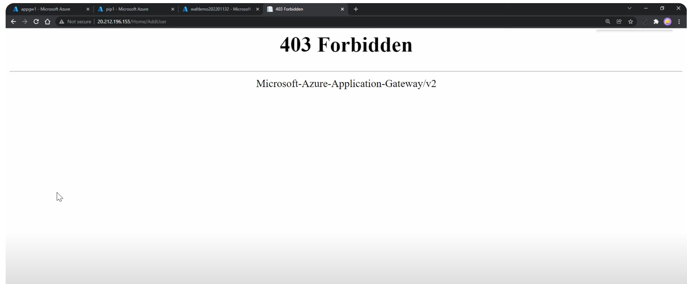

https://www.youtube.com/watch?v=CZGdfcKZ31I
#### Today, We are going to learn about Azure application gateway Web application firewall (WAF)

- Two types 

- Create an app service and download a sample application and test it 

- Create a WAF 

- Add a netwok

- Create a Public IP 

- Create a back end and app the appp servic we created 

- WAF is craeted and get the IP and try it works 

- Add a hacing code 

- Try with prebtion mode an notice you get a 403 

