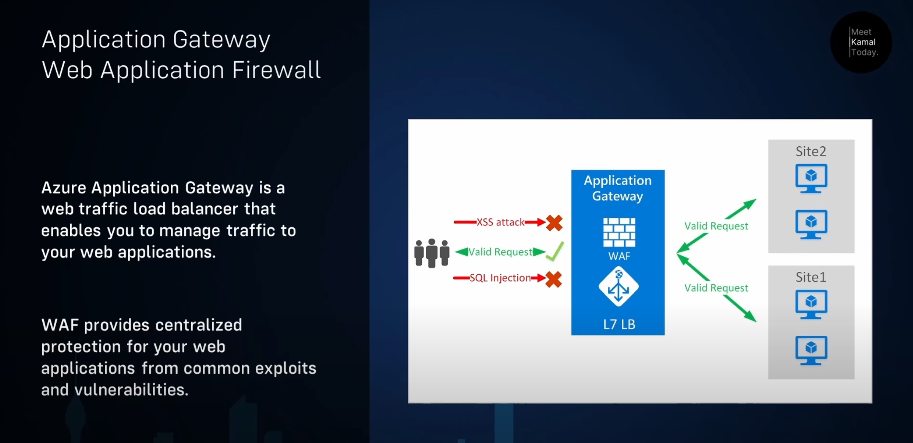
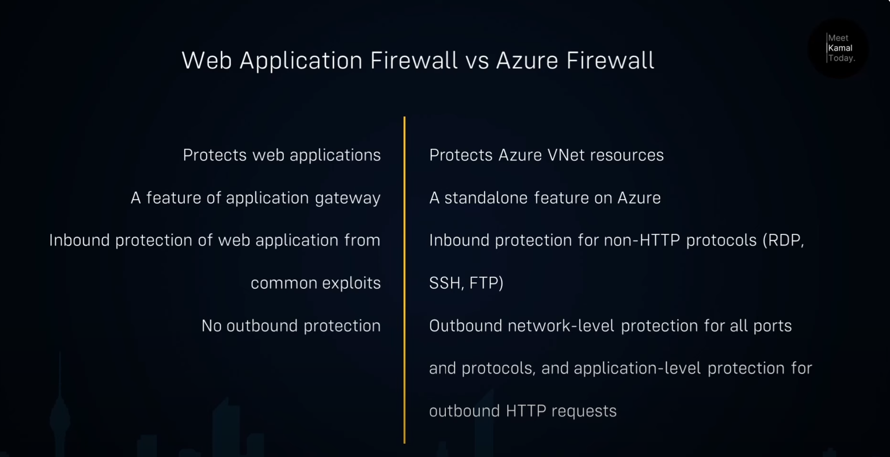
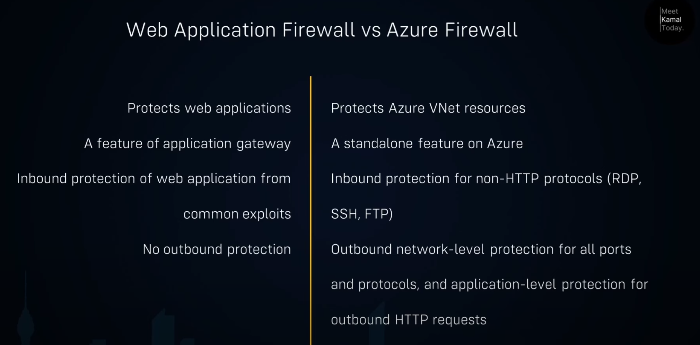
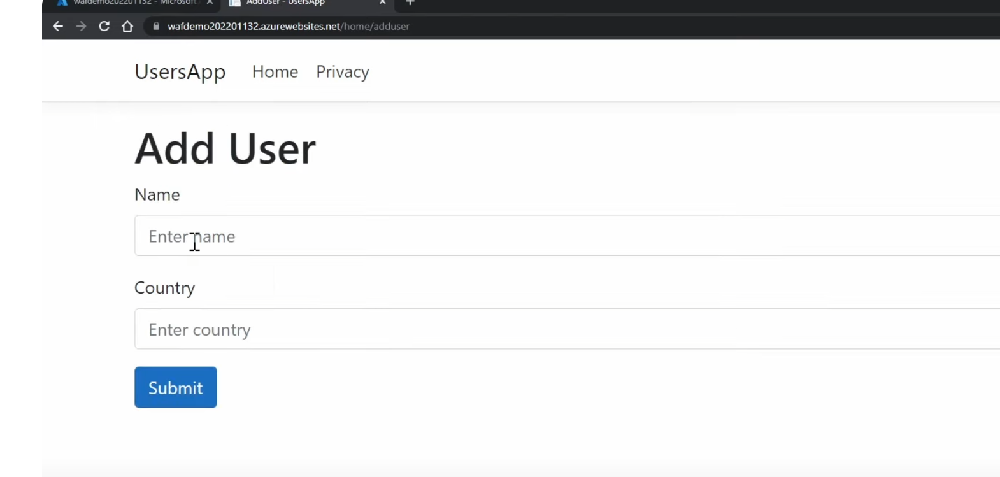
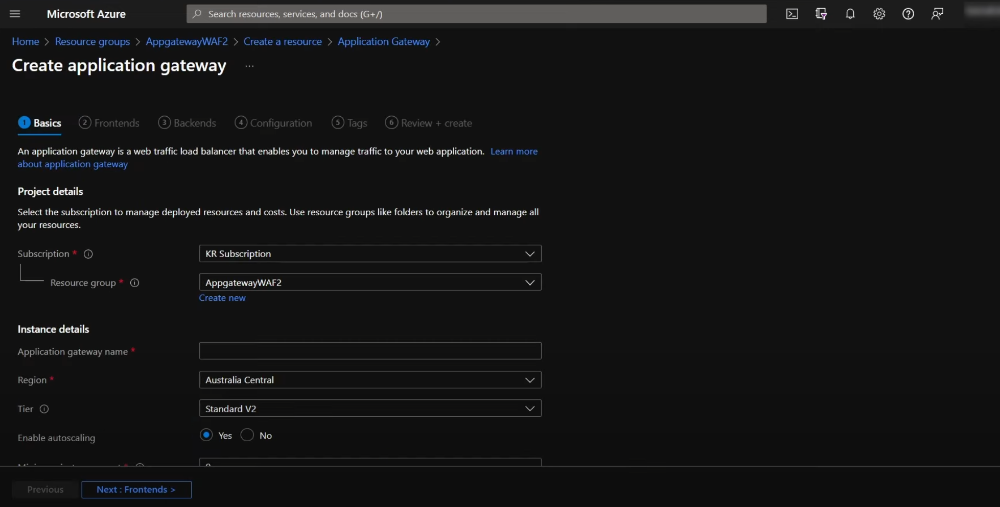
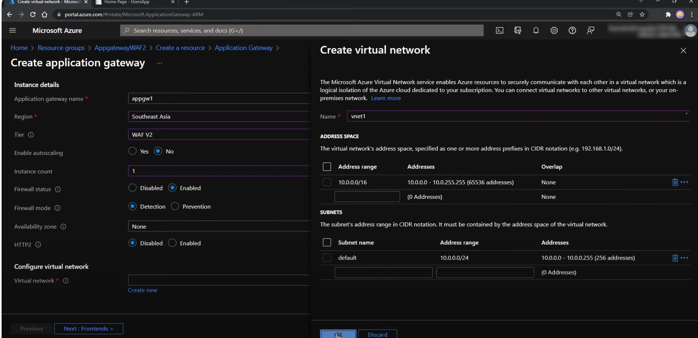
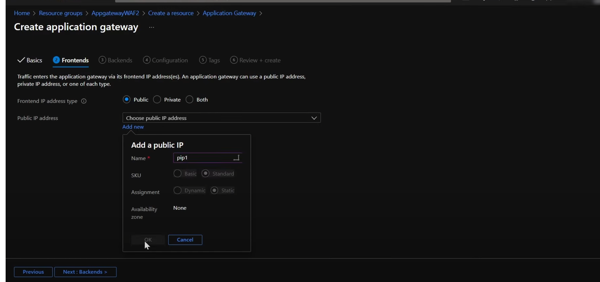
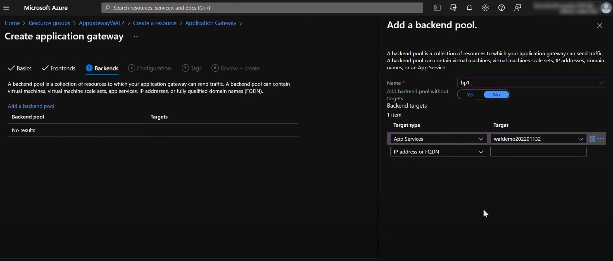
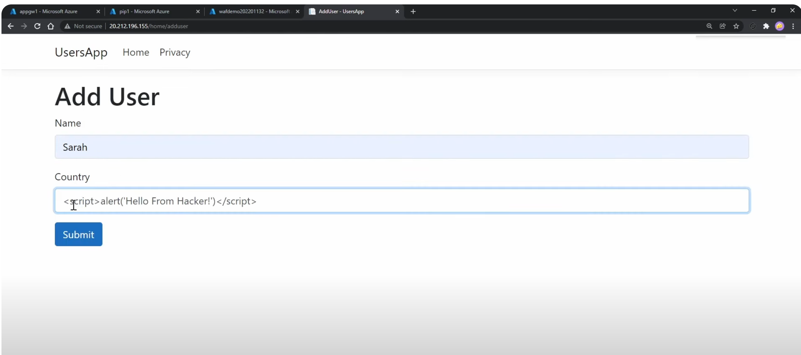
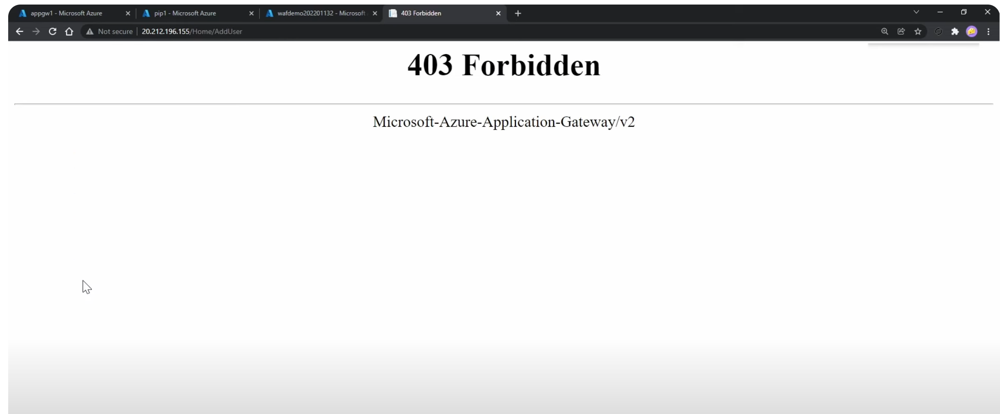

# Azure Web Application Firewall (WAF)

This guide walks through setting up the Azure Application Gateway Web Application Firewall (WAF) to protect a web application.

**Reference:** [YouTube: Azure WAF Tutorial](https://www.youtube.com/watch?v=CZGdfcKZ31I)

## WAF Modes

WAF supports two modes of operation:

## Setup Steps

### Step 1: Create an App Service

Create an App Service, download a sample application, and test that it is working.

### Step 2: Create a WAF Policy

Create a WAF policy in the Azure portal.

### Step 3: Add a Network

Configure the virtual network for the WAF.

### Step 4: Create a Public IP

Assign a public IP address to the WAF.

### Step 5: Create a Backend Pool

Create a backend pool and add the App Service created in Step 1.

### Step 6: Verify WAF is Working

Once the WAF is created, retrieve the IP address and confirm that the application is accessible.

### Step 7: Test WAF Detection

Add a simulated attack (hacking code) to a request to test the WAF.

### Step 8: Enable Prevention Mode

Switch the WAF to **Prevention** mode and confirm that malicious requests receive a `403 Forbidden` response.

