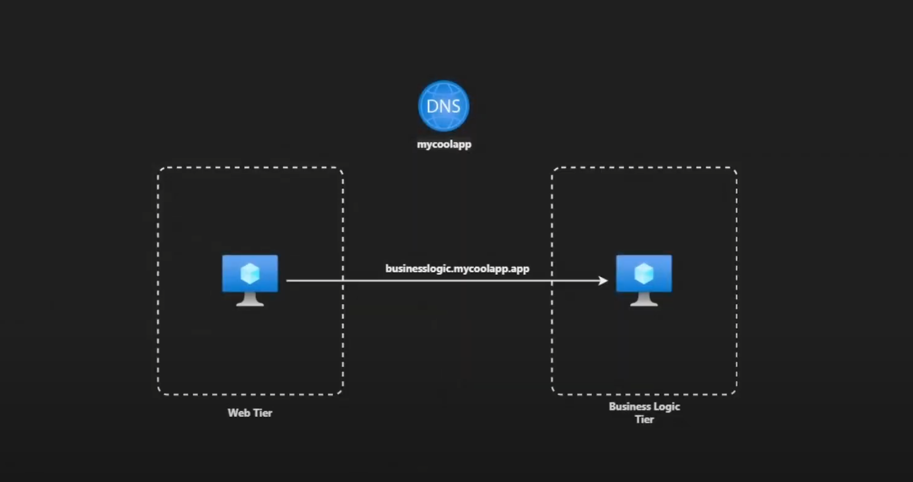
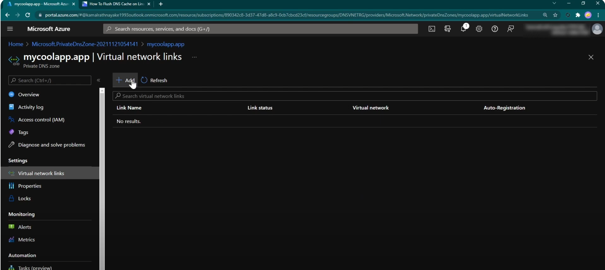
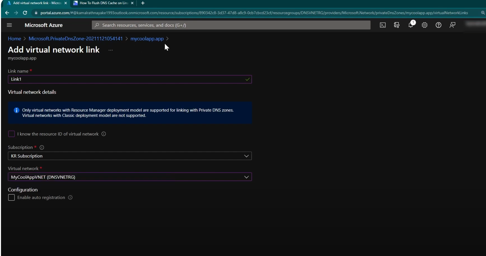
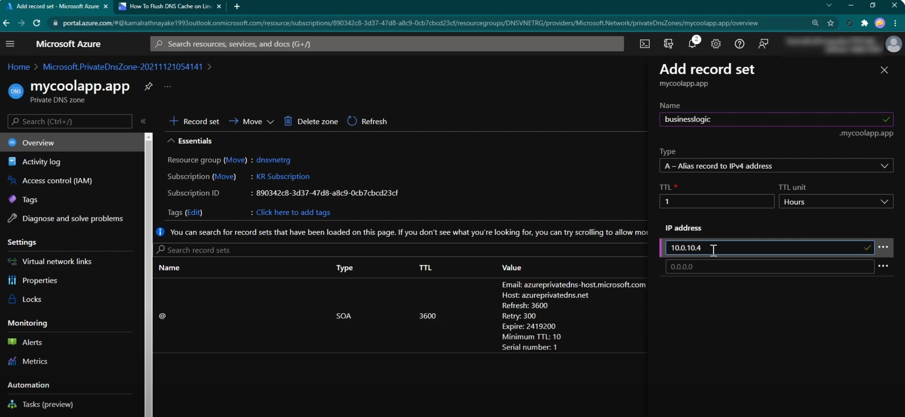
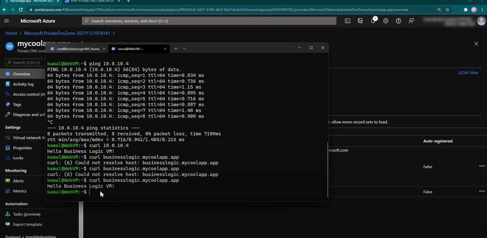

#### Today, let's learn how to integrate Azure private DNS zone to an Azure virtual network with virtual network link feature.

- We know we can use IP what if we want to use domain name url to commincate betwen the two VMs

- Create two VMS 
We can ping the IP what about domina name 

### Lets create a DNS 

Notice we have atab called virtual network links 

- Add you VM's network a

- No create a DNS records 

- And add IP of the VM 

- Lets test it on the VM 

