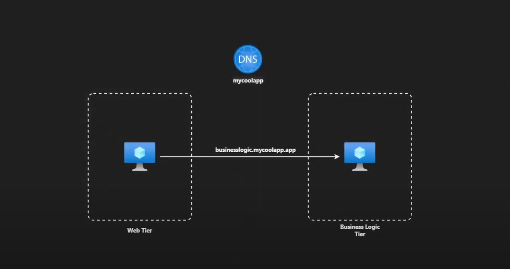
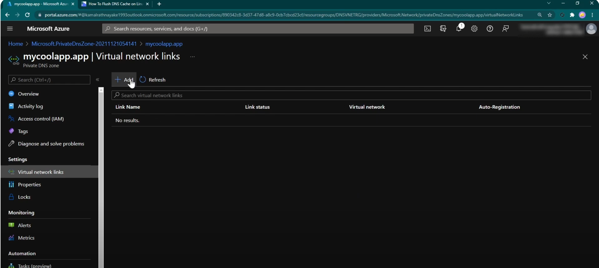
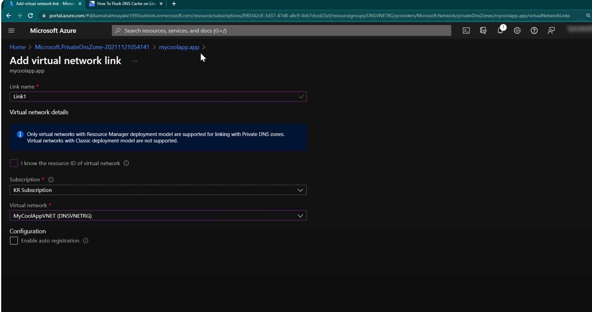
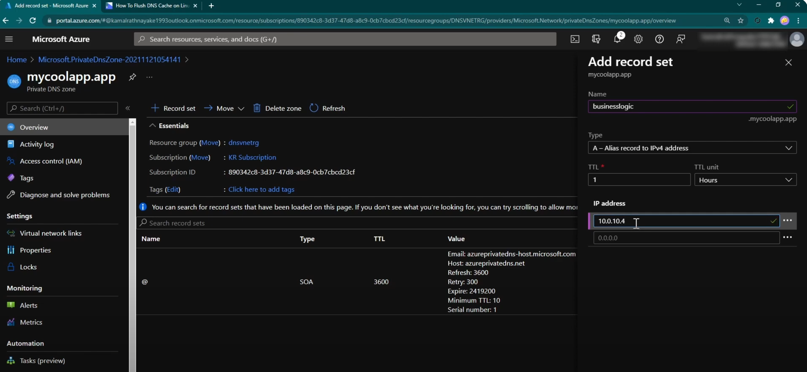
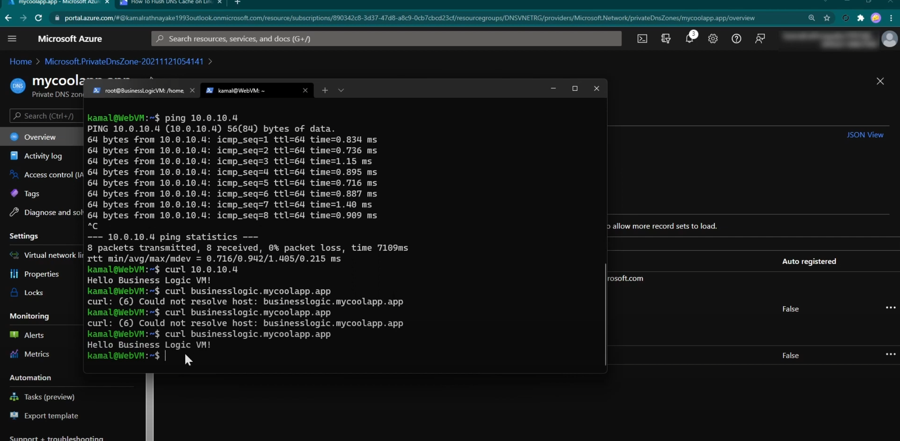

# Azure Private DNS Zone

This guide demonstrates how to integrate an Azure Private DNS Zone with an Azure Virtual Network using the Virtual Network Link feature, so that VMs can communicate using domain names instead of IP addresses.

While VMs can communicate using IP addresses, you may want to use domain name URLs to communicate between two VMs. This guide shows how to set that up.

## Steps

### Step 1: Create Two VMs

Create two VMs in your virtual network. You can ping by IP address, but to use domain names you need to configure a private DNS zone.

### Step 2: Create a Private DNS Zone

Create a private DNS zone in the Azure portal.

Notice the **Virtual Network Links** tab on the DNS zone resource.

### Step 3: Add a Virtual Network Link

Link your VMs' virtual network to the private DNS zone using the Virtual Network Links feature.

### Step 4: Create DNS Records

Add a DNS record (for example, an A record) for each VM.

Add the private IP address of each VM to its corresponding DNS record.

### Step 5: Test DNS Resolution

Test the DNS resolution from within one of the VMs to confirm name-based communication is working.

