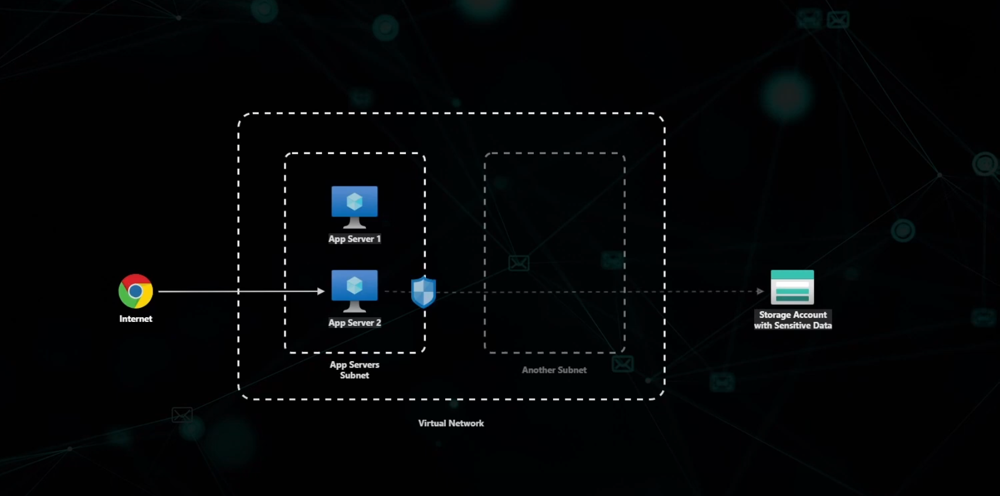
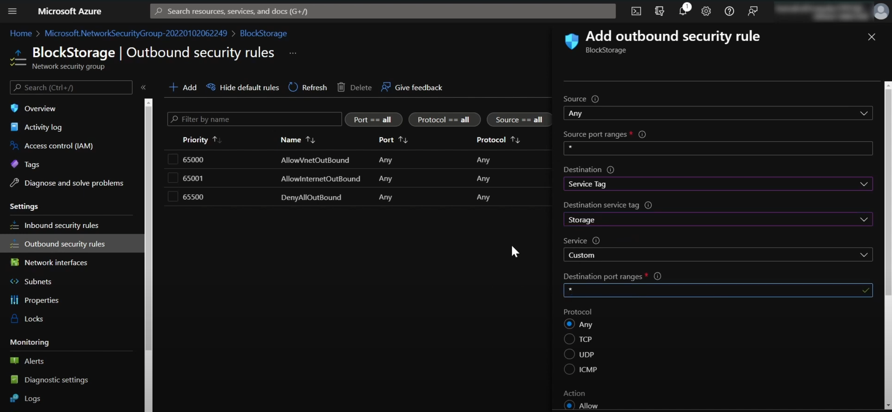

# Azure Service Tags

## Overview

Azure Service Tags represent groups of IP address prefixes from a given Azure service. They simplify the management of network security rules by allowing you to use a tag name instead of specific IP addresses.

A user can connect to a storage account as shown below:

If you want to block or allow access to a storage account based on Azure service traffic, you can use the specific IP addresses of those services, or use Microsoft-managed Service Tags instead:

## Reference

- [YouTube: Azure Service Tags Explained](https://www.youtube.com/watch?v=1Pm5-cH_45I)
