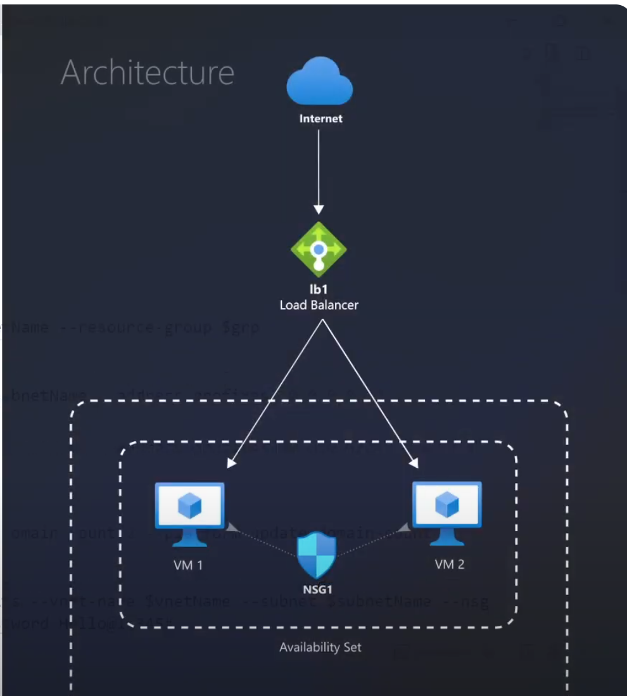
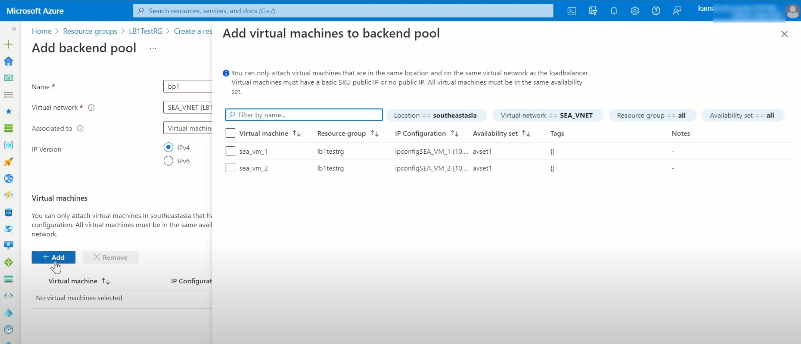
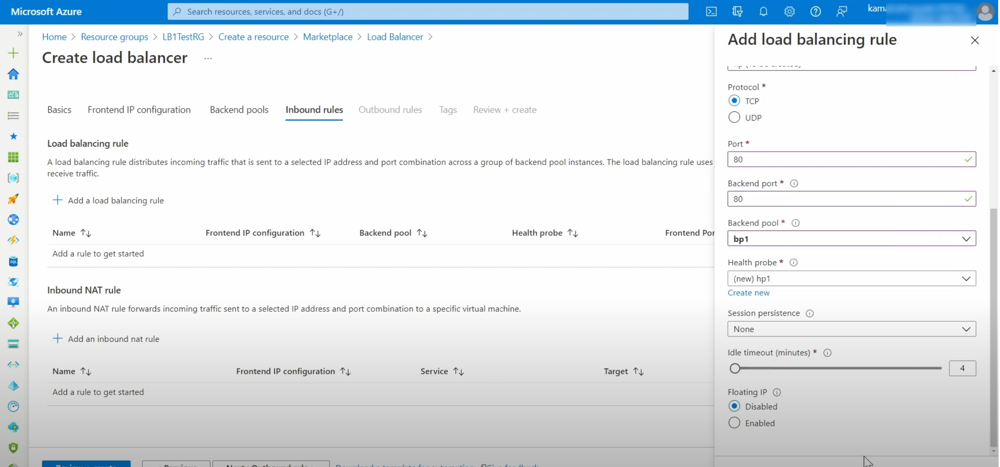
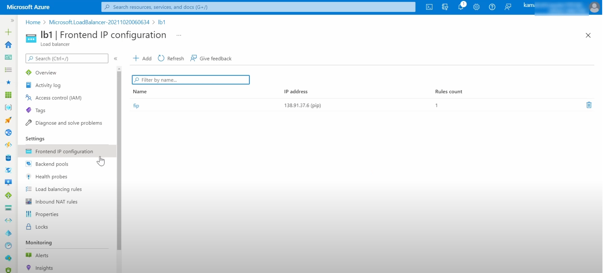

# Azure Load Balancer

Azure Load Balancer distributes inbound traffic across backend VM instances according to rules and health probes. This guide walks through the key configuration steps.

## Architecture Diagram

## Setup Steps

### Step 1: Add Backend Pools

Add the VMs or VM scale set instances that will receive the distributed traffic.

### Step 2: Create a Load Balancing Rule

Define a rule that maps a frontend IP and port to a backend pool and port.

### Step 3: Access the Application via the Frontend IP

Once the rule is configured, access the application using the load balancer's frontend IP address.

## Reference

- [YouTube: Azure Load Balancer Tutorial](https://www.youtube.com/watch?v=hR84YJpffIs)
