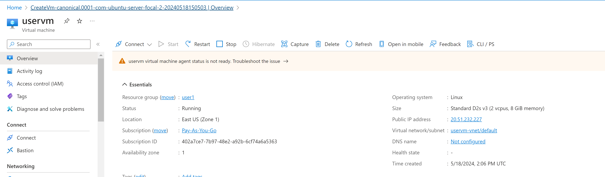
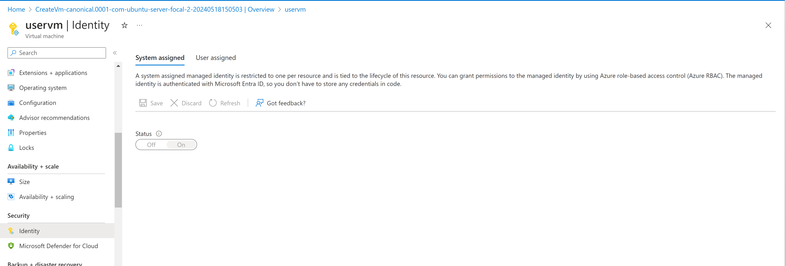
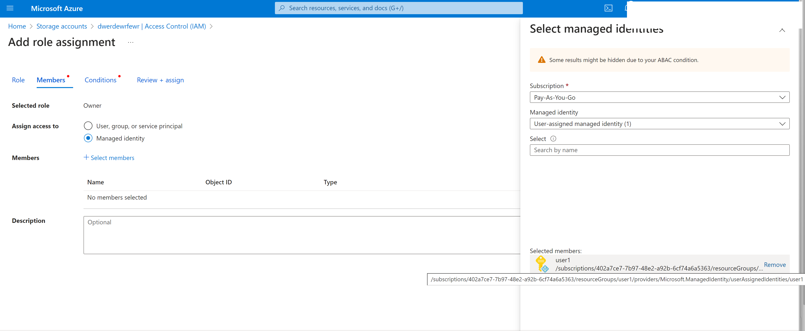
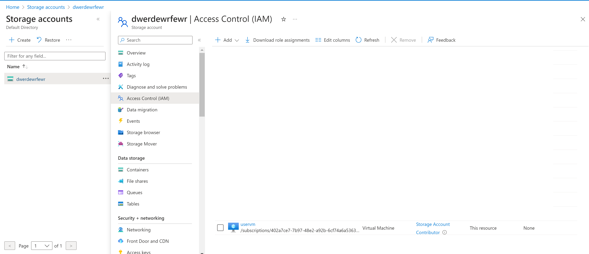
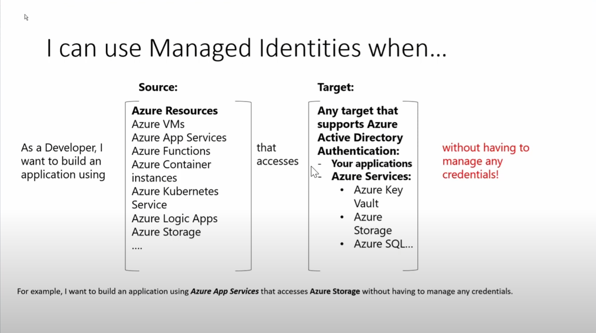

Example a VM wants to have access to a stoarge account 

Create a VM 

Turn on manged idenity 

Create a stoarge account and add that idenity 

Cofirm its added 

https://learn.microsoft.com/en-us/entra/identity/managed-identities-azure-resources/managed-identity-best-practice-recommendations