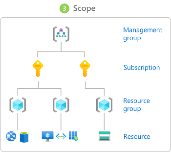

Azure role-based access control (Azure RBAC) helps you manage who has access to Azure resources, what they can do with those resources, and what areas they have access to.

Example :Allow one user to manage virtual machines in a subscription and another user to manage virtual networks

The way you control access to resources using Azure RBAC is to assign Azure roles.

Security principal: A security principal is an object that represents a user, group, service principal, or managed identity that is requesting access to Azure resources. You can assign a role to any of these security principals.

Role definition:  Is a collection of permissions.  A role definition lists the actions that can be performed, such as read, write, and delete. 
Action: what a user can do
Notaction what a user can not do

Scope is the set of resources that the access applies to. When you assign a role, you can further limit the actions allowed by defining a scope. This is helpful if you want to make someone a Website Contributor, but only for one resource group.

A role assignment is the process of attaching a role definition to a user, group, service principal, or managed identity at a particular scope for the purpose of granting access. Access is granted by creating a role assignment, and access is revoked by removing a role assignment.

Role assignments are transitive for groups, which means that if a user is a member of a group and that group is a member of another group that has a role assignment, the user has the permissions in the role assignment.