### IAM
Idenity and Access managment 

### Components of IAM 

##### Users:
IAM users represent individual people or entities 

##### Groups: 
- IAM groups are collections of users with similar access requirements.
- Instead of managing permissions for each user individually, you can assign permissions to groups, making it easier to manage access control.
- Users can be added or removed from groups as needed.

#### Roles: 
- IAM roles are used to grant temporary access to AWS resources. 
- Roles are typically used by applications or services that need to access AWS resources on behalf of users or other services. 
- Roles have associated policies that define the permissions and actions allowed for the role.

#### Policies: 
- IAM policies are JSON documents that define permissions. 
- Policies specify the actions that can be performed on AWS resources and the resources to which the actions apply. 
- Policies can be attached to users, groups, or roles to control access. 
- IAM provides both AWS managed policies (predefined policies maintained by AWS) and customer managed policies (policies created and managed by you).

## User 

- Create a Root user, and log in à you have full access

- Create an IAM user 
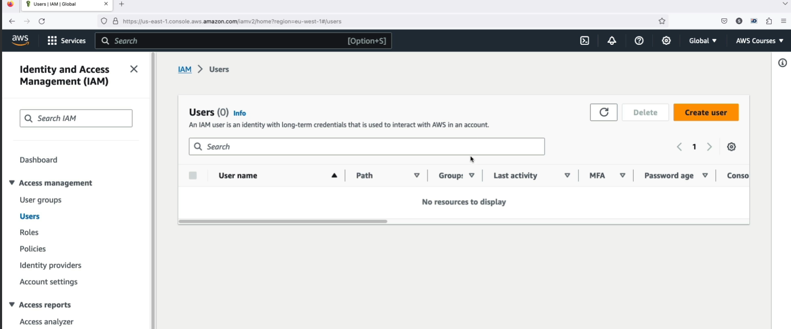

- log in  You will not have any permission to do anything

- Login back as a Root user and grant S3 as below to the user. 

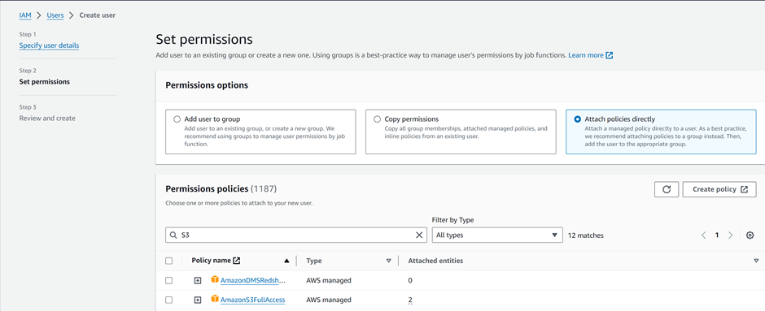

- Log in back as IAM and notice, that you have full access to S3

## Group 
- Group: Create a group, we call we Admin

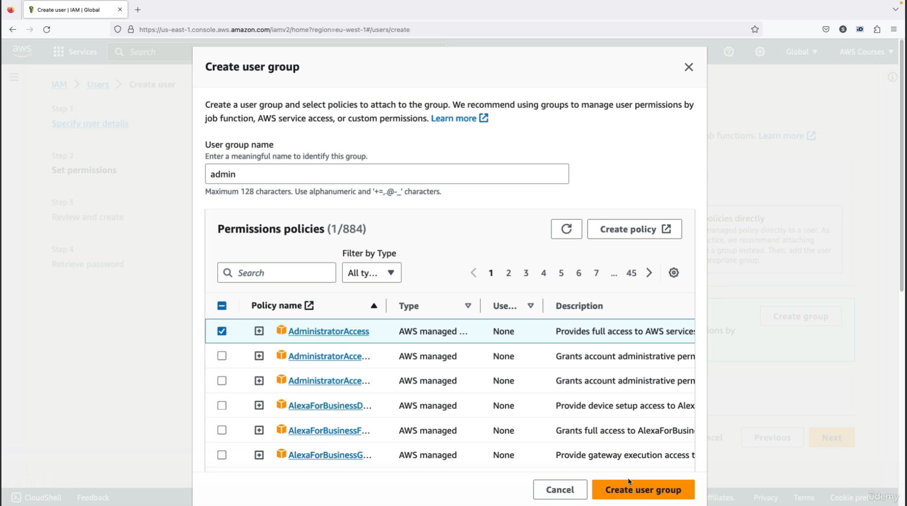

- Add the user to the Group
  
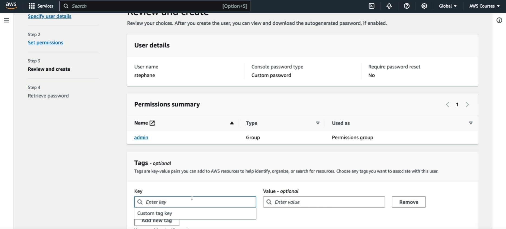

- Login and Notice they have access to S3

# Policies

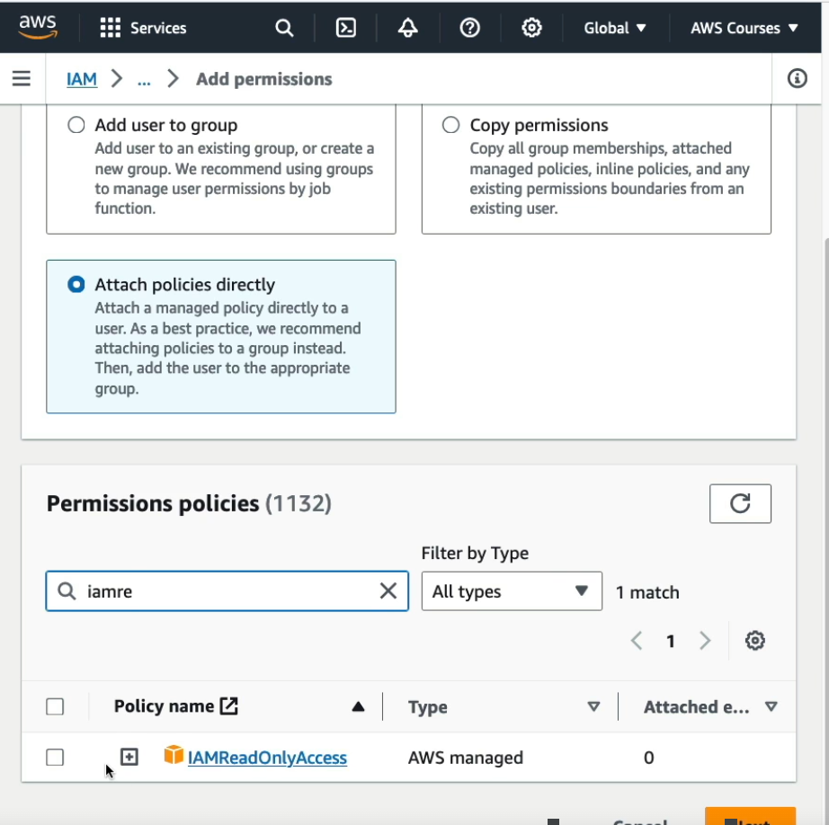

-Remove user we created from the group 
-Go to the user and add permissons "IAM read only"

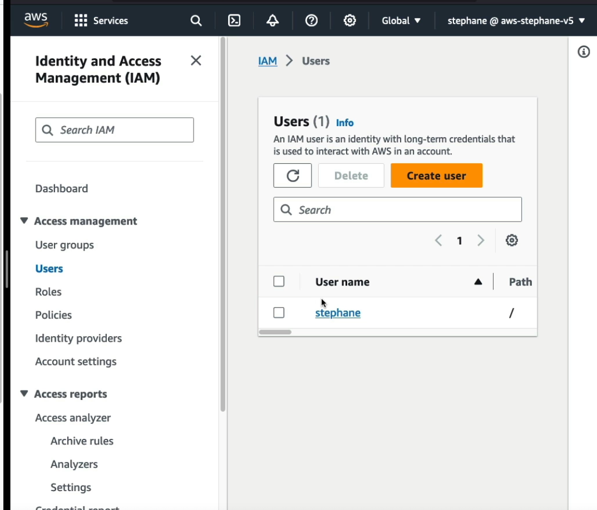

Add and refresh, you can see the user have permission, but can it create a group, No

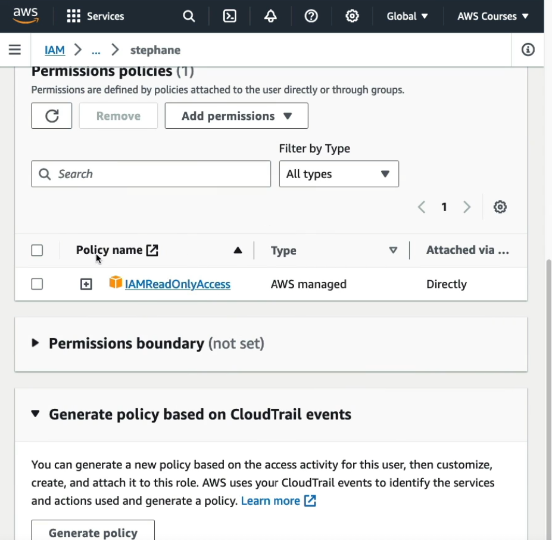

Becuase the user has IAM read only 

- No  I am going to create a group 
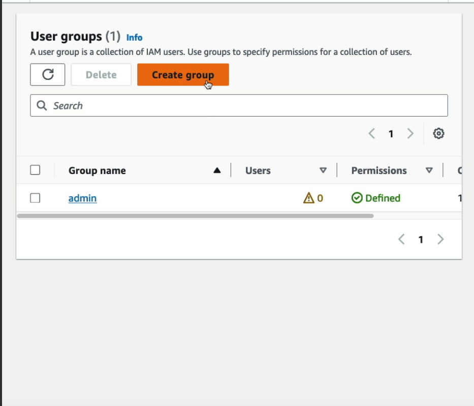

Add Stpehen to the group and attach policy (attach any)

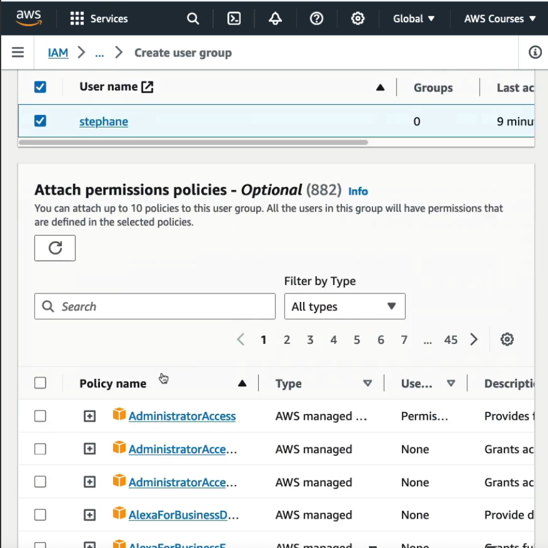

Add user to admin group 

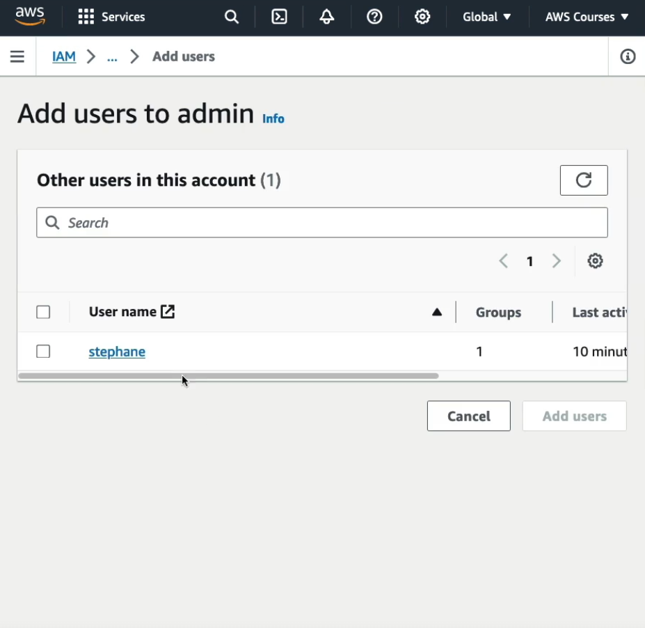

Now if we look at the user, we have 3 policy and look at te attached section

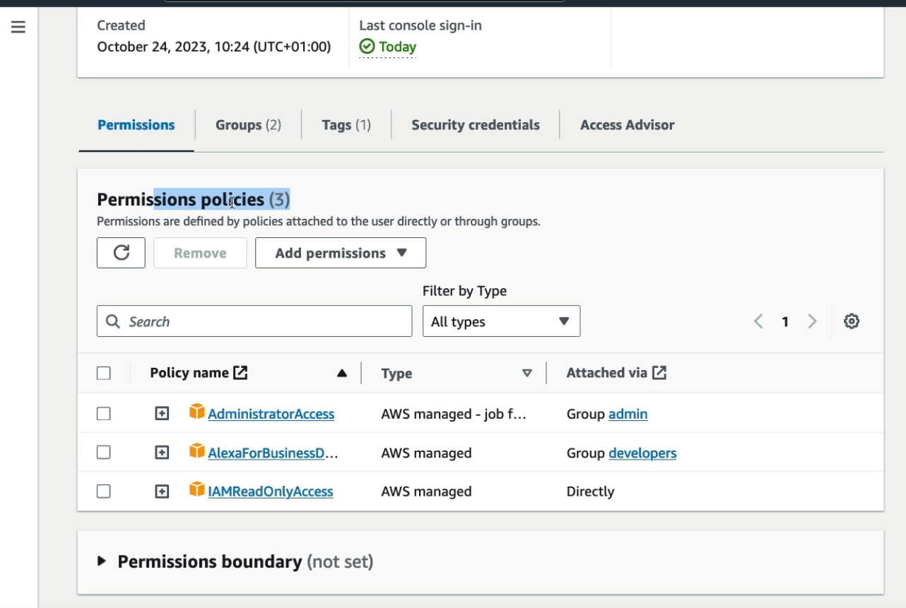

