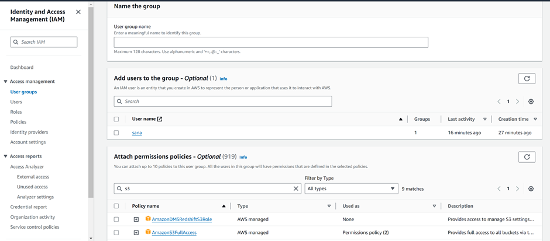

# IAM

- Create a Root user, and log in à you have full access

- Create an IAM user and log in à You will not have any permission to do anything

- Login back as a Root user and grant S3 as below to the user. 

- Log in back as IAM and notice, that you have full access to S3

- Group: Create a group

- Add the user to the Group

- Login and Notice they have access to S3

## Components of IAM 

Users: IAM users represent individual people or entities (such as applications or services) that interact with your AWS resources. Each user has a unique name and security credentials (password or access keys) used for authentication and access control.

Groups: IAM groups are collections of users with similar access requirements. Instead of managing permissions for each user individually, you can assign permissions to groups, making it easier to manage access control. Users can be added or removed from groups as needed.

Roles: IAM roles are used to grant temporary access to AWS resources. Roles are typically used by applications or services that need to access AWS resources on behalf of users or other services. Roles have associated policies that define the permissions and actions allowed for the role.

Policies: IAM policies are JSON documents that define permissions. Policies specify the actions that can be performed on AWS resources and the resources to which the actions apply. Policies can be attached to users, groups, or roles to control access. IAM provides both AWS managed policies (predefined policies maintained by AWS) and customer managed policies (policies created and managed by you).