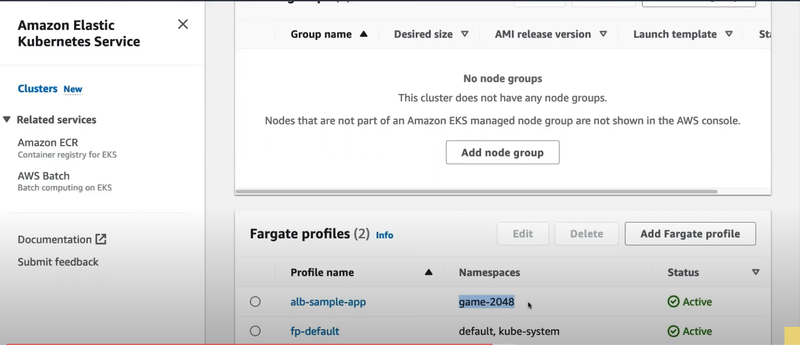
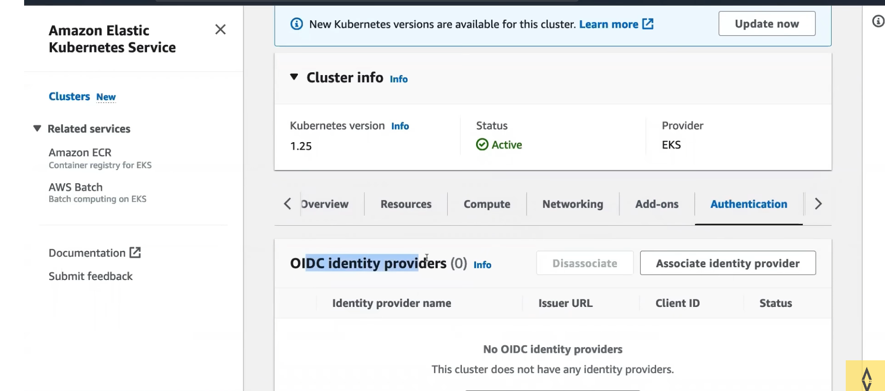

# Amazon EKS

This document covers the steps to set up, configure, and deploy applications on an Amazon Elastic Kubernetes Service (EKS) cluster.

## Access Keys (for Programmatic Access)

- If you selected "Programmatic access" during user creation, you will receive access keys (Access Key ID and Secret Access Key).
- Store these access keys securely, as they will be used to authenticate API requests made to AWS services.

## Configuring the AWS CLI, eksctl, and kubectl

### Configuring AWS CLI Credentials

Open a terminal and run the following command:

```bash
aws configure
```

- Enter the Access Key ID and Secret Access Key of the IAM user you created earlier. You can get the access key from **Security Credentials** in AWS under the username.
- Choose a default region and output format for AWS CLI commands.

## Installing kubectl

Once `kubectl` is installed, you need to configure it to work with your EKS cluster.

1. In the AWS Management Console, go to the EKS service and select your cluster.
2. Click on the **Config** button and follow the instructions to update your `kubeconfig` file. Alternatively, use the AWS CLI:

```bash
aws eks update-kubeconfig --name your-cluster-name
```

Verify the configuration by running a `kubectl` command against your EKS cluster:

```bash
kubectl get nodes
```

## Create a Fargate Profile

```bash
eksctl create fargateprofile \
    --cluster demo-cluster \
    --region us-east-1 \
    --name alb-sample-app \
    --namespace game-2048
```



## Deploy the Deployment, Service, and Ingress

```bash
kubectl apply -f https://raw.githubusercontent.com/kubernetes-sigs/aws-load-balancer-controller/v2.5.4/docs/examples/2048/2048_full.yaml
```

- Notice there is no external IP.
- The ingress resources are installed, but there is no ingress controller yet.
- The ALB controller will create and configure a load balancer.

## Commands to Configure the IAM OIDC Provider

```bash
export cluster_name=demo-cluster

oidc_id=$(aws eks describe-cluster --name $cluster_name --query "cluster.identity.oidc.issuer" --output text | cut -d '/' -f 5)
```



### Check if There Is an IAM OIDC Provider Already Configured

```bash
aws iam list-open-id-connect-providers | grep $oidc_id | cut -d "/" -f4
```

If not, run the below command:

```bash
eksctl utils associate-iam-oidc-provider --cluster $cluster_name --approve
```

## How to Set Up the ALB Add-On

### Download the IAM Policy

```bash
curl -O https://raw.githubusercontent.com/kubernetes-sigs/aws-load-balancer-controller/v2.5.4/docs/install/iam_policy.json
```

### Create the IAM Policy

```bash
aws iam create-policy \
    --policy-name AWSLoadBalancerControllerIAMPolicy \
    --policy-document file://iam_policy.json
```

### Create the IAM Role

```bash
eksctl create iamserviceaccount \
  --cluster=<your-cluster-name> \
  --namespace=kube-system \
  --name=aws-load-balancer-controller \
  --role-name AmazonEKSLoadBalancerControllerRole \
  --attach-policy-arn=arn:aws:iam::<your-aws-account-id>:policy/AWSLoadBalancerControllerIAMPolicy \
  --approve
```

## Deploy the ALB Controller

Add the Helm repo:

```bash
helm repo add eks https://aws.github.io/eks-charts
```

Update the repo:

```bash
helm repo update eks
```

Install the controller:

```bash
helm install aws-load-balancer-controller eks/aws-load-balancer-controller \
  -n kube-system \
  --set clusterName=<your-cluster-name> \
  --set serviceAccount.create=false \
  --set serviceAccount.name=aws-load-balancer-controller \
  --set region=<region> \
  --set vpcId=<your-vpc-id>
```

Verify that the deployments are running:

```bash
kubectl get deployment -n kube-system aws-load-balancer-controller
```

## Preparing Networking and Security Groups for EKS

Before launching an EKS cluster, prepare the networking and security groups to ensure proper communication and security within the cluster.

### Creating an Amazon VPC (Virtual Private Cloud)

- Go to the AWS Management Console and navigate to the VPC service.
- Click on **Create VPC** and enter the necessary details like VPC name, IPv4 CIDR block, and subnets.
- Create public and private subnets to distribute resources across different availability zones.

### Configuring Security Groups

Security Groups are a fundamental aspect of AWS that act as virtual firewalls for your AWS resources, including EKS clusters. They control inbound and outbound traffic based on rules you define.

#### Create a Security Group

- Go to the AWS Management Console and navigate to the Amazon VPC service.
- Click on **Security Groups** in the left-hand navigation pane.
- Click on **Create Security Group**.
- Provide a name and description for the Security Group.
- Select the appropriate VPC for the Security Group.

#### Inbound Rules

- Define inbound rules to control incoming traffic to your EKS worker nodes.
- By default, all inbound traffic is denied unless explicitly allowed.
- Common inbound rules include allowing SSH (port 22) access for administrative purposes and allowing ingress traffic from specific CIDR blocks or Security Groups.

#### Outbound Rules

- Define outbound rules to control the traffic leaving your EKS worker nodes.
- By default, all outbound traffic is allowed unless explicitly denied.
- For security purposes, you can restrict outbound traffic to specific destinations or ports.

#### Security Group IDs

After creating the Security Group, you will receive a Security Group ID. This ID will be used when launching your EKS worker nodes.

#### Attach the Security Group to EKS Worker Nodes

When launching the EKS worker nodes, specify the Security Group ID in the launch configuration. This associates the Security Group with the worker nodes, allowing them to communicate based on the defined rules.

## Setting Up an Internet Gateway (IGW)

An Internet Gateway (IGW) is a horizontally scaled, redundant, and highly available AWS resource that allows communication between your VPC and the internet. To enable EKS worker nodes to access the internet for tasks like pulling container images, set up an Internet Gateway in your VPC.

### Create an Internet Gateway

- Go to the AWS Management Console and navigate to the Amazon VPC service.
- Click on **Internet Gateways** in the left-hand navigation pane.
- Click on **Create Internet Gateway**.
- Provide a name for the Internet Gateway and click **Create Internet Gateway**.

### Attach the Internet Gateway to the VPC

- After creating the Internet Gateway, select it in the list and click **Attach to VPC**.
- Choose the VPC to which you want to attach the Internet Gateway and click **Attach**.

### Update Route Tables

- Go to **Route Tables** in the Amazon VPC service.
- Identify the Route Table associated with the private subnets where your EKS worker nodes will be deployed.
- Edit the Route Table and add a route with the destination `0.0.0.0/0` (all traffic) and the Internet Gateway ID as the target.

By setting up an Internet Gateway and updating the Route Tables, you provide internet access to your EKS worker nodes, enabling them to interact with external resources like container registries and external services.

## Configuring IAM Policies

Identity and Access Management (IAM) is a service in AWS that allows you to manage access to AWS resources securely. IAM policies define permissions that specify what actions are allowed or denied on specific AWS resources. For your EKS cluster, configure IAM policies to grant necessary permissions to your worker nodes and other resources.

### Create a Custom IAM Policy

- Go to the AWS Management Console and navigate to the IAM service.
- Click on **Policies** in the left-hand navigation pane.
- Click on **Create policy**.
- Choose **JSON** as the policy language and define the permissions required for your EKS cluster. For example, you might need permissions for EC2 instances, Auto Scaling, Elastic Load Balancing, and accessing ECR (Elastic Container Registry).

### Attach the IAM Policy to IAM Roles

- Go to **Roles** in the IAM service and select the IAM role that your EKS worker nodes will assume.
- Click on **Attach policies** and search for the custom IAM policy you created.
- Attach the policy to the IAM role.

### Update the EKS Worker Node Launch Configuration

- When launching your EKS worker nodes, specify the IAM role ARN (Amazon Resource Name) of the IAM role that includes the necessary IAM policy.
- The IAM role allows the worker nodes to authenticate with the EKS cluster and access AWS resources based on the permissions defined in the attached IAM policy.

By configuring IAM policies and associating them with IAM roles, you grant specific permissions to your EKS worker nodes, ensuring they can interact with AWS resources as needed while maintaining security and access control.

By completing these steps, your AWS environment is ready to host an Amazon EKS cluster. You can proceed with creating an EKS cluster using the AWS Management Console or AWS CLI.
