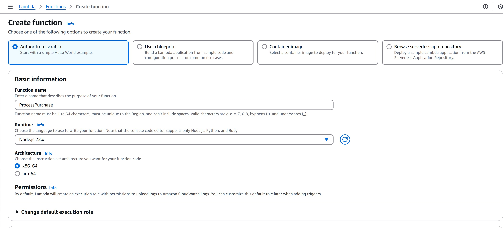
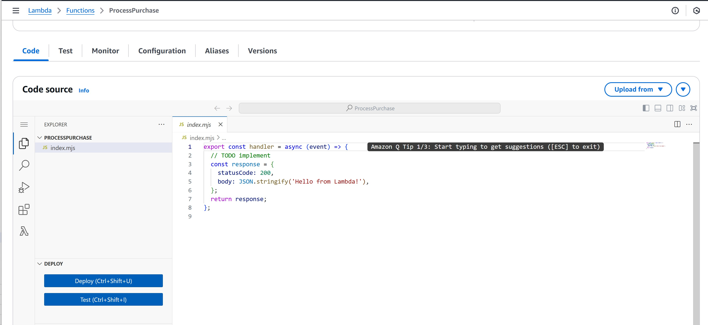
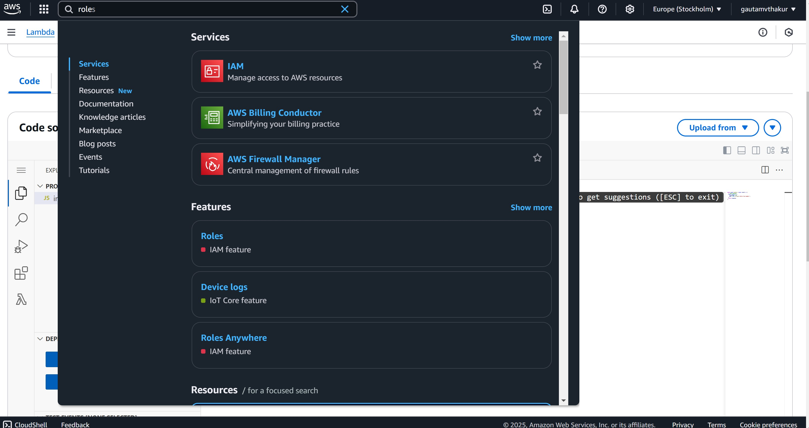
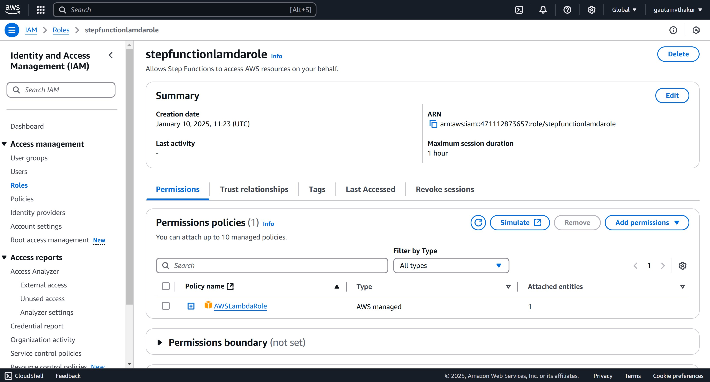
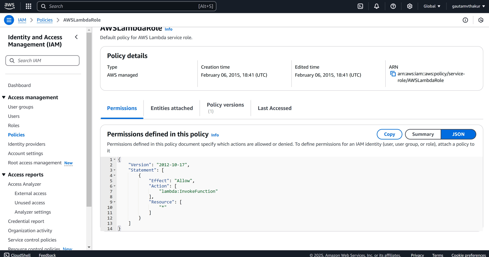
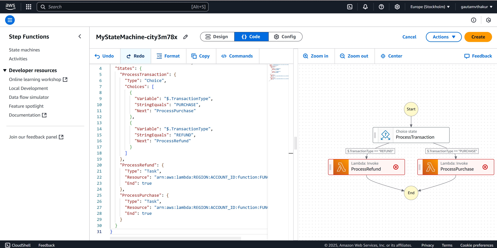
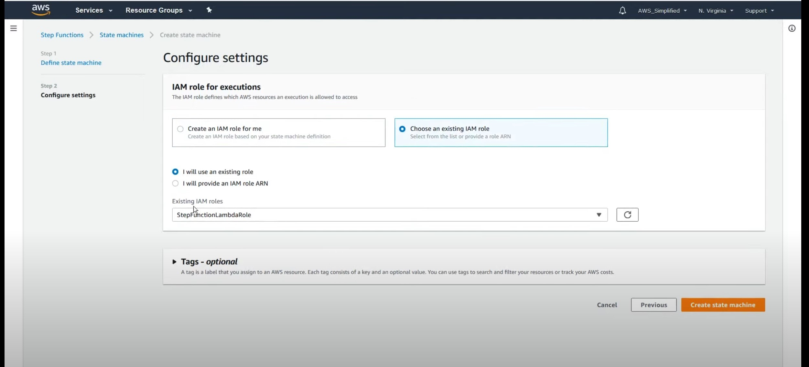
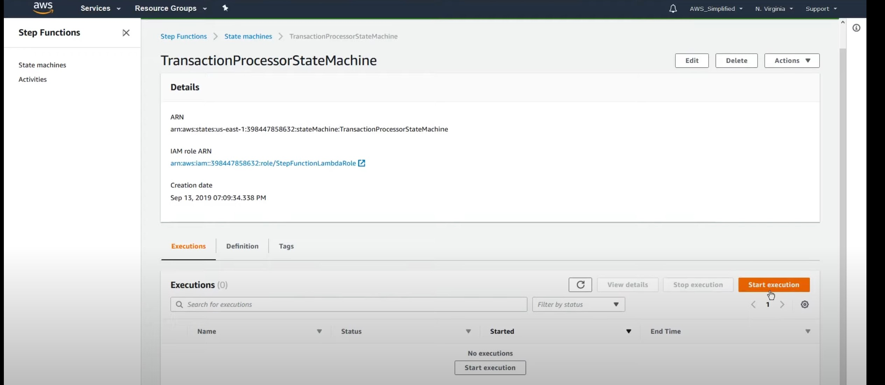
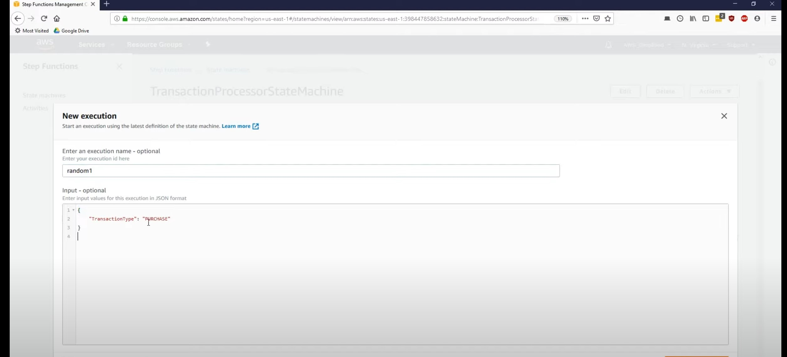
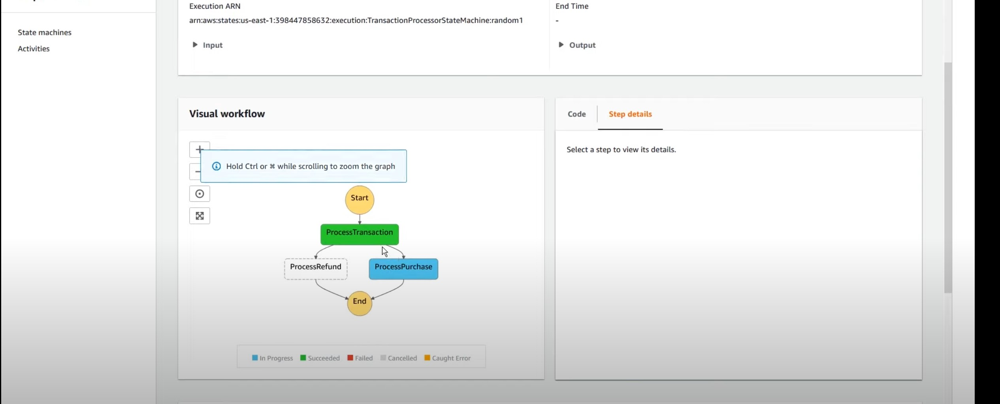

# AWS Step Functions and Lambda

This guide demonstrates how to create a simple AWS Step Functions state machine that orchestrates two Lambda functions to process transactions.

**Reference:** [AWS Step Functions and Lambda Tutorial](https://www.youtube.com/watch?v=s0XFX3WHg0w)

## Create Two Lambda Functions

Create two Lambda functions: `ProcessPurchase` and `ProcessRefund`.



### ProcessPurchase Lambda

Add the following code to the first Lambda function:

```python
import json
import datetime
import urllib
import boto3


def lambda_handler(message, context):
    print("received message from step fn")
    print(message)

    response = {}
    response['TransactionType'] = message['TransactionType']
    response['Timestamp'] = datetime.datetime.now().strftime("%Y-%m-%d %H-%M-%S")
    response['Message'] = "Hello from process purchase lambda"

    return response
```



Save the function.

### ProcessRefund Lambda

Create the second function and name it `ProcessRefund`.



## Create the IAM Role

Create an IAM role that grants Step Functions the ability to invoke the Lambda functions.



As shown on line 7, the role grants invocation permissions:



## Create the State Machine

Create your state machine in Step Functions.





Add the following JSON definition, replacing the `arn` placeholders with the ARNs from your Lambda functions:

```json
{
  "Comment": "A simple AWS Step Functions state machine that automates a call center support session.",
  "StartAt": "ProcessTransaction",
  "States": {
    "ProcessTransaction": {
      "Type": "Choice",
      "Choices": [
        {
          "Variable": "$.TransactionType",
          "StringEquals": "PURCHASE",
          "Next": "ProcessPurchase"
        },
        {
          "Variable": "$.TransactionType",
          "StringEquals": "REFUND",
          "Next": "ProcessRefund"
        }
      ]
    },
    "ProcessRefund": {
      "Type": "Task",
      "Resource": "arn:aws:lambda:REGION:ACCOUNT_ID:function:FUNCTION_NAME",
      "End": true
    },
    "ProcessPurchase": {
      "Type": "Task",
      "Resource": "arn:aws:lambda:REGION:ACCOUNT_ID:function:FUNCTION_NAME",
      "End": true
    }
  }
}
```

Grab the ARN from each Lambda function's configuration page.






