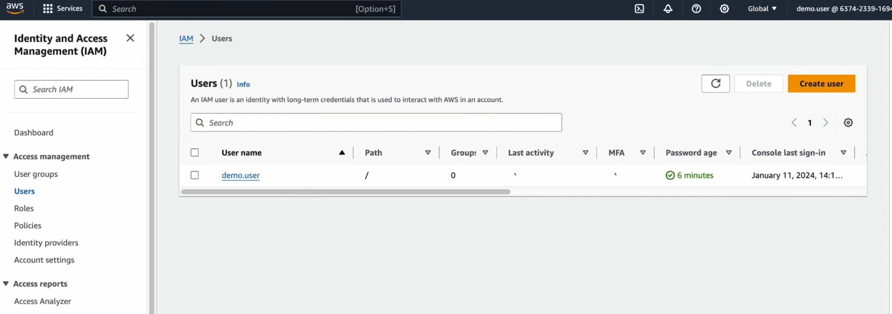
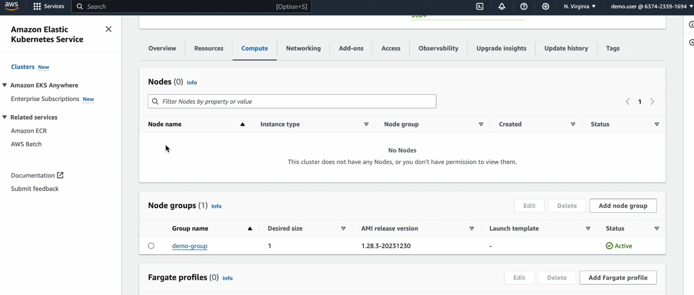
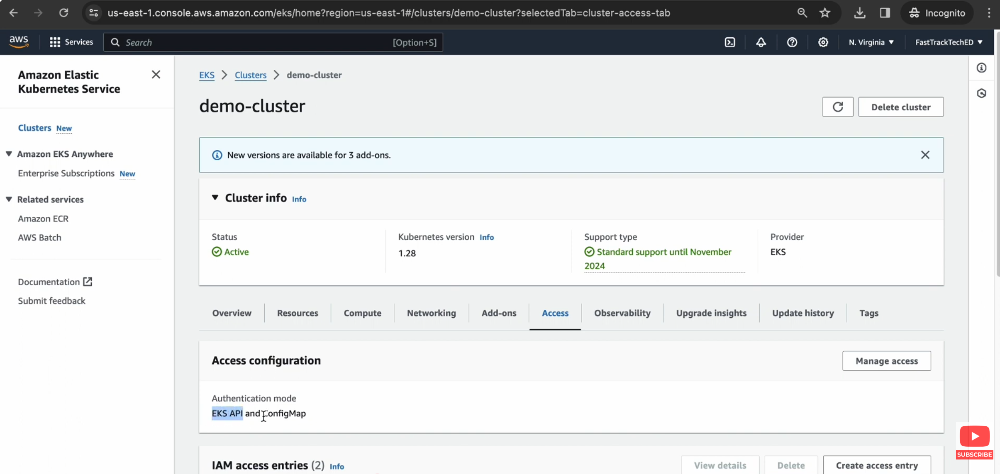
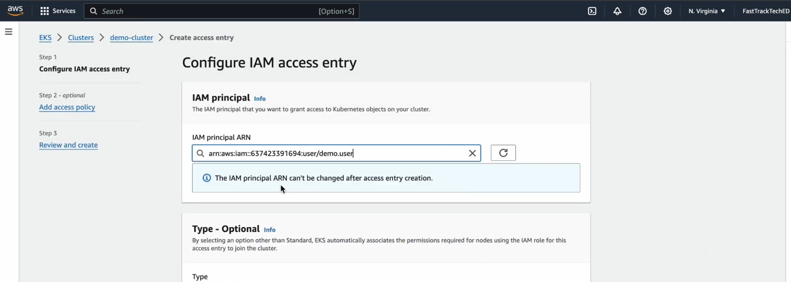
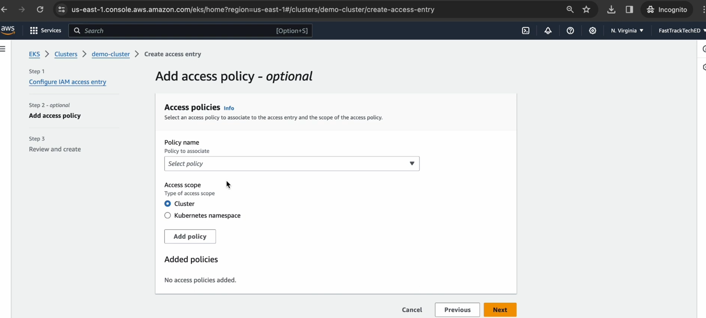
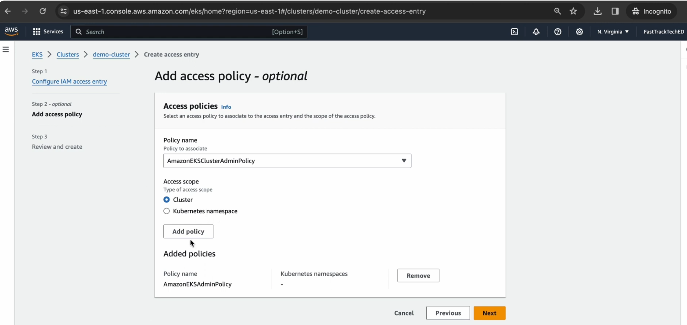
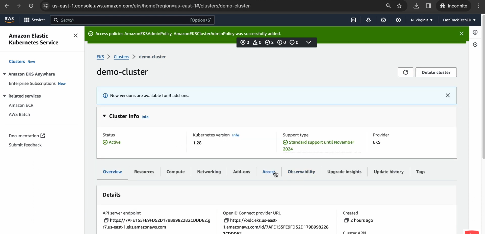
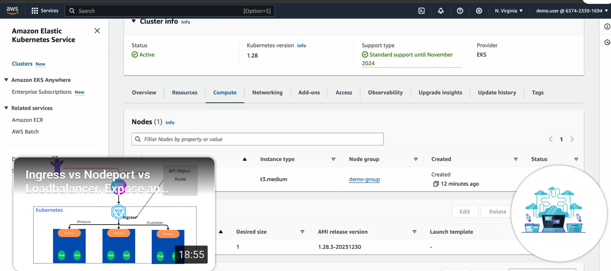

- I have one IAM user 




- I have one EKS clustre 


- You can see the User can't see the node of the EKS 

- How can we provide access 

- Log into as admin 

- Go to access and either use EKS API or ConfigMap



- Select the user 
- Create a access entry 

- Add a policy name 

- Add another policy 

- Confirm 

- Log in as that user

- You can see access has been granted


An access entry allows an IAM principal (user or role) to access your cluster. Access entries can replace the need to maintain the aws-auth ConfigMap for authentication. 

####  How it works 
-  Create an access entry for an IAM user/role (the “principal”). This establishes authentication. 


- Authorize it by either:

- ###### Attaching EKS access policies (AWS-managed sets of Kubernetes permissions) and scoping them to the cluster or specific namespaces, or
- ###### Mapping to Kubernetes groups you bind via normal RBAC. 


- You can mix both (policies + RBAC groups). 


#### Access entry types (most common)

- STANDARD — for humans/automation; you attach access policies and/or k8s groups.

- Node types like EC2_LINUX, EC2_WINDOWS, FARGATE_LINUX, HYBRID_LINUX, and EC2 (Auto Mode); EKS auto-grants the permissions nodes need. 
AWS Documentation

#### Why use it instead of aws-auth?

- Central, API-driven management (console/CLI/IaC), easier scoping to namespaces, and no editing of a cluster ConfigMap. You can also run in dual mode (API_AND_CONFIG_MAP) during migration. 

-  If you delete and later recreate the same IAM principal, the old access entry won’t work—delete/recreate the entry because the internal role/user ID has changed. 


- EKS Auto Mode depends on access entries and you can’t disable them there (you may still enable aws-auth if needed). 


### Common AWS-managed access policies

Examples you can attach:

- AmazonEKSClusterAdminPolicy (cluster-wide admin)

- AmazonEKSAdminPolicy (typically namespace-scoped admin)

- AmazonEKSViewPolicy (view-only)
  
Attach them with a cluster or namespace access scope. 


# 1) Create the entry (authentication)
``` 
aws eks create-access-entry \
  --cluster-name my-eks \
  --principal-arn arn:aws:iam::111122223333:role/dev-team
``` 
# 2) Grant admin to just the 'dev' namespace (authorization)
``` 
aws eks associate-access-policy \
  --cluster-name my-eks \
  --principal-arn arn:aws:iam::111122223333:role/dev-team \
  --policy-arn arn:aws:eks::aws:cluster-access-policy/AmazonEKSAdminPolicy \
  --access-scope type=namespace,namespaces=dev
``` 
# Or cluster-wide admin
``` 
aws eks associate-access-policy \
  --cluster-name my-eks \
  --principal-arn arn:aws:iam::111122223333:role/platform-admin \
  --policy-arn arn:aws:eks::aws:cluster-access-policy/AmazonEKSClusterAdminPolicy \
  --access-scope type=cluster
``` 


Terraform
``` 
resource "aws_eks_access_entry" "dev" {
  cluster_name  = aws_eks_cluster.this.name
  principal_arn = aws_iam_role.dev.arn
  type          = "STANDARD"
}
``` 
``` 
resource "aws_eks_access_policy_association" "dev_admin_ns" {
  cluster_name  = aws_eks_cluster.this.name
  principal_arn = aws_iam_role.dev.arn
  policy_arn    = "arn:aws:eks::aws:cluster-access-policy/AmazonEKSAdminPolicy"

  access_scope {
    type       = "namespace"
    namespaces = ["dev"]
  }
}
``` 

Terraform Registry
+1

If you want, I can also show the eksctl commands or a minimal migration plan from aws-auth to access entries for your clusters.