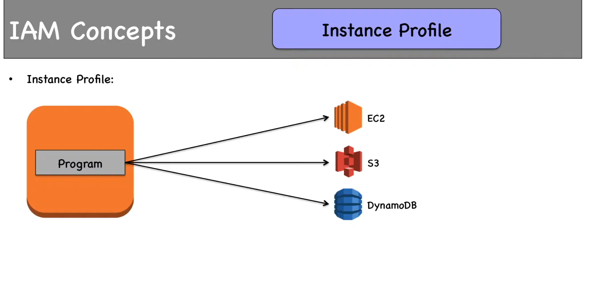
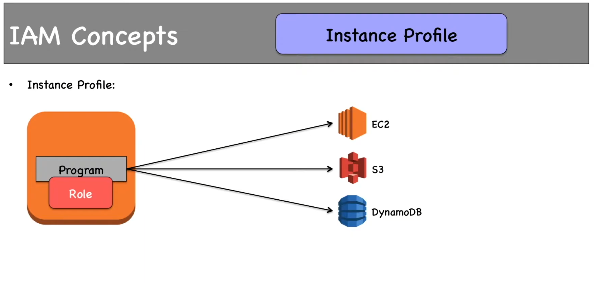
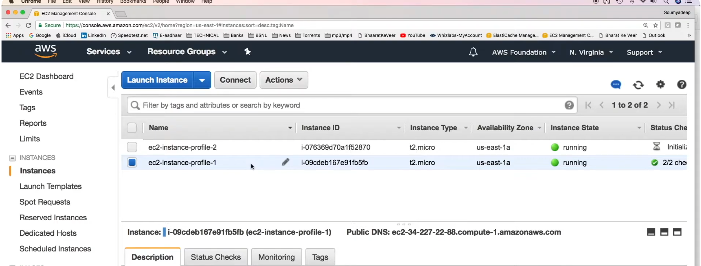
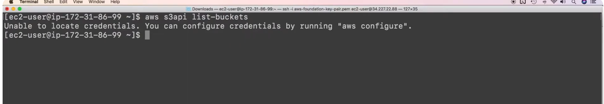
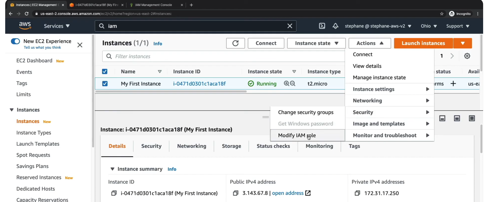
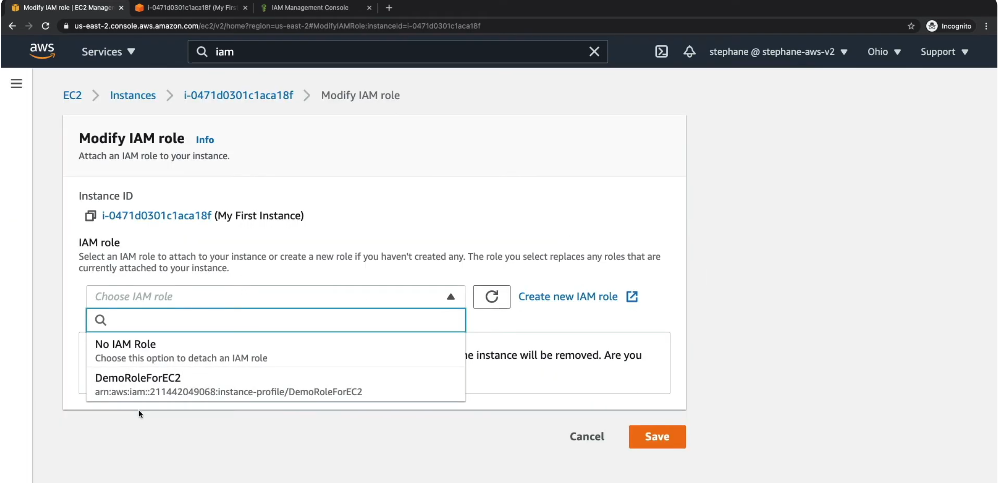

- Instance profile is what you attach to EC2 instance to give permissions to the instance.
  
- An IAM Role is attached to the instance profile. So attaching the instance profile to the EC2 will give the permission of your IAM Role.

- Using the console, when you create IAM Role for EC2, it creates automatically the instance profile with the same name. That’s why « you can directly use the role for the ec2 instance ». Behind the scene, it creates automatically instance profile with the same name.

- Say a pogram needs access to S3

We can create a Role and this role can be attached to the EC2 instance 

- We have two instance 

- We can't access resources from this EC2, lets try 
-login into the EC2

- Now if I type aws s3api list-buckets (this will list the s3 buckes)
-  Its asking me to configure the creds (but this is not what we want)
  

what we can do is create an IAM role and attach to my our EC2 instance 

- click on --> actions--> security--> modiy IAM roles

