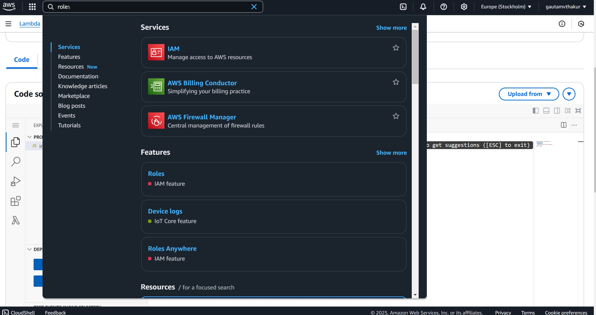

https://www.youtube.com/watch?v=s0XFX3WHg0w


Create two lambda functions.


Add the code
```
import json
import datetime
import urllib
import boto3


def lambda_handler(message, context):
    # TODO implement

    print("received messsage from step fn")
    print(message)

    response = {}
    response['TransactionType'] = message['TransactionType']
    response['Timestamp'] = datetime.datetime.now().strftime("%Y-%m-%d %H-%M-%S")
    response['Message'] = "Hello from process purchase lambda"


    return response
```


Save

Now Create the second function; just call it ProcessRefund.

We need to create the role.



This gives the ability to involve the function.

as you can see line 7

Create your state machine. Step function 


add the json but change the arm
```
{
  "Comment": "A simple AWS Step Functions state machine that automates a call center support session.",
  "StartAt": "ProcessTransaction",
  "States": {
    "ProcessTransaction": {
        "Type" : "Choice",
        "Choices": [ 
          {
            "Variable": "$.TransactionType",
            "StringEquals": "PURCHASE",
            "Next": "ProcessPurchase"
          },
          {
            "Variable": "$.TransactionType",
            "StringEquals": "REFUND",
            "Next": "ProcessRefund"
          }
      ]
    },
     "ProcessRefund": {
      "Type": "Task",
      "Resource": "arn:aws:lambda:REGION:ACCOUNT_ID:function:FUNCTION_NAME",
      "End": true
    },
    "ProcessPurchase": {
      "Type": "Task",
      "Resource": "arn:aws:lambda:REGION:ACCOUNT_ID:function:FUNCTION_NAME",
      "End": true
    }
  }
}
```
Grab the arm from the lambda function.


