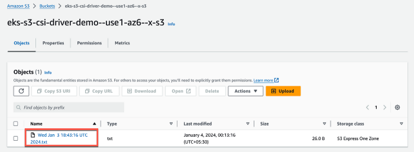

- Invent 2023, AWS has made [Mountpoint for Amazon S3 Container Storage Interface (CSI) driver generally available](https://aws.amazon.com/about-aws/whats-new/2023/11/mountpoint-amazon-s3-csi-driver/). Amazon S3 CSI uses [Mountpoint](https://aws.amazon.com/s3/features/mountpoint/) for Amazon S3 under the hood. 
- Applications running on Amazon Elastic Kubernetes Service (EKS) or self-managed Kubernetes clusters can access (read and write) objects through a file system interface when mountpoint for Amazon S3 CSI driver is configured. 

In this post we are going to create an end to end demo to configure Mountpoint for Amazon S3 CSI driver in an Amazon EKS cluster (Kubernetes version 1.27) and then read and write from objects on an Amazon S3 Bucket. 


- [Mountpoint for Amazon S3 CSI driver](https://docs.aws.amazon.com/eks/latest/userguide/s3-csi.html)
- [Mountpoint for Amazon S3 Container Storage Interface (CSI) driver](https://github.com/awslabs/mountpoint-s3-csi-driver)

**Prerequisites**


- Access to AWS account via AWS Console and CLI. The IAM user that you use must have sufficient permissions to make necessary AWS service calls and manage AWS resources mentioned in this post.
- Access to a terminal with [Kubectl](https://docs.aws.amazon.com/eks/latest/userguide/install-kubectl.html) and [Amazon EKS command line tool](https://docs.aws.amazon.com/eks/latest/userguide/eksctl.html) ([eksctl](https://eksctl.io/) version 0.165.0 or greater), installed and configured.
- Additionally, please refer to the Considerations and Prerequisites sections of the [Amazon EKS User Guide](https://docs.aws.amazon.com/eks/latest/userguide/s3-csi.html).

**Demo Preparation**


1. Create an Amazon EKS cluster
2. Create Amazon S3 buckets
3. Create an IAM policy to allow access to Amazon S3 buckets
4. Create an IAM OIDC provider for the EKS Cluster
5. Create an IAM role, Service Account and link them
6. Install Mountpoint for Amazon S3 CSI driver
7. Deploy a sample application and Test
8. Cleaning up

**Step 1: Create an Amazon EKS cluster**


**Step 2: Create Amazon S3 buckets**
```
BUCKET=$CLUSTER-demo-bucket
aws s3api create-bucket --bucket $BUCKET --region $REGION \
  --create-bucket-configuration LocationConstraint=$REGION
```

i. Open Amazon S3 Service from AWS console and click the **Create bucket** button.


ii. Select **us-east-1** as the region, select **General Purpose** as Bucket type and provide a **bucket name**. Leave all other settings to default and click the **Create bucket** button at the bottom of the page. My bucket name is: eks-s3-csi-driver-demo


iii. Now, we will create Amazon S3 Express One Zone bucket. Go to the Create bucket page, Select **us-east-1** as the region, this time select Bucket type as **Directory**, **use1-az6** as the Availability Zone. Acknowledge the warning and provide a base name of the bucket.
 - Please note the full bucket name is derived based on the chosen Availability Zone. Leave all other settings to default and click the **Create bucket** button at the bottom of the page. My Express One Zone bucket name is: eks-s3-csi-driver-demo--use1-az6--x-s3


**Step 3: Create an IAM policies to allow access to Amazon S3 buckets**
```
aws iam create-policy \
  --policy-name AmazonS3CSIDriverPolicy \
  --policy-document file://AmazonS3CSIDriverPolicy.json
```
Let us first create the IAM policy to provide access to the General purpose bucket. Open the [IAM console](https://console.aws.amazon.com/iam/), choose **Policies** from In the left navigation pane. Click **Create policy**. For **Policy editor**, choose **JSON**. Under **Policy editor**, copy and paste the following:\
Please note, for this demo purpose I am giving access to all the buckets. Ideally we should be giving access to only the required buckets.

json
```
{
    "Version": "2012-10-17",
    "Statement": [
        {
            "Sid": "MountpointFullBucketAccess",
            "Effect": "Allow",
            "Action": [
                "s3:ListBucket"
            ],
            "Resource": [
                "arn:aws:s3:::*"
            ]
        },
        {
            "Sid": "MountpointFullObjectAccess",
            "Effect": "Allow",
            "Action": [
                "s3:GetObject",
                "s3:PutObject",
                "s3:AbortMultipartUpload",
                "s3:DeleteObject"
            ],
            "Resource": [
                "arn:aws:s3:::*/*"
            ]
        }
    ]
}
```
- Choose **Next**. On the **Review and create** page, name your policy. I have used AmazonS3CSIDriverPolicy\
as the policy name. Choose **Create policy**.

- Now, let create another policy to provide access to Amazon S3 Express One Zone bucket. Follow the steps as before and create a policy with name S3ExpressFullAccess with the following JSON:

json
```
{
    "Version": "2012-10-17",
    "Statement": [
        {
            "Sid": "AllowAccessRegionalEndpointAPIs",
            "Effect": "Allow",
            "Action": [
                "s3express:DeleteBucket",
                "s3express:DeleteBucketPolicy",
                "s3express:CreateBucket",
                "s3express:PutBucketPolicy",
                "s3express:GetBucketPolicy",
                "s3express:ListAllMyDirectoryBuckets"
            ],
            "Resource": "arn:aws:s3express:*:*:bucket/*/*"
        },
        {
            "Sid": "AllowCreateSession",
            "Effect": "Allow",
            "Action": "s3express:CreateSession",
            "Resource": "*"
        }
    ]
}

```
**Step 4: Create an IAM OIDC provider for the EKS Cluster**

- One of the prerequisites is to have an existing AWS Identity and Access Management (IAM) OpenID Connect (OIDC) provider for the EKS cluster. 
- Now lets create an IAM OIDC provider for our EKS cluster. It can be done via eksctl or AWS Management Console following the AWS Documentation [Creating an IAM OIDC provider for your cluster](https://docs.aws.amazon.com/eks/latest/userguide/enable-iam-roles-for-service-accounts.html).

Lets run the following command:

```
<eksctl utils associate-iam-oidc-provider --cluster $CLUSTER --approve>

eksctl utils associate-iam-oidc-provider --region=us-east-1 --cluster=eks-s3-mountpoint-csi --approve

```
It gives an output as follows:
```
2024-01-03 21:37:38 [ℹ] will create IAM Open ID Connect provider for cluster "eks-s3-mountpoint-csi" in "us-east-1"\
2024-01-03 21:37:41 [✔] created IAM Open ID Connect provider for cluster "eks-s3-mountpoint-csi" in "us-east-1"
```
- Open the [IAM console](https://console.aws.amazon.com/iam/). In the left navigation pane, choose **Identity Providers** under **Access management**. Validate the provide is created. It should match **OpenID Connect provider URL** of the EKS cluster (without the [https://).](https://\)./)

**Step 5: Create an IAM role, Service Account and link them**

- This is step can be performed via eksctl or IAM Console or AWS CLI. This step is a bit tricky and contains multiple substeps if you doing it via IAM Console or AWS CLI. Please refer to AWS [documentation](https://docs.aws.amazon.com/eks/latest/userguide/s3-csi.html#s3-create-iam-role) for detailed steps.

Run the following commands:
```
CLUSTER_NAME=eks-s3-mountpoint-csi
REGION=us-east-1
ROLE_NAME=AmazonEKS_S3_CSI_Driver_Role
POLICY_ARN1=arn:aws:iam::123456789012:policy/AmazonS3CSIDriverPolicy
POLICY_ARN2=arn:aws:iam::123456789012:policy/S3ExpressFullAccess
```
```
eksctl create iamserviceaccount \
    --name s3-csi-driver-sa \
    --namespace kube-system \
    --cluster $CLUSTER_NAME \
    --attach-policy-arn $POLICY_ARN1 \
    --attach-policy-arn $POLICY_ARN2 \
    --approve \
    --role-name $ROLE_NAME \
    --region $REGION
```
The output should be as follows:
```
2024-01-03 21:50:20 [ℹ] 1 iamserviceaccount (kube-system/s3-csi-driver-sa) was included (based on the include/exclude rules)\
2024-01-03 21:50:20 [!] serviceaccounts that exist in Kubernetes will be excluded, use —override-existing-serviceaccounts to override\
2024-01-03 21:50:20 [ℹ] 1 task: { \
` `2 sequential sub-tasks: { \
` `create IAM role for serviceaccount "kube-system/s3-csi-driver-sa",\
` `create serviceaccount "kube-system/s3-csi-driver-sa",\
` `} }2024-01-03 21:50:20 [ℹ] building iamserviceaccount stack "eksctl-eks-s3-mountpoint-csi-addon-iamserviceaccount-kube-system-s3-csi-driver-sa"\
2024-01-03 21:50:20 [ℹ] deploying stack "eksctl-eks-s3-mountpoint-csi-addon-iamserviceaccount-kube-system-s3-csi-driver-sa"\
2024-01-03 21:50:21 [ℹ] waiting for CloudFormation stack "eksctl-eks-s3-mountpoint-csi-addon-iamserviceaccount-kube-system-s3-csi-driver-sa"\
2024-01-03 21:50:52 [ℹ] waiting for CloudFormation stack "eksctl-eks-s3-mountpoint-csi-addon-iamserviceaccount-kube-system-s3-csi-driver-sa"\
2024-01-03 21:50:53 [ℹ] created serviceaccount "kube-system/s3-csi-driver-sa"
```
The above command will perform the following tasks:

- Create IAM role named AmazonEKS\_S3\_CSI\_Driver\_Role and attach policies AmazonS3CSIDriverPolicy and S3ExpressFullAccess. Please log into IAM Console to validate it.
- Create a Kubernetes service account named s3-csi-driver-sa and annotate it with the ARN of the IAM role. Please run the below command to validate it.
```
kubectl -n kube-system describe sa s3-csi-driver-sa
```
The output should be as follows:
```
Name:                s3-csi-driver-sa\
Namespace:           kube-system\
Labels:              app.kubernetes.io/managed-by=eksctl\
Annotations:         eks.amazonaws.com/role-arn: arn:aws:iam::123456789012:role/AmazonEKS\_S3\_CSI\_Driver\_Role\
Image pull secrets:  <none>\
Mountable secrets:   <none>\
Tokens:              <none>\
Events:              <none>
```
**Step 6: Install Mountpoint for Amazon S3 CSI driver**

- Now we will install the Mountpoint for Amazon S3 CSI driver. It can be done using eksctl or AWS Management Console or AWS CLI. 
- Please refer to AWS [documentation](https://docs.aws.amazon.com/eks/latest/userguide/managing-add-ons.html#creating-an-add-on) for detailed steps using different methods.

- I am doing it via eksctl as I created the service account using eksctl. Please note: I tried to create it via AWS Management Console but it failed with conflict error that service account was managed by eksctl.

Run the following command:. Replace the IAM Role ARN.
```
eksctl create addon --cluster eks-s3-mountpoint-csi --name aws-mountpoint-s3-csi-driver --version latest --service-account-role-arn arn:aws:iam::123456789012:role/AmazonEKS\_S3\_CSI\_Driver\_Role --force
```
The command should give output as follows:
```
2024-01-03 23:44:09 [ℹ] Kubernetes version "1.27" in use by cluster "eks-s3-mountpoint-csi"\
2024-01-03 23:44:10 [ℹ] using provided ServiceAccountRoleARN "arn:aws:iam::123456789012:role/AmazonEKS\_S3\_CSI\_Driver\_Role"\
2024-01-03 23:44:10 [ℹ] creating addon\
2024-01-03 23:44:52 [ℹ] addon "aws-mountpoint-s3-csi-driver" active
```
Also validate it from AWS Console. Open Amazon EKS Console and select the cluster. Go to **Add-ons** tab:


**Step 7: Deploy a sample application and Test**

Now deploy sample application from awslabs Github [repository](https://github.com/awslabs/mountpoint-s3-csi-driver/tree/main/examples/kubernetes/static_provisioning) to test the setup.

i. Let us first try with static\_provisioning.yam . I have modified the bucket name as per my setup.
```
apiVersion: v1
kind: PersistentVolume
metadata:
  name: s3-pv
spec:
  capacity:
    storage: 1200Gi # ignored, required
  accessModes:
    - ReadWriteMany # supported options: ReadWriteMany / ReadOnlyMany
  mountOptions:
    - allow-delete
    - region us-east-1
  csi:
    driver: s3.csi.aws.com # required
    volumeHandle: s3-csi-driver-volume
    volumeAttributes:
      bucketName: eks-s3-csi-driver-demo
---
apiVersion: v1
kind: PersistentVolumeClaim
metadata:
  name: s3-claim
spec:
  accessModes:
    - ReadWriteMany # supported options: ReadWriteMany / ReadOnlyMany
  storageClassName: "" # required for static provisioning
  resources:
    requests:
      storage: 1200Gi # ignored, required
  volumeName: s3-pv
---
apiVersion: v1
kind: Pod
metadata:
  name: s3-app
spec:
  containers:
    - name: app
      image: centos
      command: ["/bin/sh"]
      args: ["-c", "echo 'Hello from the container!' >> /data/$(date -u).txt; tail -f /dev/null"]
      volumeMounts:
        - name: persistent-storage
          mountPath: /data
  volumes:
    - name: persistent-storage
      persistentVolumeClaim:
        claimName: s3-claim
```
ii. Create resources based on the above yaml file:
```
kubectl apply -f static\_provisioning.yaml
```
iii. Check the status of the pod:
```
kubectl get po
```
```
NAME   READY STATUS   RESTARTS AGE\
s3-app 1/1   Running  0        24s
```
iv. Open the bucket eks-s3-csi-driver-demo from the AWS Console and validate a new file has been created by the pod:


v. Log into the pod and create another file.
```
kubectl exec -it pod/s3-app -- /bin/bash\
cd data\
ls
```
vi. Create another file here and validate the same is also reflected under S3 bucket.
```
echo "Hello world." > helloworld.txt
```


Validate the new file is visible on Amazon S3 using AWS Console.

vi. Now a upload a new file into the Amazon S3 bucket. The same should be visible from inside the container.

vii. Delete the pod and associated resources:
```
kubectl delete -f static\_provisioning.yaml
```
viii. Now lets modify s3\_express\_specify\_az.yaml based on our bucket name and Availability Zone.
```
apiVersion: v1
kind: PersistentVolume
metadata:
  name: s3-pv
spec:
  capacity:
    storage: 1200Gi # ignored, required
  accessModes:
    - ReadWriteMany # supported options: ReadWriteMany / ReadOnlyMany
  mountOptions:
    - allow-delete
    - region us-east-1
  csi:
    driver: s3.csi.aws.com # required
    volumeHandle: s3-csi-driver-volume
    volumeAttributes:
      bucketName: eks-s3-csi-driver-demo--use1-az6--x-s3
  nodeAffinity:
    required:
      nodeSelectorTerms:
        - matchExpressions:
          - key: topology.kubernetes.io/zone
            operator: In
            values:
            - us-east-1a
---
apiVersion: v1
kind: PersistentVolumeClaim
metadata:
  name: s3-claim
spec:
  accessModes:
    - ReadWriteMany # supported options: ReadWriteMany / ReadOnlyMany
  storageClassName: "" # required for static provisioning
  resources:
    requests:
      storage: 1200Gi # ignored, required
  volumeName: s3-pv
---
apiVersion: v1
kind: Pod
metadata:
  name: s3-app
spec:
  containers:
    - name: app
      image: centos
      command: ["/bin/sh"]
      args: ["-c", "echo 'Hello from the container!' >> /data/$(date -u).txt; tail -f /dev/null"]
      volumeMounts:
        - name: persistent-storage
          mountPath: /data
  volumes:
    - name: persistent-storage
      persistentVolumeClaim:
        claimName: s3-claim
```
ix. Apply the yaml file and check the pod status like before. Wait until the pod status is running.
```
kubectl apply -f s3\_express\_specify\_az.yaml
```
x. Check that new file created by pod is visible from the AWS Web Console. You can also perform additional tests like before by creating different files from within Pod or through AWS console.



